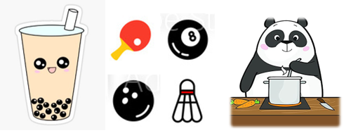
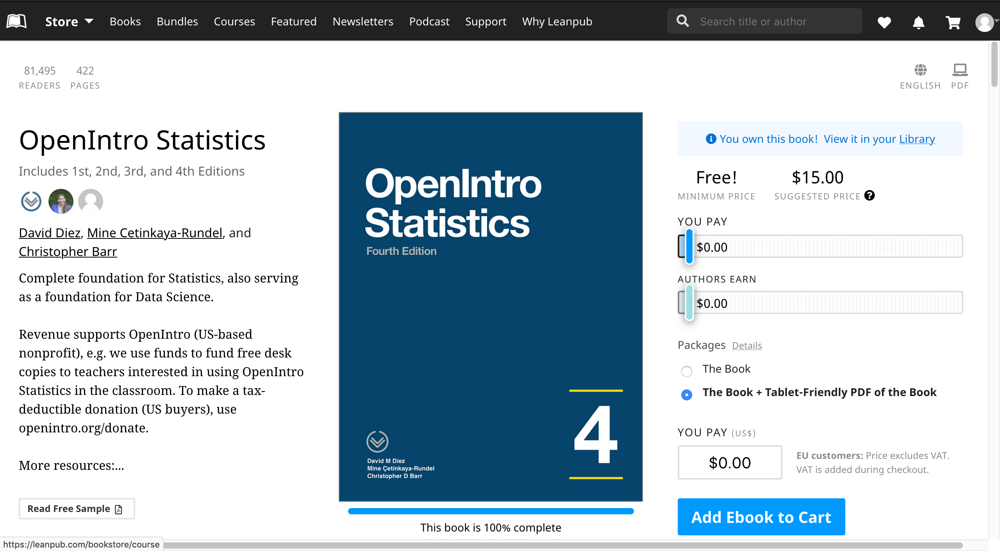
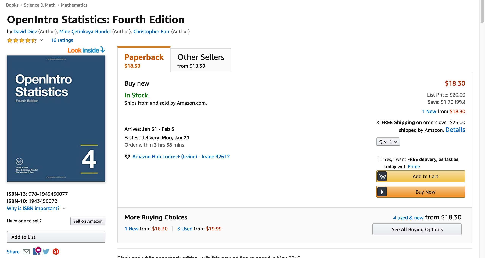
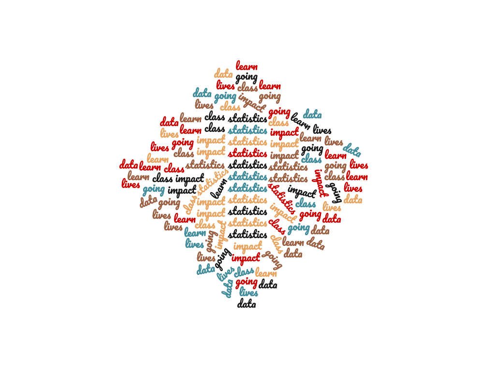
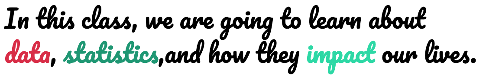
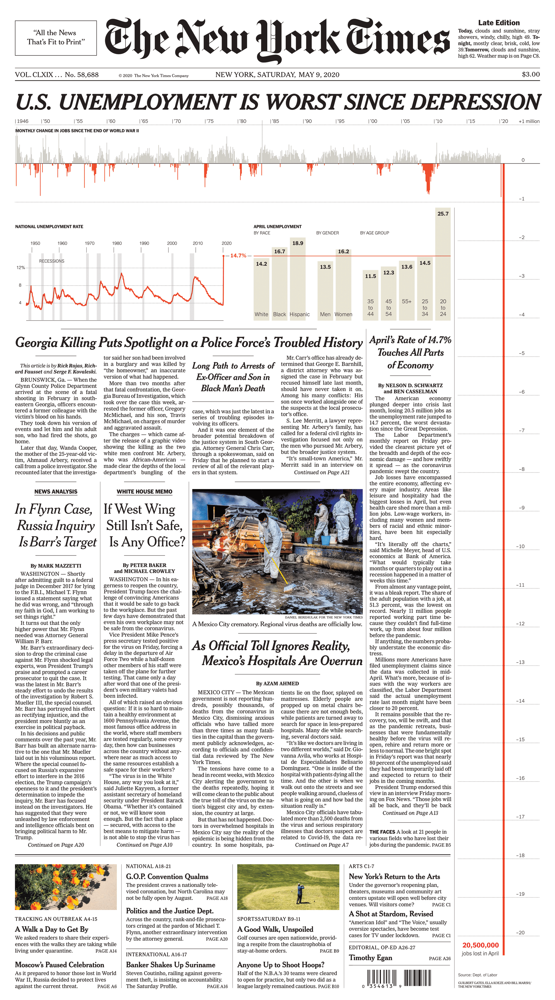
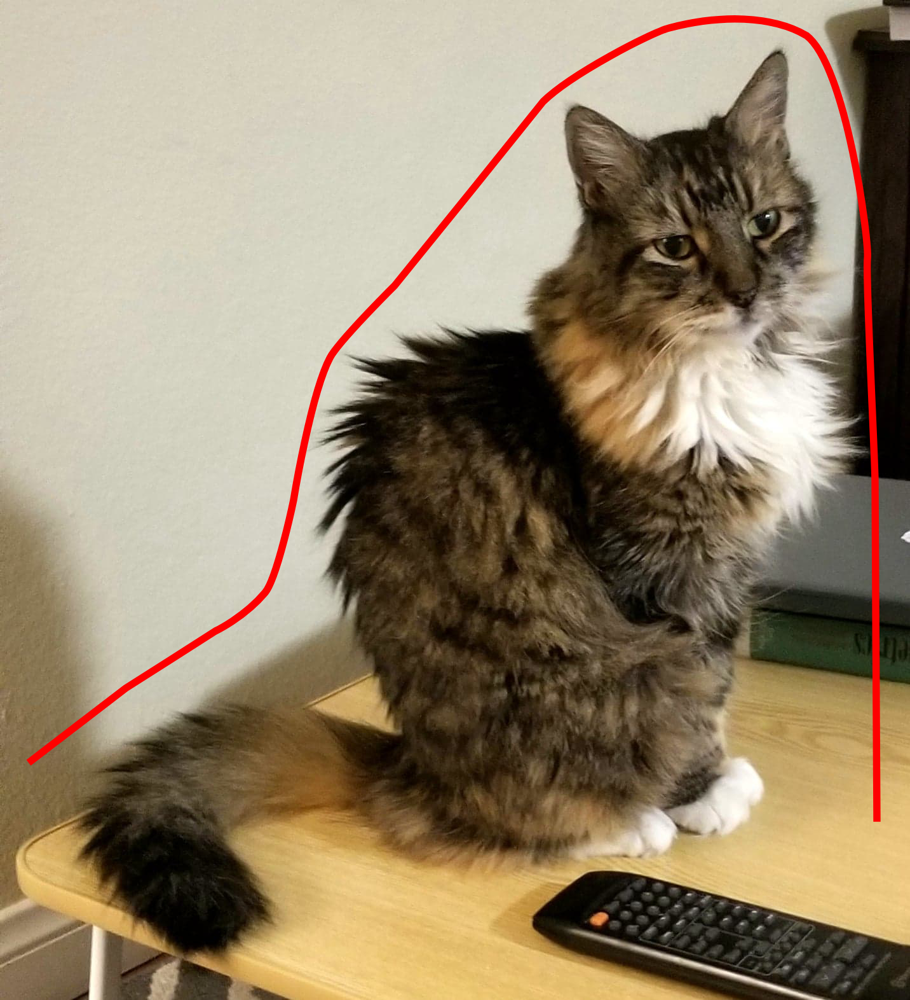

```{r setup, include = FALSE}
knitr::opts_chunk$set(echo = TRUE)
knitr::opts_chunk$set(cache=TRUE)
knitr::opts_chunk$set(fig.align='center', out.width="63%", warning=FALSE, fig.retina=3)
```

```{r load libraries, include=FALSE, comment='#'}
#install.packages( 'tidyverse' )
#install.packages( 'readxl' )

library( tidyverse, quietly=T, warn.conflicts = F )
library( knitr, quietly=T, warn.conflicts = F )
library( readxl, quietly=T, warn.conflicts = F )
#library( tufte, quietly=T, warn.conflicts = F )
library( quantmod, quietly=T, warn.conflicts = F )
library(patchwork)
#library(WDI)
library(wbstats)

```

```{r reduce code spacing, include = FALSE}
hook1 <- function(x){ gsub("```\n*```r*\n*", "", x) }
hook2 <- function(x){ gsub("```\n+```\n", "", x) }
knit_hooks$set(document = hook2)
```

```{r load data, include=F}


#avocado <- read_excel( "avocado.xlsx" )

```

layout: true
class: 

<!-- Old footer font color: #00A895 -->
<!-- old footer background color: #383838 -->

<!-- footer -->
<div style="position:fixed; bottom:10px; left:4px; font-size: 12pt; color: #17f9b4; background-color: #545454; width:93.5%">&nbsp;&nbsp;&nbsp;&nbsp;&nbsp;Mary Ryan</div> <!--&nbsp;&nbsp;&nbsp;&nbsp;&nbsp;&nbsp;&nbsp;&nbsp;&nbsp;&nbsp;&nbsp;&nbsp;&nbsp;&nbsp;&nbsp;&nbsp;&nbsp;&nbsp;&nbsp;&nbsp;&nbsp;&nbsp;&nbsp;&nbsp;&nbsp;&nbsp;&nbsp;&nbsp;&nbsp;&nbsp;&nbsp;&nbsp;&nbsp;&nbsp;&nbsp;&nbsp;&nbsp;&nbsp;&nbsp;&nbsp;&nbsp;&nbsp;&nbsp;&nbsp;&nbsp;&nbsp;&nbsp;&nbsp;&nbsp;&nbsp;&nbsp;&nbsp;&nbsp;&nbsp;&nbsp;&nbsp;&nbsp; -->
<div style="position:fixed; bottom:10px; left:500px; font-size: 12pt; color: #17f9b4">Introduction to Statistics</div> <!--&nbsp;&nbsp;&nbsp;&nbsp;&nbsp;&nbsp;&nbsp;&nbsp;&nbsp;&nbsp;&nbsp;&nbsp;&nbsp;&nbsp;&nbsp;&nbsp;&nbsp;&nbsp;&nbsp;&nbsp;&nbsp;&nbsp;&nbsp;&nbsp;&nbsp;&nbsp;&nbsp;&nbsp;&nbsp;&nbsp;&nbsp;&nbsp;&nbsp;&nbsp;&nbsp;&nbsp;&nbsp;&nbsp;&nbsp;&nbsp;&nbsp;&nbsp;&nbsp;&nbsp;&nbsp;&nbsp;&nbsp;&nbsp;&nbsp;&nbsp;&nbsp;&nbsp;&nbsp;&nbsp;&nbsp;&nbsp;&nbsp; -->
<div style="position:fixed; bottom:10px; right:92px; font-size: 12pt; color: #17f9b4">Stats 7</div>

---

<div style="position:fixed; left:50px; right:50px; top:175px; padding:30px; margin:auto; background-color:#C0F3E4; border-radius:15px">
<p>This class is being conducted over Zoom. As the instructor, I will be .alert[recording] this session. I have disabled the recording feature for others so that no one else will be able to record this session. I will be posting this session to the course’s website.</p>

<p>If you have privacy concerns and .alert[do not wish to appear in the recording], you may turn video off (click .alert[“stop video”]) so that Zoom does not record you.</p>

<p>The chat box is always open for discussion and questions to the entire class. You may also send messages privately to the instructor or the TAs. Please note that Zoom saves all chat transcripts.</p>
</div>

---

class: title-slide2

# <center> Introduction to Statistics </center>
## <center> Stats 7 </center>
### <center> Mary Ryan </center>
### .center[Aug. 4, 2020]

<!-- social media info -->
<div style="position:fixed; bottom:40px; left:70px;">
<p> Course website:</p>
<p><a href="https://canvas.eee.uci.edu/courses/28451"> https://canvas.eee.uci.edu/courses/28451 </a></p>

<p> Slides can be found at:</p>
</p><a href="https://maryryan.github.io/stats7-SS2-2020-slides/stats7-SS2-2020-samplingBias/stats7-SS2-2020-samplingBias"> https://maryryan.github.io/stats7-SS2-2020-slides/lec1/stats7-SS2-2020-lec1 </a></p>
</div>


---

# About the Teaching Team


<!--  -->
<div style="position:fixed; right:250px; top:100px">

</div>

<div style="position:fixed; right:170px; top:90px">

</div>

<div style="position:fixed; right:80px; top:120px">

</div>

<div style="position:fixed; right:500px; top:100px">


</div>

<div style="position:fixed; left:925px; top:230px;">


</div>

<div style="position:fixed; right:500px; top:450px">


</div>

<div style="position:fixed; right:100px; top:500px">


</div>

<div style="position:fixed; top:75px;">
<ul>
<li> Instructor: Mary Ryan</li>
   <ul>
   <li> 5th year Statistics PhD student </li>
   <li> : <a href="mailto:marymr@uci.edu">marymr@uci.edu</a> </li>
   <li> OH: </li>
   </ul>

<br>
<br>
<br>
<br>

<li> TA: Kyle Conniff </li>
   <ul>
   <li> 5th year Statistics PhD student </li>
   <li> : <a href="mailto:krconnif@uci.edu ">krconnif@uci.edu </a> </li>
   <li> OH: </li>
   </ul>
   
<br>
<br>
<br>
<br>
   
<li> TA: Jenifer Rim
   <ul>
   <li> 4th year Statistics PhD student </li>
   <li> : <a href="mailto:jsrim@uci.edu ">jsrim@uci.edu </a> </li>
   <li> OH: </li>
   </ul>

</ul>
</div>

---

<h1> Tentative Schedule</h1>

<div style="position:relative; top:-30px; width:1000px;height:90px;padding:2px;background-color:#F5F5F5;">

<b>Week 1</b>
<div style="position:relative; top:-10px;">
<ul>
<li>Descriptive statistics & data visualization</li>
<li>Data sampling & bias</li>
</ul>
</div>
</div>

<div style="position: relative; width:1000px;height:90px;padding:2px;background-color: #ffff; top:-5px;">
<b>Week 2</b>
<div style="position:relative; top:-10px;">
<ul>
<li> Regression </li>
<li> Basic probability </li>
</ul>
</div>
</div>

<div style="position:relative; width:1000px;height:90px;padding:2px;background-color:#F5F5F5; top:-5px;">

<b>Week 3</b>
<div style="position:relative; top:-10px;">
<ul>
<li><span style="color:#d82d47;"><b>Midterm</b></span></li>
<li>Discrete probability distributions</li>
</ul>
</div>
</div>

<div style="position: relative; width:1000px;height:90px;padding:2px;background-color: #ffff; top:-5px;">

<b>Week 4</b>
<div style="position:relative; top:-10px;">
<ul>
<li> Continuous probability distributions & sampling distributions</li>
<li> One-sample inference </li>
</ul>
</div>
</div>

<div style="position:relative; width:1000px;height:90px;padding:2px;background-color:#F5F5F5; top:-5px;">

<b>Week 5</b>
<div style="position:relative; top:-10px;">
<ul>
<li>Two-sample inference</li>
<li>Inference for categorical data</li>
</ul>
</div>
</div>

<div style="position:relative; width:1000px;height:25px;padding:2px;background-color:#ffff; top:-5px;">
<span style="color:#d82d47;"><b>Final Exam</b></span>
</div>


---

# Textbook

Recommended text: <a href="https://www.openintro.org/book/os/">OpenIntro Statistics, 4th Edition</a>

.pull-left[
- PDF free to download


]

.pull-right[
- Paperback copy $20 from Amazon 


]

---

# Assignments

<div style="position:relative; top:-40px;">
<ul>
<li>Video Quizzes & Surveys: 15%</li>
<br>
   <ul>
   <li>Short topic videos with embedded quiz questions to be completed before appropriate lecture, found on <a href="https://canvas.eee.uci.edu/courses/28451">course website</a></li>
   </ul>
</ul>
</div>

<div style="position:relative; top:-70px;">
.pull-left-75[
- Homework: 25%
   - Weekly assignments, found on the <a href="https://canvas.eee.uci.edu/courses/28451">course website</a>
   - Open Tuesdays @ 1p
   - Due .alert2[__following Tuesday @ 12.59p__] (before lecture) via Canvas
   - For .alert2[__every day__] late, homework grade will suffer a .alert2[__20%__] penalty

- Labs: 15%
   - Open Thursdays @ 4p, found on the <a href="https://canvas.eee.uci.edu/courses/28451">course website</a>
   - Due .alert2[__following Tuesday @ 12.59p__] (before lecture) via Canvas

- Midterm Exam: 25%
    - Date: <span style="color:#1f9773;"><b>Tuesday, Aug. 18 @ 1p</b></span>

- Final Exam: 30%
   - Date: .alert2[__Tuesday, Sept. 8 @ 1p__]
   - Cumulative
]
</div>

.pull-right-25[
<div style="position:relative; top: 225px; right: 100px;">
.content-box-pink[
.center[**If you have issues with either of the exam dates, let me know as soon as possible**]
]
</div>
]

---

# What is Statistics?

--

<div></div>

<div, style="position:fixed; left:0px; bottom:30px"></div>


<div, style="position:fixed; right:150px; top:100px"></div>

<div, style="position:fixed; right:90px; top:250px"></div>


<div, style="position:fixed; right:220px; bottom:100px"></div>

<div, style="position:fixed; left:250px; top:260px"></div>

---

# The Grammar of Science


.pull-left[
Grammar takes a pile of words,

<div></div>

and helps turn it into a sentence that makes sense

<div></div>
]

--

.pull-right[
.alert[**Statistics**] takes a pile of data,

<div></div>
<!-- Other possible gif: -->
<!-- <div></div> -->

and helps turn it into scientific conclusions that we can .alert2[**interpret**]

<!-- <div></div> -->
]

---

# What Statistics Isn't

Just like all sentences that are grammatically correct aren't necessarily good at communicating their meaning...

<br>

.center[

]

<br>

Statistics is not simply a machine where data goes in and truth pops out the other side

<br>

<div style="position:relative; left:175px;">
.content-box-pink-short[
.center[
We need to use Statistics **conciously** and understand its **limitations**
]
]
</div>

---

# Types of Data

- A .alert[**variable**] is a measured characteristic of your data

   - A dataset is often made up of many different variables, of many different types

--

- .alert[**Categorical**] (qualitative) variables

   - Ordinal variable: categorical variable whose categories have a .alert2[**specific ordering**]
   
   - Nominal variable: categorical variable .alert2[**without any ordering**]
   
   - Binary variable: categorical variable with .alert2[**only 2 categories**]
   
--

- .alert[**Quantitative**] variables

   - Discrete variable: takes on numerical values in .alert2[**jumps**]
   
   - Continuous variable: takes on numerical values that can go out to .alert2[**infinite decimal points**]

---

# Types of Data

.pull-left[
1) Number of cats at the animal shelter

2) Species of pet

3) Weight

4) Mood

5) Diagnosis

6) Population of Orange County

7) Airplane ticket class
]

--

.pull-right[

Discrete
{{content}}
]
--

Nominal

{{content}}

--

Continuous
{{content}}

--

Nominal
{{content}}

--

Nominal
{{content}}

--

Discrete
{{content}}

--

Ordinal

--

.pull-left[

.alert[
   8) Money you spend to wash 1 load of laundry
   ]
]

--

.pull-right[

.alert[
   <div, style="position:fixed; bottom:185px; left:635px">Continuous</div>
   ]

]

---

# Types of Data

8) Money you spend to wash 1 load of laundry

```{r exchangeRate, echo=FALSE}
from <- rep("USD", 3)
to <- c("IQD", "EUR", "MXN")

rate <- getQuote(paste0(from, to, "=X"))$Last

laundryConversion <- 1.75*rate


```

- I spend $1.75 per wash cycle

--

   - Looks discrete, right?
   
--

   - .alert2[**Converted to Iraqi Dinar: ع.د  `r laundryConversion[1]`**]

--

   - .alert2[**Converted to Euro: € `r laundryConversion[2]`**]

--

   - .alert2[**Converted to Mexican Peso: $ `r laundryConversion[3]`**]

--

- While we might think of currency in "discrete" US Dollar (or Dinar, or Euro, or Peso) units, any amount of money can be converted from one currency to another
   - Currency conversion doesn't respect the fact that you don't carry around $1/12^{th}$ cents
   - .alert[**So we generally think of currency as a continuous variable**]
   
---

# How Do We Describe Our Data?

For categorical data, we might want to:
   
- Know how many observations are in each caetgory

   - .alert[**Counts**]

- Know how large a category is compared to all observations

   - .alert[**Percentages**]

   - $\frac{\text{# observations in a category}}{\text{Total observations}} \times 100$
      
---

# How Do We Describe Our Data?
   
For quantitative data, we might want to:   

- Know what the smallest value of a variable is

   - .alert[**Minimum**]

- Know what the largest value of a variable is

   - .alert[**Maximum**]

- Know the distance between the maximum and the minimum

   - .alert[**Range**]
   
- Know what the center of our data is...

---

# Journey to the Center of the Data

- .alert[**Mean**]

   - The "typical value" of the data
   
   - $\bar{x}=\frac{\text{sum of data points}}{\text{number of data points}} =\frac{\sum_{i=1}^n X_i}{n}$

- .alert[**Median**]

   - The "exact middle" of the data
   
   - 50% of data points are below the median, 50% of data points are above the median

- .alert[**Mode**]
   - The most common value in the data
   
--

<div style="position:relative; top:-385px; height:150px; width:450px;border: 2px solid #17f9b4;"></div>

---

# Median

<div style="font-size:35px;">
2, &nbsp; 5, &nbsp;  6, &nbsp; 8, &nbsp; 8, &nbsp; 8, &nbsp; 10, &nbsp; 13, &nbsp; 14, &nbsp; 16, &nbsp; 16, &nbsp; 19, &nbsp; 20, &nbsp; 21, &nbsp; 25 
</div>
--

<div style="position:relative; top:-410px; left:-140px; border-left:3px solid #d82d47; height:40px; margin-left:-3px; transform:rotate(315deg);"></div>
<div style="position:relative; top:-450px; right:-700px; border-left:3px solid #d82d47; height:40px; margin-left:-3px; transform:rotate(315deg);"></div>

--

<div style="position:relative; top:-490px; left:-90px; border-left:3px solid #d82d47; height:40px; margin-left:-3px; transform:rotate(315deg);"></div>
<div style="position:relative; top:-535px; right:-630px; border-left:3px solid #d82d47; height:40px; margin-left:-3px; transform:rotate(315deg);"></div>

--

<div style="position:relative; top:-570px; left:-40px; border-left:3px solid #d82d47; height:40px; margin-left:-3px; transform:rotate(315deg);"></div>
<div style="position:relative; top:-610px; right:-560px; border-left:3px solid #d82d47; height:40px; margin-left:-3px; transform:rotate(315deg);"></div>

<div style="position:relative; top:-650px; left:10px; border-left:3px solid #d82d47; height:40px; margin-left:-3px; transform:rotate(315deg);"></div>
<div style="position:relative; top:-690px; right:-490px; border-left:3px solid #d82d47; height:40px; margin-left:-3px; transform:rotate(315deg);"></div>

<div style="position:relative; top:-730px; left:60px; border-left:3px solid #d82d47; height:40px; margin-left:-3px; transform:rotate(315deg);"></div>
<div style="position:relative; top:-770px; right:-420px; border-left:3px solid #d82d47; height:40px; margin-left:-3px; transform:rotate(315deg);"></div>

<div style="position:relative; top:-810px; left:100px; border-left:3px solid #d82d47; height:40px; margin-left:-3px; transform:rotate(315deg);"></div>
<div style="position:relative; top:-850px; right:-350px; border-left:3px solid #d82d47; height:40px; margin-left:-3px; transform:rotate(315deg);"></div>

<div style="position:relative; top:-890px; left:160px; border-left:3px solid #d82d47; height:40px; margin-left:-3px; transform:rotate(315deg);"></div>
<div style="position:relative; top:-930px; right:-300px; border-left:3px solid #d82d47; height:40px; margin-left:-3px; transform:rotate(315deg);"></div>

--

<div style="position:relative; top:-610px; left:350px; height:60px; width:60px;border: 2px solid #d82d47;"></div>

--

<div style="position:fixed; top:300px; font-size:35px;">
2, &nbsp; 5, &nbsp;  6, &nbsp; 8, &nbsp; 8, &nbsp; 8, &nbsp; 10, &nbsp; 10, &nbsp; 13, &nbsp; 14, &nbsp; 16, &nbsp; 16, &nbsp; 19, &nbsp; 20, &nbsp; 21, &nbsp; 25 
</div>

--

<div style="position:fixed; top:300px; left:100px; border-left:3px solid #d82d47; height:40px; margin-left:-3px; transform:rotate(315deg);"></div>
<div style="position:fixed; top:300px; right:200px; border-left:3px solid #d82d47; height:40px; margin-left:-3px; transform:rotate(315deg);"></div>


<div style="position:fixed; top:300px; left:150px; border-left:3px solid #d82d47; height:40px; margin-left:-3px; transform:rotate(315deg);"></div>
<div style="position:fixed; top:300px; right:270px; border-left:3px solid #d82d47; height:40px; margin-left:-3px; transform:rotate(315deg);"></div>

<div style="position:fixed; top:300px; left:180px; border-left:3px solid #d82d47; height:40px; margin-left:-3px; transform:rotate(315deg);"></div>
<div style="position:fixed; top:300px; right:350px; border-left:3px solid #d82d47; height:40px; margin-left:-3px; transform:rotate(315deg);"></div>

<div style="position:fixed; top:300px; left:230px; border-left:3px solid #d82d47; height:40px; margin-left:-3px; transform:rotate(315deg);"></div>
<div style="position:fixed; top:300px; right:420px; border-left:3px solid #d82d47; height:40px; margin-left:-3px; transform:rotate(315deg);"></div>

<div style="position:fixed; top:300px; left:280px; border-left:3px solid #d82d47; height:40px; margin-left:-3px; transform:rotate(315deg);"></div>


<div style="position:fixed; top:300px; left:330px; border-left:3px solid #d82d47; height:40px; margin-left:-3px; transform:rotate(315deg);"></div>
<div style="position:fixed; top:300px; right:490px; border-left:3px solid #d82d47; height:40px; margin-left:-3px; transform:rotate(315deg);"></div>

<div style="position:fixed; top:300px; left:400px; border-left:3px solid #d82d47; height:40px; margin-left:-3px; transform:rotate(315deg);"></div>
<div style="position:fixed; top:300px; right:560px; border-left:3px solid #d82d47; height:40px; margin-left:-3px; transform:rotate(315deg);"></div>

<div style="position:fixed; top:300px; right:620px; border-left:3px solid #d82d47; height:40px; margin-left:-3px; transform:rotate(315deg);"></div>

--

<div style="position:fixed; top:290px; left:430px; height:60px; width:130px;border: 2px solid #d82d47;"></div>

--

<div style="position:fixed; top:370px; left:400px; font-size:30px; color:#d82d47">
(10+13)/2 = 11.5
</div>

---

# How Do We Describe Our Data?

- We might also want to know how much our observations .alert2[**vary**]

- Nice to compare how far away observations are from the center of the data (.alert[**deviation**])

$$x_i - \bar{x}$$
--

- But some observations are above the mean and some are below...

   - If we just add the deviations up some of them might cancel out

   - Square the deviations to remove the sign:
$$(x_i - \bar{x})^2$$

--

- But every observation has a different squared deviance. How do we get one metric?

--

   - Take an average!
   
   - .alert[**Variance**] ( $s^2$ ) $= \frac{\sum_{i=1}^n (x_i - \bar{x})^2}{n-1}$
   
   - .alert[**Standard deviation**] (s) $= \sqrt{s^2} = \sqrt{\frac{\sum_{i=1}^n (x_i - \bar{x})^2}{n-1}}$

---

# Variance & Standard Deviation

.content-box-teal[Variance ( $s^2$ ) $= \frac{\sum_{i=1}^n (x_i - \bar{x})^2}{n-1}$ &nbsp;&nbsp;&nbsp;&nbsp;&nbsp;&nbsp;&nbsp;&nbsp;&nbsp;&nbsp;&nbsp;&nbsp;&nbsp;&nbsp;&nbsp;&nbsp;&nbsp;&nbsp;&nbsp;&nbsp;&nbsp;&nbsp;&nbsp;&nbsp;&nbsp;&nbsp;&nbsp;&nbsp;&nbsp;&nbsp;&nbsp;&nbsp;&nbsp;&nbsp;&nbsp;&nbsp;&nbsp;&nbsp;&nbsp;&nbsp;&nbsp;&nbsp;&nbsp;&nbsp;&nbsp;&nbsp;&nbsp;&nbsp;&nbsp;&nbsp;&nbsp;&nbsp;&nbsp;&nbsp;&nbsp;&nbsp;&nbsp;&nbsp;&nbsp;&nbsp; Standard deviation (s) $= \sqrt{s^2} = \sqrt{\frac{\sum_{i=1}^n (x_i - \bar{x})^2}{n-1}}$
]

- When variance/standard deviation is .alert2[**large**], the observations vary from the mean a lot

- When variance/standard deviation is .alert2[**small**], the observations generally stay close to the mean


---

# Data Visualization

- Summarizing data with metrics are nice, but people are much better at identifying differences/patterns .alert2[**graphically**]

--

<br>
<br>

.pull-left[
- .alert[**Bar plot**]

   - Categories on one axis
   
   - Counts/percentages on the other axis
   
   - AKA: bar graph, bar chart, barplot
]

.pull-right[
<div, style="position:relative; left:0px">
   
   
   <div><font size="1">.alert2[The California-related topics the president tweets most frequently about (Sept. 17, 2019), via Priya Krishnakumar at <a href="https://www.latimes.com/projects/trump-california-tweets/">The LA Times </a>]</font><div>
   
</div>
]

---

# Data Visualization

.pull-left[
- .alert[**Stacked bar plot**]

   - Categories on one axis
   
   - Percentage on other axis
   
   - Bar divided into percentages of how common a 2nd categorical variable is within your axis category
   
   - Full bar should add up to 100%
]

<div, style="position:relative; left:475px; top:-250px">
   
   
   <div style="left:50px"><font size="1">.alert2[Teenagers Say Depression and Anxiety Are Major Issues Among Their Peers  (Feb. 29, 2019),
   
   via Karen Zraick at <a href="https://www.nytimes.com/2019/02/20/health/teenage-depression-statistics.html">The New York Times </a>]</font></div>
   
</div>

---

# Data Visualization

- Stacked bar chart

   - What's going on here?
   
<div, style="position:relative; left:475px; top:-50px">
   
   
   <div style="left:50px"><font size="1">.alert2[Gender Discrimination at Work: Connecting Gender Stereotypes, Institutional Policies, and Gender
   
   Composition of Workplace (Dec. 5, 2011), via Donna Bobbitt-Zeher at <a href="https://journals.sagepub.com/doi/full/10.1177/0891243211424741">Gender & Society</a>]</font></div>
   
</div>

---

# Data Visualization

.pull-left[
- .alert[**Pie chart**]

   - Can also visualize percentages
   
   - No real axes
   
   - Total circle = 100%
   
   - Each wedge corresponds to percentage of total observations correspond to one category
   
   - People are much worse at judging volume by circle wedge than volume by box, though
]
 
.pull-right[  
<div, style="position:relative; left:0px">
   
   
   <div><font size="1">.alert2[Salvaging the Pie (Sept. 26, 2014), via Joey Cherdarchuk  at <a href="https://www.darkhorseanalytics.com/blog/salvaging-the-pie/">Darkhorse Analytics </a>]</font><div>
]

---

# Data Visualization

- Pie chart & stacked bar plot

   - What's going on here?
   
   - CWS = community water system

<div, style="position:relative; left:700px; top:-225px">
   
   
   <div style="position:relative; left:-200px; top: -125px"><font size="1">.alert2[The effects of drinking water
   
   service fragmentation on
   
   drought-related water security
   
   (April 17, 2020), via Megan Mullin at
   
   <a href="https://science.sciencemag.org/content/368/6488/274/tab-figures-data">Science </a>]</font></div>
   
   

---

# Data Visualization

.pull-left[
- .alert[**Scatter plot**]

   - Quantitative variable on one axis
   
   - Another quantitative variable on other axis
   
   - Observations shown as points
]

.pull-right[  
<div, style="position:relative; left:0px">
   
   
   
   <div><font size="1">.alert2[Why Michael Jordan Was The Best (April 17, 2020), via Neil Paine at <a href="https://fivethirtyeight.com/features/why-michael-jordan-was-the-best/">FiveThirtyEight </a>]</font></div>
]

---

# Data Visualization

- Scatter plot

   - What's going on here?
   
.pull-right[  
<div, style="position:relative; left:0px; top:-200px">
   
   
   
   <div><font size="1">.alert2[This Year’s Boston Marathon Was Sloooooowww (April 16, 2018), via Gus Wezerek at <a href="https://fivethirtyeight.com/features/this-was-the-slowest-boston-marathon-since-the-1970s/">FiveThirtyEight </a>]</font></div>
]


---

# Data Visualization
.pull-left[
- .alert[**Line plot**]

   - Time on one axis (usually x-axis)
   
   - Quantitative variable on other axis
   
   - Line connecting each observation
   (usually the peaks in the line)
   
   - Good for observing trends over time
]

<div, style="position:relative; left:100px; top:-0px">
   
   
   <div style="position:relative; left:500px;"><font size="1">.alert2[Do Baseball’s Labor Fights Drive Fans Away? (June 12, 2020), via Travis Sawchik at <a href="https://fivethirtyeight.com/features/do-baseballs-labor-fights-drive-fans-away/">FiveThirtyEight </a>]</font></div>
   
</div>

---

# Data Visualization

- Line plots

   - What's going on here?
   
<div, style="position:relative; left:725px; top:-200px;">
   
</div>
   
   <div style="position:relative; left:-200px; top: -125px"><font size="1">.alert2[Thanksgiving dinner
   
   costs remain stable (Nov. 27, 2019),
   
   via Daniel Wheaton at
   
   <a href="https://www.sandiegouniontribune.com/business/story/2019-11-27/thanksgiving-dinner-costs-remain-stable">The San Diego Union-Tribune </a>]</font></div>
   
</div>

---

# Data Visualization

- Line plots

   - What's going on here (part D)?
   
<div, style="position:relative; left:500px; top:-100px">
   
   
   <div><font size="1">.alert2[History, mass loss, structure, and dynamic behavior of the Antarctic Ice Sheet (March 20, 2020),
   
   via Robin E. Bell & Helene Seroussi at <a href="https://science.sciencemag.org/content/367/6484/1321/tab-figures-data">Science</a>]</font></div>
   
</div>

---

# Data Visualization

.pull-left[
- .alert[**Histogram**]

   - Like a bar plot, but instead of counts of observations in categories we have counts of observations in intervals (bins) of a quantitative variable
   
   - You can change the interval width (and the # of bars) for histograms; you can't combine or divide categories for bar plots
   
   - Good for figuring out the .alert2[**data's shape**]
]

.pull-right[
<div, style="position:relative; left:0px; top:50px">
   
   
   <div><font size="1">.alert2[The age of first-time mothers in 2016 (Aug. 4, 2018), via Quoctrung Bui at <a href="https://www.nytimes.com/interactive/2018/08/04/upshot/up-birth-age-gap.html?module=inline">The New York Times </a>]</font></div>
   
</div>
]

---

# Data Visualization

- Histogram

   - What's going on here?

<div, style="position:relative; left:700px; top:-200px;">
   
</div>

<div style="position:relative; left:-140px; top: -125px"><font size="1">.alert2[Monthly change in jobs

since WWII (May 9, 2020),
   
   via Guilbert Gates, Ella Koeze,
   
   and Bill Marsh at
   
   <a href="https://twitter.com/nytimes/status/1259108392263655424?s=20">The New York Times </a>]</font></div>

---

# Data Shapes

.pull-left[
Uniform 
- No defined peaks

```{r, echo=FALSE, out.width="90%"}
a <- runif(1000000, 0, 1)
par(mar=c(2,2,2,2))
a %>% 
   as.data.frame() %>% 
   ggplot(aes(x=.)) +
   geom_histogram(aes(y=..density..),bins=45, color="black", fill="#17f9b4",alpha=0.2) +
   #geom_density() +
   xlab("") +
   ylab("") +
   theme_minimal()
```

]

.pull-right[
Unimodal

- One defined peak

```{r, echo=FALSE, out.width="90%"}
b <- rnorm(1000000, 10, 5)
par(mar=c(2,2,2,2))
b %>% 
   as.data.frame() %>% 
   ggplot(aes(x=.)) +
   geom_histogram(aes(y=..density..),bins=45, color="black", fill="#17f9b4",alpha=0.2) +
   #geom_density() +
   xlab("") +
   ylab("") +
   theme_minimal()
```
]


---

# Data Shapes

Multimodal

- Multiple defined peaks

<div style="position:relative; left:125px; top:-150px;">
```{r, echo=FALSE, out.width="55%"}
c <- c(rnorm(500000, 10, 5), rnorm(500000, 35, 7))
#par(mar=c(2,2,2,2))
p1 <- c %>% 
   as.data.frame() %>% 
   ggplot(aes(x=.)) +
   geom_histogram(aes(y=..density..),bins=45, color="black", fill="#17f9b4",alpha=0.2) +
   #geom_density() +
   xlab("") +
   ylab("") +
   theme_minimal()

d <- c(rnorm(250000, -5, 4), rnorm(250000, 10, 5), rnorm(250000, 35, 7),
       rnorm(250000, 55, 3))

p2 <- d %>% 
   as.data.frame() %>% 
   ggplot(aes(x=.)) +
   geom_histogram(aes(y=..density..),bins=45, color="black", fill="#17f9b4",alpha=0.2) +
   #geom_density() +
   xlab("") +
   ylab("") +
   theme_minimal()

p1|p2
```
</div>

---

# Data Shapes
.pull-left[

Symmetrical
```{r, echo=FALSE, out.width="90%"}
a <- rnorm(1000000, 0, 1)
par(mar=c(2,2,2,2))
a %>% 
   as.data.frame() %>% 
   ggplot(aes(x=.)) +
   geom_histogram(aes(y=..density..),bins=45, color="black", fill="#17f9b4",alpha=0.2) +
   #geom_density() +
   xlab("") +
   ylab("") +
   theme_minimal()
```

]


.pull-right[

Skewed
```{r, echo=FALSE, out.width="90%"}
b <- rbeta(1000000, 2, 5)
par(mar=c(2,2,2,2))

b %>% 
   as.data.frame() %>% 
   ggplot(aes(x=.)) +
   geom_histogram(aes(y=..density..),bins=45, color="black", fill="#17f9b4",alpha=0.2) +
   #geom_density() +
   xlab("") +
   ylab("") +
   theme_minimal()
```

]

---

# Skew

- Skew is what happens when the mean and median aren't exactly the same

- Right (positive) skew
   - Mean to the right .alert[**(greater than)**] median

- Left (negative) skew
   - Mean to the left .alert[**(less than)**] median
   
- When in doubt, look for the "tail"

<div style="position:fixed; bottom:100px; right:200px;">
<p>
Left skew (and good bean)
</p>
</div>


---

# Five Number Summary

- Getting a 10,000-foot view of the data's shape

- The five number summary contains:

   - Minimum
   
   - .alert[**1st quartile**] ( $25^{th}$ percentile)
   
      - 25% of data are below the 1st quartile
   
   - Median ( $50^{th}$ percentile)
   
   - .alert[**3rd quartile**] ( $75^{th}$ percentile)
   
      - 75% of data are below the 3rd quartile
   
   - Maximum


---

# Data Visualization

.pull-left[
- .alert[**Boxplot**]

   - Bottom line of box at 1st quartile
   
   - Top line of box at 3rd quartile
   
   - Line in middle of box at median
   
   - Box "whiskers" extend from minimum to maximum, or to "outlier fences"
   $$\text{Upper fence:} Q3 + 1.5\times (Q3-Q1)$$
   $$\text{Lower fence:} Q1 - 1.5\times (Q3-Q1)$$

   - Dots are outliers
      - Observations above $Q3 + 1.5\times IQR$ or below $Q1 - 1.5\times IQR$
]

.pull-right[
<div style="top:-200px">
```{r boxplot labels, echo=FALSE, message=FALSE, out.width="100%"}
library(titanic)
data(titanic_train)

p_tit <- titanic_train %>% 
   mutate(Pclass = factor(Pclass)) %>% 
   mutate(Pclass = recode(Pclass, "1"="1st", "2"="2nd", "3"="3rd")) %>% 
   ggplot(aes(y=Age, fill=Pclass))+
   geom_boxplot()+
   ggtitle("Age of passengers on the Titanic")+
   guides(fill=guide_legend(title="Passenger Class"))+
   theme(axis.title.x=element_blank(),
        axis.text.x=element_blank(),
        axis.ticks.x=element_blank())+
   theme_minimal()

p_tit +
   geom_label(aes(x=-0.3, y=25, label="Q1"), fill="white")+
   geom_label(aes(x=-0.2, y=51, label="Q3"), fill="white")+
   geom_label(aes(x=-0.25, y=40, label="Median"), fill="white")+
   geom_label(aes(x=-0.18, y=80, label="Maximum"), fill="white")+
   geom_label(aes(x=-0.32, y=0, label="Minimum"), fill="white")+
   geom_label(aes(x=0.2, y=-0.05, label="Q1 - 1.5*IQR"), fill="white")+
   geom_label(aes(x=0.28, y=51, label="Q3 + 1.5*IQR"), fill="white")+
   geom_label(aes(x=0.05, y=71, label="Outlier"), fill="white")
```
</div>
]
---

# Outliers

.pull-left[
- .alert[**Outliers**] are data points that are strangely far away from the rest of the data

- Could signal that the values of those observations are wrong
   - Data entry error, recorded in inches instead of centimeters, etc.
   
- Could just be strange observations

- Outliers will create skew, pull your mean away from the median
]

.pull-right[
```{r gdp per capita, echo=FALSE, message=FALSE, out.width="100%"}
#new_wb_cache <- wbcache() 

wb_dat <- wb(indicator = c("NY.GDP.PCAP.KD", "SP.DYN.LE00.IN", "SP.DYN.IMRT.IN"))
wb_countries <- wbcountries() 

wb_dat <- merge(wb_dat, y = wb_countries[c("iso2c", "region")], by = "iso2c", all.x = TRUE)
wb_dat <- subset(wb_dat, region != "Aggregates")

wb_dat$indicatorID[wb_dat$indicatorID == "NY.GDP.PCAP.KD"] <- "GDP"
wb_dat$indicatorID[wb_dat$indicatorID == "SP.DYN.LE00.IN"] <- "life_expectancy"
wb_dat$indicatorID[wb_dat$indicatorID == "SP.DYN.IMRT.IN"] <- "infant_mortality"

gdp.2019 <- wb_dat %>% 
   dplyr::filter(date == "2017") %>% 
   select(-indicator) %>% 
   spread(key="indicatorID", value="value") %>% 
   mutate(outlier=ifelse(GDP > 150000 | (GDP < 25000 & infant_mortality > 63 & GDP > 10000), country, NA))


gdp.2019 %>% 
   ggplot(aes(x=GDP, y=infant_mortality))+
   geom_point() +
   theme_minimal() +
   ylab("Infant Mortality (2017)") +
   xlab("GDP (2017)") +
   geom_label(aes(x=10000, y=62, label="Equitorial Guinea"), fill="white", vjust=-0.5, hjust=-0.1)+
   geom_label(aes(x=160000, y=5, label="Morrocco"), fill="white", vjust=-0.5, hjust=0.1)


```
]
--

<div style="position:relative; top:-200px">
<ul>
   <li> What do we do with them?</li>
</ul>
</div>
---

# Data Visualization

- Histogram vs. boxplot

   - Histograms give a more detailed view of data shape than boxplots
   
   - Because its less detailed, boxplots can be better for comparing the data shapes of multiple groups


.pull-left[
<div style="top:-500px;">
```{r titanic histogram, echo=FALSE, message=FALSE, out.width="80%"}
titanic_train %>% 
   mutate(Pclass = factor(Pclass)) %>% 
   mutate(Pclass = recode(Pclass, "1"="1st", "2"="2nd", "3"="3rd")) %>% 
   ggplot(aes(x=Age, fill=Pclass))+
   geom_histogram(alpha=0.5, position="identity", bins=40)+
   ggtitle("Age of passengers on the Titanic")+
   guides(fill=guide_legend(title="Passenger Class"))+
   theme_minimal()+
   ylab("")

```
</div>
]

.pull-right[
<div style="top:-500px;">
```{r titanic boxplot no labels, echo=FALSE, message=FALSE, out.width="80%"}
p_tit
```
</div>
]
