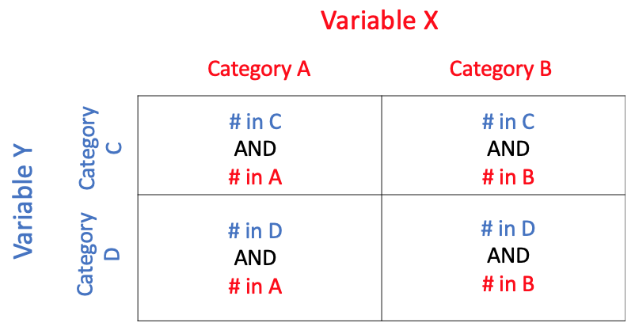
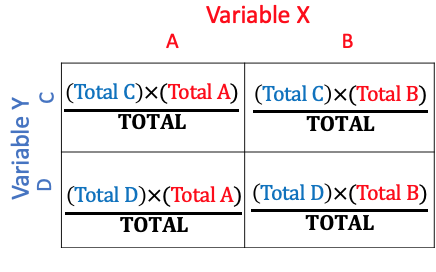
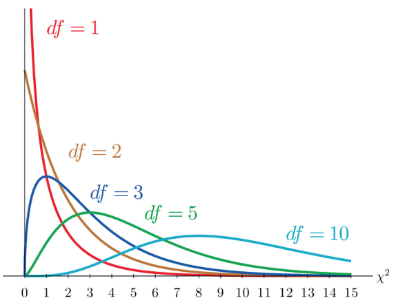
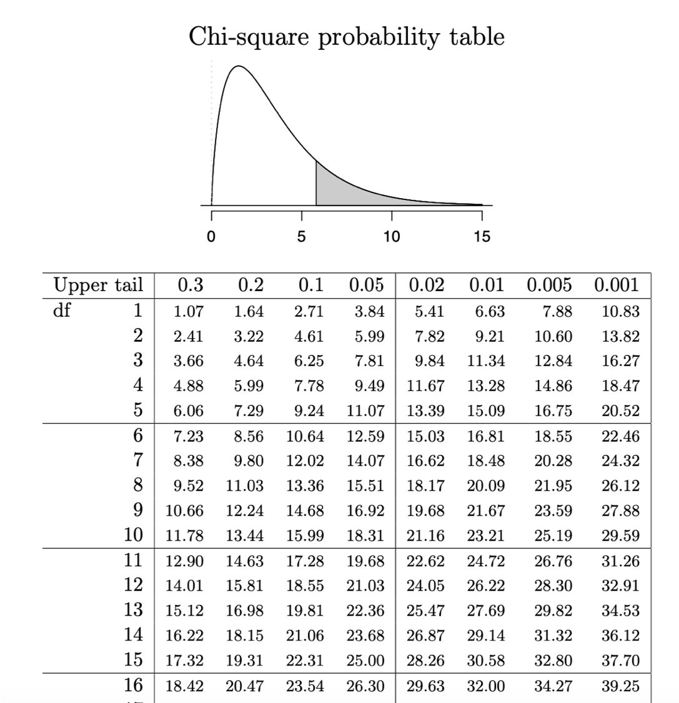
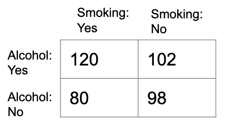
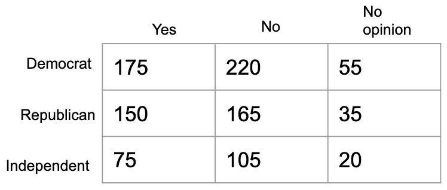

```{r setup, include = FALSE}
knitr::opts_chunk$set(echo = TRUE)
knitr::opts_chunk$set(cache=TRUE)
knitr::opts_chunk$set(fig.align='center', out.width="53%", warning=FALSE, fig.retina = 3)
```

```{r load libraries, include=FALSE, comment='#'}
#install.packages( 'tidyverse' )
#install.packages( 'readxl' )

library( tidyverse, quietly=T, warn.conflicts = F )
library( knitr, quietly=T, warn.conflicts = F )
library( readxl, quietly=T, warn.conflicts = F )
#library( tufte, quietly=T, warn.conflicts = F )
#library( quantmod, quietly=T, warn.conflicts = F )
library( WVPlots, quietly=T, warn.conflicts = F )
library(patchwork)

```

```{r reduce code spacing, include = FALSE}
hook1 <- function(x){ gsub("```\n*```r*\n*", "", x) }
hook2 <- function(x){ gsub("```\n+```\n", "", x) }
knit_hooks$set(document = hook2)
```

layout: true
class: 

<!-- Old footer font color: #00A895 -->
<!-- old footer background color: #383838 -->

<!-- footer -->
 <div style="position:fixed; bottom:10px; left:4px; font-size: 12pt; color: #2DD8A5; background-color: #545454; width:93.5%">&nbsp;&nbsp;&nbsp;&nbsp;&nbsp;Mary Ryan</div> <!--&nbsp;&nbsp;&nbsp;&nbsp;&nbsp;&nbsp;&nbsp;&nbsp;&nbsp;&nbsp;&nbsp;&nbsp;&nbsp;&nbsp;&nbsp;&nbsp;&nbsp;&nbsp;&nbsp;&nbsp;&nbsp;&nbsp;&nbsp;&nbsp;&nbsp;&nbsp;&nbsp;&nbsp;&nbsp;&nbsp;&nbsp;&nbsp;&nbsp;&nbsp;&nbsp;&nbsp;&nbsp;&nbsp;&nbsp;&nbsp;&nbsp;&nbsp;&nbsp;&nbsp;&nbsp;&nbsp;&nbsp;&nbsp;&nbsp;&nbsp;&nbsp;&nbsp;&nbsp;&nbsp;&nbsp;&nbsp;&nbsp; -->
<div style="position:fixed; bottom:10px; left:500px; font-size: 12pt; color: #2DD8A5">Inference for Categorical Data</div> <!--&nbsp;&nbsp;&nbsp;&nbsp;&nbsp;&nbsp;&nbsp;&nbsp;&nbsp;&nbsp;&nbsp;&nbsp;&nbsp;&nbsp;&nbsp;&nbsp;&nbsp;&nbsp;&nbsp;&nbsp;&nbsp;&nbsp;&nbsp;&nbsp;&nbsp;&nbsp;&nbsp;&nbsp;&nbsp;&nbsp;&nbsp;&nbsp;&nbsp;&nbsp;&nbsp;&nbsp;&nbsp;&nbsp;&nbsp;&nbsp;&nbsp;&nbsp;&nbsp;&nbsp;&nbsp;&nbsp;&nbsp;&nbsp;&nbsp;&nbsp;&nbsp;&nbsp;&nbsp;&nbsp;&nbsp;&nbsp;&nbsp; -->
<div style="position:fixed; bottom:10px; right:92px; font-size: 12pt; color: #2DD8A5">Stats 7</div>

---

<div style="position:fixed; left:50px; right:50px; top:125px; padding:30px; margin:auto; background-color:#C0F3E4; border-radius:15px">
<p>This class is being conducted over Zoom. As the instructor, I will be .alert[recording] this session. I have disabled the recording feature for others so that no one else will be able to record this session. I will be posting this session to the course’s website.</p>

<p>If you have privacy concerns and .alert[do not wish to appear in the recording], you may turn video off (click .alert[“stop video”]) so that Zoom does not record you.</p>

<p>The chat box is always open for discussion and questions to the entire class. You may also send messages privately to the instructor or the TAs. Please note that Zoom saves all chat transcripts.</p>

<p>I create a live transcription of each session using <a href="https://otter.ai/">Otter.ai</a>. This means that Otter.ai will transcribe anything spoken over the Zoom audio. The transcript will be posted with the session video on the course website.</p>
</div>

---

# Some Notes About Week 5 & Finals Week

- Final exam is next .alert[**Tuesday, Sept. 8 @ 1 p.m. PST**]
   - If you .alert[**have not**] heard from me this week and cannot make the original time, .alert[**email me as soon as possible**]
   
- Discussion Lab 5 this Friday will be a review. The discussion section will be recorded.

- Deadline to change grade option to pass/no pass is Friday, Sept. 4

- All extra credit work due by Tuesday, Sept. 8 @ 1 p.m. PST
   
- Finals week OH:
   - Mary
      - Sat., Sept. 5 @ 6 - 8 p.m. PST
   - Kyle
      - Sun., Sept. 6 @ 7:30 - 8:30 p.m. PST
      - Mon., Sept. 7 @ 7 - 9 p.m. PST
   - Jenifer
      - Fri., Sept. 5 @ 2 - 4 p.m. PST
      - Mon., Sept. 7 @ 2 - 4 p.m. PST

- Please fill out class evals!

---

class: title-slide2

# <center> Inference for Categorical Data </center>
## <center> Stats 7 </center>
### <center> Mary Ryan </center>
### .center[Sept. 3, 2020]

<!-- social media info -->
<div style="position:fixed; bottom:40px; left:70px;">
<p> Course website:</p>
<p><a href="https://canvas.eee.uci.edu/courses/28451"> https://canvas.eee.uci.edu/courses/28451 </a></p>

<p> Slides can be found at:</p>
</p><a href="https://maryryan.github.io/stats7-SS2-2020-slides/stats7-SS2-2020-chiSquared/stats7-SS2-2020-chiSquared"> https://maryryan.github.io/stats7-SS2-2020-slides/stats7-SS2-2020-chiSquared/stats7-SS2-2020-chiSquared </a></p>
</div>


---

# Learning Objectives

By the end of today's lecture, you should be able to:

- organize data from two categorical variables into a two-way table

- understand how to find expected counts under the assumption of independence between variables

- perform chi-squared hypothesis tests for indepdence

- draw appropriate conclusions for chi-squared tests in the context of the problem

---

# Organizing Categorical Data for Comparison

- In the last few lecture we've talked about how draw inference about populations using continuous quantitative data or a single binary variable

- What if we wanted to compare .alert2[**categorical**] variables, though?

   - For each variable, we can look at the number of observations (.alert[**counts**]) in each category
   
   - If we want to look at two variables at once, we can look at the number of observations that belong to one category of the first variabe and another category of the second variable
   
   - Can arrange counts into a .alert[**two-way table**] (AKA, .alert[**contingency table**])
   
.center[

]

---

# Comparing Two Categorical Variables

- When we compare categorical variables, we often want to study the .alert2[**relationship**] between them

   - Does being in one category of one variable influence what category from the second variable you're in?
   
   - Are the variables .alert[**independent**] or .alert[**dependent**]?
   
- How do we tell if variables are independent?

- Recall basic probability:

   - Events *A* and *B* are independent if:
   $$P(A\cap C) = P(A)\times P(C)$$
   
---

# Independence of Two Categorical Variables

**Events *A* and *B* are independent if $P(A\cap C) = P(A)\times P(C)$**

.pull-left-66[
- **P(category A of variable X)?**

$\begin{align}P(A) &= \frac{\text{(# in C AND # in A)} + \text{(# in D AND # in A)}}{\text{Total # observed in all categories}}\\&=\frac{\text{Total in A}}{\text{Total observed}}\end{align}$

<br>

- **P(category C of variable Y)?**

$\begin{align}P(C) &= \frac{\text{(# in C AND # in A)} + \text{(# in C AND # in B)}}{\text{Total # observed in all categories}}\\&=\frac{\text{Total in C}}{\text{Total observed}}\end{align}$
]

.pull-right-33[

<br>
<br>


]

---

# Independence of Two Categorical Variables

**Events *A* and *B* are independent if $P(A\cap C) = P(A)\times P(C)$**

**P(category A AND category C) if independent?**

$\begin{align}P(A \cap C) &= P(A) \times P(C)\\&= \frac{\text{(Total in A)}}{\text{Total # observed in all categories}} \times \frac{\text{(Total in C)}}{\text{Total # observed in all categories}}\\&= \frac{\text{(Total in A)}\times \text{(Total in C)}}{\text{(Total observed)}^2}\end{align}$
   
<br>

**Number of observations in A and C if independent?**

$\begin{align}P(A \cap C)\times \text{(Total observed)} &= \frac{\text{(Total in A)}\times \text{(Total in C)}}{\text{(Total observed)}^2}\times \text{(Total observed)}\\&= \frac{\text{(Total in A)}\times \text{(Total in C)}}{\text{(Total observed)}}\end{align}$


<div style="position:fixed; right:25px; top:50px">

</div>

<div style="position:fixed; right:125px; top:275px">

</div>

<div style="position:fixed; right:25px; bottom:50px">

</div>


---

# Independence of Two Categorical Variables

- So if your table of data matches the table of counts we would expect to get if two variables are independent, then can conclude variables are independent!


.center[

]

- But we're sampling, and we rarely get *exactly* our expected values. And what if some counts match but others don't?

--

- How do we know when counts are close enough to expected for the variables to be considered .alert2[**independent**]?

- How do we when counts are far away enough from expected for the variables to be considered .alert2[**not independent**]?

--

- We determine this relationship through a .alert[**Chi-Squared Test for Independence**]

---

# Chi-Squared Test for Independence: Hypotheses

- We are looking to see if there is a .alert2[**non-independent relationship**] between the two variables

   - For .alert[**null hypothesis**] ( $H_0$ ), we will assume there is no relationship, or the variables are .alert2[**independent**]

   - For .alert[**alternative hypothesis**] ( $H_A$ ), we will find evidence that there is some kind of relationship, or the variables are .alert2[**not independent**]

$$H_0: \text{ variable X and variable Y are independent}$$
$$H_A: \text{ variable X and variable Y are not independent}$$

---

# Chi-Squared Test for Independence: Test Statistic

- In other hypothesis testing scenarios, we used a .alert[**test statistic**] to help us determine whether our data would be too weird to see if $H_0$ was true

   - Z-statistics, T-statistics
   
- Here we use a .alert[**chi-squared statistic**] ( $\chi^2$ )

$$\begin{align}
\chi^2 &= \frac{\left[(\text{observed counts for being in category A and category C}) - (\text{expected counts for category A and C})\right]^2}{(\text{observed counts for category A and  C})}\\
&+ ... +\\
& + \frac{\left[(\text{observed counts for category B and D}) - (\text{expected counts for category B and  D})\right]^2}{(\text{observed counts for category B and D})}\\
\end{align}$$

- If $\chi^2 = 0$, variables X and Y are perfectly .alert2[**independent**]

- As $\chi^2$ gets bigger, we are accruing more and more evidence that X and Y are .alert2[**not independent**]

- $\chi^2$ will also be bigger if we have more categories to compare

---

# Chi-Squared Test for Independence: Chi-Squared Distribution

.pull-left-66[

- $\chi^2$ follows a Chi-squared distribution

   - Shape of the distribution controlled by .alert2[**degrees of freedom**]
   
]

.pull-right-33[

]

.center[
$\begin{align}\text{degrees of freedom} &= (\text{# rows in two-way table} - 1)\times (\text{# columns in two-way table} - 1)\\&=(\text{# categories in variable X} - 1)\times (\text{# categories in variable Y} - 1)\end{align}$
]

---

# Chi-Squared Test for Independence: Critical Value

.pull-left[
- How do we know when $\chi^2$ is big enough to reject $H_0$ ?

   - Look up critical value, $\chi^{2*}$ , in chi-squared table

1. Find row with correct degrees of freedom

2. Find column with desired probability of statistics being more extreme
   - Want this to be small, so usually choose 0.05
   
]
   
.pull-right[



]

---

# Chi-Squared Test for Independence: Decision

- If your test statistic $\chi^2$ > critical value $\chi^{2*}$, .alert[**reject the null hypothesis**]

   - We have sufficient evidence to conclude that variables X and Y are .alert2[**not independent**]
   
   - The category you are in for variable X will influence what category you're in for variable Y

- If your test statistic $\chi^2$ < critical value $\chi^{2*}$, .alert[**fail-to-reject the null hypothesis**]

   - We .alert2[**do not**] have sufficient evidence to conclude that variables X and Y are .alert2[**not independent**]
   
   - The category you are in for variable X will likely not influence what category you're in for variable Y
   
---

# Example: Alcohol & Smoking

.pull-left-66[
A social study was conducted to see if hard alcohol consumption (yes or no) and cigarette (traditional or electronic) smoking (yes or no) were linked. 400 subjects were sampled.
]

.pull-right-33[

]

- What are our hypotheses?

---

# Example: Alcohol & Smoking

.pull-left-66[
A social study was conducted to see if hard alcohol consumption (yes or no) and cigarette (traditional or electronic) smoking (yes or no) were linked. 400 subjects were sampled.
]

.pull-right-33[

]

- Find the expected count table.

---

# Example: Alcohol & Smoking

.pull-left-66[
A social study was conducted to see if hard alcohol consumption (yes or no) and cigarette (traditional or electronic) smoking (yes or no) were linked. 400 subjects were sampled.
]

.pull-right-33[

]

- Calculate the test statistic. Find the critical value.

---

# Example: Alcohol & Smoking

.pull-left-66[
A social study was conducted to see if hard alcohol consumption (yes or no) and cigarette (traditional or electronic) smoking (yes or no) were linked. 400 subjects were sampled.
]

.pull-right-33[

]

- Decision?

---

# Example: Party Confidence

.pull-left-66[
In a nationwide telephone poll of 1,000 adults representing Democrats, Republicans, and Independents, respondents were asked 2 questions: their party affiliation and if their confidence in the U.S. banking system had been shaken by the 2008 financial crisis.
]

.pull-right-33[

]

- What are our hypotheses?

---

# Example: Party Confidence

.pull-left-66[
In a nationwide telephone poll of 1,000 adults representing Democrats, Republicans, and Independents, respondents were asked 2 questions: their party affiliation and if their confidence in the U.S. banking system had been shaken by the 2008 financial crisis.
]

.pull-right-33[

]

- Find the expected count table.

---

# Example: Party Confidence

.pull-left-66[
In a nationwide telephone poll of 1,000 adults representing Democrats, Republicans, and Independents, respondents were asked 2 questions: their party affiliation and if their confidence in the U.S. banking system had been shaken by the 2008 financial crisis.
]

.pull-right-33[

]

- Calculate the test statistic. Find the critical value.

---

# Example: Party Confidence

.pull-left-66[
In a nationwide telephone poll of 1,000 adults representing Democrats, Republicans, and Independents, respondents were asked 2 questions: their party affiliation and if their confidence in the U.S. banking system had been shaken by the 2008 financial crisis.
]

.pull-right-33[

]

- Decision?

