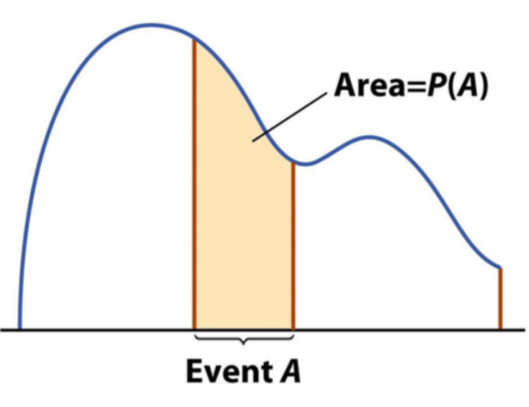
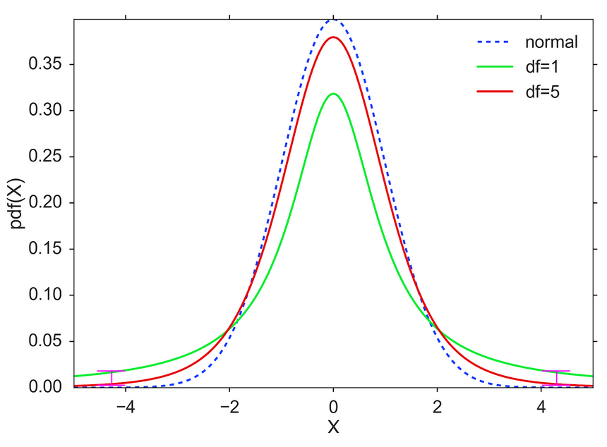

```{r setup, include = FALSE}
knitr::opts_chunk$set(echo = TRUE)
knitr::opts_chunk$set(cache=TRUE)
knitr::opts_chunk$set(fig.align='center', out.width="63%", warning=FALSE, fig.retina=3)
```

```{r load libraries, include=FALSE, comment='#'}
#install.packages( 'tidyverse' )
#install.packages( 'readxl' )

library( tidyverse, quietly=T, warn.conflicts = F )
library( knitr, quietly=T, warn.conflicts = F )
library( readxl, quietly=T, warn.conflicts = F )
#library( tufte, quietly=T, warn.conflicts = F )
#library( quantmod, quietly=T, warn.conflicts = F )
library( patchwork )

```

```{r reduce code spacing, include = FALSE}
hook1 <- function(x){ gsub("```\n*```r*\n*", "", x) }
hook2 <- function(x){ gsub("```\n+```\n", "", x) }
knit_hooks$set(document = hook2)
```


layout: true
class: 

<!-- Old footer font color: #00A895 -->
<!-- old footer background color: #383838 -->

<!-- footer -->
 <div style="position:fixed; bottom:10px; left:4px; font-size: 12pt; color: #17f9b4; background-color: #545454; width:93.5%">&nbsp;&nbsp;&nbsp;&nbsp;&nbsp;Mary Ryan</div> <!--&nbsp;&nbsp;&nbsp;&nbsp;&nbsp;&nbsp;&nbsp;&nbsp;&nbsp;&nbsp;&nbsp;&nbsp;&nbsp;&nbsp;&nbsp;&nbsp;&nbsp;&nbsp;&nbsp;&nbsp;&nbsp;&nbsp;&nbsp;&nbsp;&nbsp;&nbsp;&nbsp;&nbsp;&nbsp;&nbsp;&nbsp;&nbsp;&nbsp;&nbsp;&nbsp;&nbsp;&nbsp;&nbsp;&nbsp;&nbsp;&nbsp;&nbsp;&nbsp;&nbsp;&nbsp;&nbsp;&nbsp;&nbsp;&nbsp;&nbsp;&nbsp;&nbsp;&nbsp;&nbsp;&nbsp;&nbsp;&nbsp; -->
<div style="position:fixed; bottom:10px; left:500px; font-size: 12pt; color: #17f9b4">Continuous Distributions</div> <!--&nbsp;&nbsp;&nbsp;&nbsp;&nbsp;&nbsp;&nbsp;&nbsp;&nbsp;&nbsp;&nbsp;&nbsp;&nbsp;&nbsp;&nbsp;&nbsp;&nbsp;&nbsp;&nbsp;&nbsp;&nbsp;&nbsp;&nbsp;&nbsp;&nbsp;&nbsp;&nbsp;&nbsp;&nbsp;&nbsp;&nbsp;&nbsp;&nbsp;&nbsp;&nbsp;&nbsp;&nbsp;&nbsp;&nbsp;&nbsp;&nbsp;&nbsp;&nbsp;&nbsp;&nbsp;&nbsp;&nbsp;&nbsp;&nbsp;&nbsp;&nbsp;&nbsp;&nbsp;&nbsp;&nbsp;&nbsp;&nbsp; -->
<div style="position:fixed; bottom:10px; right:92px; font-size: 12pt; color: #17f9b4">Stats 7</div>

<!-- Recording Notice Slide -->
---

<div style="position:fixed; left:50px; right:50px; top:125px; padding:30px; margin:auto; background-color:#C0F3E4; border-radius:15px">
<p>This class is being conducted over Zoom. As the instructor, I will be .alert[recording] this session. I have disabled the recording feature for others so that no one else will be able to record this session. I will be posting this session to the course’s website.</p>

<p>If you have privacy concerns and .alert[do not wish to appear in the recording], you may turn video off (click .alert[“stop video”]) so that Zoom does not record you.</p>

<p>The chat box is always open for discussion and questions to the entire class. You may also send messages privately to the instructor or the TAs. Please note that Zoom saves all chat transcripts.</p>

<p>I create a live transcription of each session using <a href="https://otter.ai/">Otter.ai</a>. This means that Otter.ai will transcribe anything spoken over the Zoom audio. The transcript will be posted with the session video on the course website.</p>
</div>

<!-- Title Slide -->
---

class: title-slide2

# <center> Continuous Probability Distributions </center>
## <center> Stats 7 </center>
### <center> Mary Ryan </center>
### .center[Aug. 25, 2020]

<!-- social media info -->
<div style="position:fixed; bottom:40px; left:70px;">
<p> Course website:</p>
<p><a href="https://canvas.eee.uci.edu/courses/28451"> https://canvas.eee.uci.edu/courses/28451 </a></p>

<p> Slides can be found at:</p>
</p><a href="https://maryryan.github.io/stats7-SS2-2020-slides/stats7-SS2-2020-samplingBias/stats7-SS2-2020-samplingBias"> https://maryryan.github.io/stats7-SS2-2020-slides/stats7-SS2-2020-contDist/stats7-SS2-2020-contDist</a></p>
</div>


---

# Probability Distributions

- Remember from last week: we might want to know the probability of an event, but have no data

   - Might be useful to apply a .alert[**probability model**] or .alert[**probability distribution**]

   - Existing framework with .alert2[**known properties**], given that certain .alert2[**conditions**] apply
   
   - Each distribution has formulae for calculating probability
   
   - Different types of models for .alert2[**discrete**] and .alert2[**continuous**] variables
   
      - Today we'll focus on continuous random variables
      
---

# Continuous Random Variables

- Like continuous data types, continuous random variables are variables that take on numerical values that can go out to .alert2[**infinite decimal points**]

- Continuous sample spaces have an .alert2[**infinite number of outcomes**] over an interval of values

   - But the probability over certain segments of those sample spaces are not necessarily constant
   
   - We use .alert[**density curves**] to visualize where probability mass lies
   
   - The more probability mass an interval has, the more likely it is to happen!

---

# Probability Density Curves

.pull-left[
- Events are defined over an .alert2[**interval or range of values**]
   - $a \le X < b$ , $X \ge a$ , $X < b$

- Probability is defined as the .alert2[**area under the curve**] of certain portions of the density curve

- The area under the entire curve will be equal to 1 (or 100% of some event in the entire sample space occurring)

- The area under one specific value is 0 -- therefore .alert2[**the probability of an event being exactly a certain value is 0.**]
]

.pull-right[

]

---

# Density Curves & Probability Density Functions

- The shape of a density curve is defined by something called a .alert[**probability density function**], or pdf

- The pdf is the continuous equivalent of the probability equations we saw for discrete distributions

- The pdf will also help us find the area under the curve for the specific area we want -- just integrate!

   - This might take quite a bit of math, though, so we often just have a computer calculate the probabilities for us
   
---

# Continuous Uniform Distribution

- The most simple continuous distribution we might think of is one where all events defined on .alert2[**intervals of equal length**] have an equal probability of happening

--

- Applies to .alert2[**continuous**] random variables

   - Variables can take on values that exist between some number *a* and another number *b*
   - Intervals of equal length are .alert2[**equally likely**] to happen
   - Defined by the minimum value the variable can take on (*a*) and the maximum value it can take on (*b*)

.content-box-teal[
- Some properties:
   - $P(X<x) = \int_a^x \frac{x-a}{b-a}$dx
   - $E(X) = \frac{a+b}{2}$
   - $Var(X) = \frac{(b-a)^2}{12}$
]
   
- Arrival time of a package you're told will be delivered between 3 pm and 5 pm

<div style="position:fixed; bottom:50px; right:-550px;">
```{r uniform, echo=FALSE, message=FALSE, out.width="20%"}
uni <- runif(1000000,1,10)

uni %>% 
   as.data.frame() %>% 
   ggplot(aes(x=.))+
   geom_histogram(color="white")+
   theme( axis.text = element_text(size=12),
          axis.title = element_text(size=16)
   )+
   theme_minimal()
```

</div>

---

# Example: Waiting for the Bus

<div style="position:relative;float:left; width:75%">
We are waiting at a bus stop for a bus that comes once per hour. We do not know what time the bus came last, so we could have just missed it or it might be just about to arrive. The time we will wait for the bus is uniformly distributed, with a minimum wait time of 0 minutes and a maximum wait time of 60 minutes.

</div>


<div style="position:relative; top:-75px; right:-20px;">

</div>


- What is the probability that you will have to wait between 15 and 20 minutes for the bus?

<br>
<br>
<br>


- What’s the probability you will have to wait more than 40 minutes for the bus?

<br>
<br>
<br>

- How long might we expect to wait for the bus?


---

# Normal Distribution

- Applies to .alert2[**continuous**] random variables

   - Variables can take on values that exist between $\infty$ and $-\infty$ (we fudge this condition a lot in real life)
   - Defined by the mean, $\mu$, and variance, $\sigma^2$
   - Intervals .alert2[**near the mean more likely**] to happen than intervals near "tails"

.content-box-teal[
- Some properties:
   - $P(X<u) = \int_{-\infty}^u \frac{1}{\sigma\sqrt{2\pi}}e^{-\frac{(x-\mu)^2}{2\sigma^2}} dx$
   - $E(X) = \mu$
   - $Var(X) = \sigma^2$
]

<div style="position:absolute; right:-550px; top:0px">
```{r, echo=FALSE, out.width="17%"}
a <- rnorm(1000000, 0, 1)
par(mar=c(2,2,2,2))
a %>% 
   as.data.frame() %>% 
   ggplot(aes(x=.)) +
   geom_density() +
   geom_vline(xintercept=0)+
   geom_segment(aes(x = 0, y = 0.25, xend = 0.99, yend = 0.25))+
   annotate("text", label="")+
   xlab("") +
   ylab("") +
   theme_minimal()+
   theme(axis.text.x=element_blank(),
        axis.ticks.x=element_blank())+
   annotate("text", x=0, y=0, label=expression(mu), vjust=1, size=8)+
   annotate("text", x=0.5, y=0.27, label=expression(sigma), size=8)+
   coord_cartesian(expand=F, clip = "off") # added clip = "off"

```

</div>
--

<div style="position:fixed; right:400px; top:300px">

</div>

---

# Normal Distribution

.pull-left[
- $\mu$ and $\sigma$ affect the shape of the distribution

   - Increasing or decreasing $\mu$ shifts the distribution right to left
   
   - Increasing or decreasing $\sigma$ makes the distribution taller/narrower or shorter/fatter
]

.pull-right[
```{r mu and sigma shift, echo=FALSE, out.width="100%"}
a <- rnorm(100000, 0, 1)
b <- rnorm(100000, 5, 1)
c <- rnorm(100000, -5, 1)

mu.df <- data.frame(cbind(rep(c(0,5,-5), each=100000), c(a,b,c)))

mu.df <- mu.df %>% 
   mutate(X1 = factor(X1))

par(mar=c(2,2,2,2))

mu.p <- mu.df %>% 
   #as.data.frame() %>% 
   ggplot(aes(x=X2, fill=X1)) +
   geom_density(alpha=0.5) +
   xlab("") +
   ylab("") +
   theme_minimal()+
   guides(fill=guide_legend(title="μ = "))

d <- rnorm(100000, 0, 1)
e <- rnorm(100000, 0, 2)
f <- rnorm(100000, 0, 5)

sig.df <- data.frame(cbind(rep(c(1,2,5), each=100000), c(d,e,f)))

sig.df <- sig.df %>% 
   mutate(X1 = factor(X1))

par(mar=c(2,2,2,2))

sig.p <- sig.df %>% 
   #as.data.frame() %>% 
   ggplot(aes(x=X2, fill=X1)) +
   geom_density(alpha=0.5) +
   xlab("") +
   ylab("") +
   theme_minimal()+
   guides(fill=guide_legend(title="σ = "))

mu.p/sig.p

```

]

---

# Calculator: normalcdf()

To get to the calculator function on a TI-84:
- 2nd DISTR > 2: normalcdf(

To calculate P(X $\le$ a):
- normalcdf( $\mu$ , $\sigma$ , -1E99,a)

To calculate P(X $\ge$ a):
- normalcdf( $\mu$ , $\sigma$ , a, 1E99)

To calculate P(a $\le$ X $\le$ b):
- normalcdf( $\mu$ , $\sigma$ , a, b)

---

# Example 1: SAT

The Scholastic Assessment Test (SAT) is a standardized test that's (was?🤞) widely used by colleges and universities to help make admission decisions. Scores can range 400 to 1600. SAT scores have a mean of 1,100 and a standard deviation of 200.

- What is the probability someones scores at least a 1,300?

---

# Example 1: SAT

The Scholastic Assessment Test (SAT) is a standardized test that's (was?🤞) widely used by colleges and universities to help make admission decisions. Scores can range 400 to 1600. SAT scores have a mean of 1,100 and a standard deviation of 200.

- What is the probability someones scores lower than an 800?

---

# Example 1: SAT

The Scholastic Assessment Test (SAT) is a standardized test that's (was?🤞) widely used by colleges and universities to help make admission decisions. Scores can range 400 to 1600. SAT scores have a mean of 1,100 and a standard deviation of 200.

- What is the probability someones scores between a 900 and a 1,200?


---

# Calculator: invNorm()

If we have a .alert2[**percentile**], and want to find the cut off value corresponding to that percentile, we use invNorm().

To get to the calculator function on a TI-84:
- 2nd DISTR > 3: invNorm(

To calculate the cut off value for the a$^{th}$ percentile (a% of the data is smaller than the cutoff):
- invNorm( $\frac{a}{100}$ , $\mu$ , $\sigma$ )

---

# Example 1: SAT

The Scholastic Assessment Test (SAT) is a standardized test that's (was?🤞) widely used by colleges and universities to help make admission decisions. Scores can range 400 to 1600. SAT scores have a mean of 1,100 and a standard deviation of 200.

- For what score are 90% of all other scores below?


---

# Example: Hyena Bite Strength

<div style="position:relative;float:left; width:75%">
Hyena bite strength is thought to follow a normal distribution, with a mean of 1,000 psi and a standard deviation of 300 psi. For comparison, humans have a bite strength of 171 psi when using the molars.
</div>

<div style="position:relative; top:-75px; right:-20px;">

</div>

- What’s the probability that a randomly selected hyena will have a bite strength greater than 852 psi?

---

# Example: Hyena Bite Strength

<div style="position:relative;float:left; width:75%">
Hyena bite strength is thought to follow a normal distribution, with a mean of 1,000 psi and a standard deviation of 300 psi. For comparison, humans have a bite strength of 171 psi when using the molars.
</div>

<div style="position:relative; top:-75px; right:-20px;">

</div>

- What’s the probability that a hyena will have a bite strength between 910 psi and 1,067 psi?

---

# Example: Hyena Bite Strength

<div style="position:relative;float:left; width:75%">
Hyena bite strength is thought to follow a normal distribution, with a mean of 1,000 psi and a standard deviation of 300 psi. For comparison, humans have a bite strength of 171 psi when using the molars.
</div>

<div style="position:relative; top:-75px; right:-20px;">

</div>

- The top 15% of hyenas will have a bite strength greater than what?

---

# Example: Hyena Bite Strength

<div style="position:relative;float:left; width:75%">
Hyena bite strength is thought to follow a normal distribution, with a mean of 1,000 psi and a standard deviation of 300 psi. For comparison, humans have a bite strength of 171 psi when using the molars.
</div>

<div style="position:relative; top:-75px; right:-20px;">

</div>

- The middle 40% of hyneas will have a bite strength between what psi’s?

---

# Standard Normal Distribution

- The .alert[**standard Normal distribution**] is a Normal distribution with a mean of 0 and a variance of 1:
$$X \sim N(\mu=0, \sigma^2=1)$$

- If a random variable *X* follows a different type of Normal distribution, we can always .alert2[**transform**] it so its transformation follows a standard Normal distribution

--

.content-box-teal[
- We call this transformation a .alert[**Z score**] or .alert[**Z statistic**]:
$$Z = \frac{x - \mu}{\sigma}$$
$$Z \sim N(0,1)$$
]

---

# Z Scores

- Z scores are nice because we can look at them and approximately know where it sits on its distribution

- If $\mu \ne 0$ or $\sigma^2 \ne 1$ , it's harder to figure out where *X* is
   
--

.pull-left[
- A Z score of 1 means that *X* is 1 standard deviation above its mean

- A Z score of -2 means means that *X* is 2 standard deviations below its mean
]


<div style="position:absolute; right: -450px; top: 180px">
```{r, echo=FALSE, out.width="30%"}
a <- rnorm(100000, 0, 1)

#par(mar=c(2,2,2,2))

p1 <- a %>% 
   as.data.frame() %>% 
   ggplot(aes(x=.)) +
   geom_density() +
   geom_vline(xintercept=1)+
   xlab("") +
   ylab("") +
   theme_minimal()+
   annotate("text", x=1, y=0, label="X = 1", vjust=2, size=6)+
   coord_cartesian(expand=F, clip = "off")

p2 <- a %>% 
   as.data.frame() %>% 
   ggplot(aes(x=.)) +
   geom_density() +
   geom_vline(xintercept=-2)+
   xlab("") +
   ylab("") +
   theme_minimal()+
   annotate("text", x=-2, y=0, label="Z = -2", vjust=2, size=6)+
   coord_cartesian(expand=F, clip = "off")


p1|p2

```

</div>

---

# Why Z Scores?

- Before calculators, it was a real pain to find the probability of events with the Normal distribution

   - Integrating this by hand
   $$\int_{-\infty}^u \frac{1}{\sigma\sqrt{2\pi}}e^{-\frac{(x-\mu)^2}{2\sigma^2}} dx$$
   was gnarly
   
- Statisticians came up with Z scores to get out of making those calculations by hand all the time

   - Simply have someone find and write down $P(Z<z)$ for a whole bunch of values of *z* where *Z* follows a N(0,1)
   
   - Now by transforming an observation from a different Normal distribution to a Z score, we can just look up the probabilty of the Z score!
   
--

- This $Z = \frac{x - \mu}{\sigma}$ was way easier to deal with than this
$\int_{-\infty}^u \frac{1}{\sigma\sqrt{2\pi}}e^{-\frac{(x-\mu)^2}{2\sigma^2}} dx$

---

# Reading a Z Table

---

# Example 1

What is the Z-score for a random variable coming from a Normal distribution with a mean of 18 and standard deviation of 3, which takes on a value of 13?

---

# Example 2

What is the Z-score for a random variable coming from a Normal distribution with a mean of -32 and standard deviation of 6.8, which takes on a value of -46?

---

# Example 3

What is the Z-score for a random variable coming from a Normal distribution with a mean of 248 and standard deviation of 57, which takes on a value of 689?

---

# Steps for a Normal Probability Problem

1. Draw the distribution

2. Write in the Z scale

3. Mark the probability interval you want to find

4. Calculate the Z-score

5. Use your calculator/Z-table to find the probability

---

# Example: CD4+ Count

CD4+ count is an indicator of immune function. Decreasing CD4+ count indicates poor immune function. In the 1970s, men at high risk of contracting HIV were enrolled into a study to see if changes in their CD4+ count corresponded with seroconversion (time at which they officially contract HIV). CD4+ count is normally distributed in humans, with a mean of 1,300 and a standard deviation of 400.

- What is the probability that someone’s CD4+ count is less than 700?

---

# Example: CD4+ Count

CD4+ count is an indicator of immune function. Decreasing CD4+ count indicates poor immune function. In the 1970s, men at high risk of contracting HIV were enrolled into a study to see if changes in their CD4+ count corresponded with seroconversion (time at which they officially contract HIV). CD4+ count is normally distributed in humans, with a mean of 1,300 and a standard deviation of 400.

- What is the probability that someone's CD4+ count is greater than 1,400?

---

# Example: CD4+ Count

CD4+ count is an indicator of immune function. Decreasing CD4+ count indicates poor immune function. In the 1970s, men at high risk of contracting HIV were enrolled into a study to see if changes in their CD4+ count corresponded with seroconversion (time at which they officially contract HIV). CD4+ count is normally distributed in humans, with a mean of 1,300 and a standard deviation of 400.

- What is the probability that someone’s CD4+ count is between 1,200 and 1,600?

---

# Variability in Sampling

- Two research groups are interested in the mean height of giraffes

--

- Both groups go out independently and gather a simple random sample of 200 giraffes and measure them

--

.pull-left[
.content-box-teal[
Group 1 gets an sample mean of 17.32 feet.
]
]

.pull-right[
.content-box-pink[
 Group 2 gets a sample mean of 18.75 feet
]
]

--

.center[
**Who is correct?**
]

---

# Sampling Distributions

- Because samples do not include every member of the population, there will be some .alert2[**variation**] in the value a sample's mean will take on

- As your sample size gets .alert2[**bigger**], there should be .alert2[**less variation**] because you are included a larger portion of the population

   - When your sample includes the whole population, there should be .alert2[**no variation**] at all

--

- In a way, your sample mean follows a distribution...

   - We call this a .alert[**sampling distribution**]
   
--

- But what distribution does your sample mean follow?

---

# Central Limit Theorem

.content-box-teal[
When

1) observations are .alert[**independent**], and 

2) the sample size is .alert[**sufficiently large**],

the sample mean $\bar{x}$ will follow a .alert[**Normal distribution**] with mean $\mu$ and standard deviation $\frac{\sigma}{\sqrt{n}}$:

$$\bar{x} \sim N \left(\mu, \frac{\sigma^2}{n}\right)$$
]

--

- Notice that the variance depends on your sample size, n
   
   - As .alert2[**n increases**], the variance of the sampling distribution of $\bar{x}$ .alert2[**decreases**]

---

# Example 1: SAT

Remember that SAT scores are Normally distributed with a population mean score of 1,100 and a population standard deviation of 200.

- If we gather a random sample of .alert2[**40**] scores, what distribution would the sample mean of those scores follow?


---


# Example 1: SAT

Remember that SAT scores are Normally distributed with a population mean score of 1,100 and a population standard deviation of 200.

- If we gather a random sample of .alert2[**100**] scores, what distribution would the sample mean of those scores follow?

---

# Example 1: SAT

Remember that SAT scores are Normally distributed with a population mean score of 1,100 and a population standard deviation of 200.

- If we gather a random sample of .alert2[**500**] scores, what distribution would the sample mean of those scores follow?

---

# How Big Is Big Enough?

Well, it depends on your data...

- Nearly normal data, no clear outliers: $n \ge 10$

- Not sure what distributions the observations come from, no clear outliers: $n \ge 30$

---

# CLT with Proportions

- One of the greatest things about CLT is that .alert2[**we don't have to know what distribution our observations come from**] in order to apply it

   - As long as the observations are independent and our sample size is large enough, we're good!
   
- Particularly, if we are dealing with count data to get proportions, this "large enough" means:

$$np \ge 10 \text{ and } n(1-p) \ge 10$$

- If we have binomial data and we want to estimate the sample proportion of successes, $\hat{p}$, we simply need to remember what the mean and variance of a binomial distribution is to find the sampling distribution.

--

   - Remember: E(X) = p, Var(X) = p(1-p)
   
--

.content-box-teal[
$$\hat{p} \sim N \left(p, \frac{p(1-p)}{n} \right)$$
]

---

# Binomial CLT example 1

---

# Binomial CLT example 2

---

# Estimating Variance

- All the distributions we've talked about so far have assumed we know what the population variance is

--

   - You're telling me we're estimating the population mean with a sample mean, but we always know the population variance?
   
--
  
.center[]

--

- Then do we get a Z score if we replace $\sigma$ with *s*?

$$\frac{\bar{x} - \mu}{\frac{s}{\sqrt{n}}} = ?$$


---

# The T Distribution

.pull-left[
- When we replace $\sigma$ with *s*, we get a .alert[**T score**]:
$$T = \frac{\bar{x} - \mu}{\frac{s}{\sqrt{n}}}$$

- The T score follows the .alert[**T distribution**]:
$$t \sim T(df=n-1)$$
   
- Always centered with a mean of 0 (like a standard Normal)
   
- Shape defined by .alert[**degrees of freedom**] (df) = n-1
   
   - The more degrees of freedom, the more the distribution looks like a standard Normal
   
- Designed to give you a little more wiggle room than a regular Normal distribution, to account for you also estimating the standard deviation
   
]



---

# Calculator: tcdf()

To get to the calculator function on a TI-84:
- 2nd DISTR > 6: tcdf(

To calculate P(X $\le$ a):
- tcdf(-1E99,a,df)

To calculate P(X $\ge$ a):
- tcdf(a,1E99,df)

To calculate P(a $\le$ X $\le$ b):
- tcdf(a,b,df)

---

# Calculator: invT()

If we have a .alert2[**percentile**], and want to find the cut off value corresponding to that percentile, we use invT().

To get to the calculator function on a TI-84:
- 2nd DISTR > 4: invT(

To calculate the cut off value for the a$^{th}$ percentile (a% of the data is smaller than the cutoff):
- invT( $\frac{a}{100}$ , df )


---

# T score example 1

---

# T score example 2

---

# T score example 3