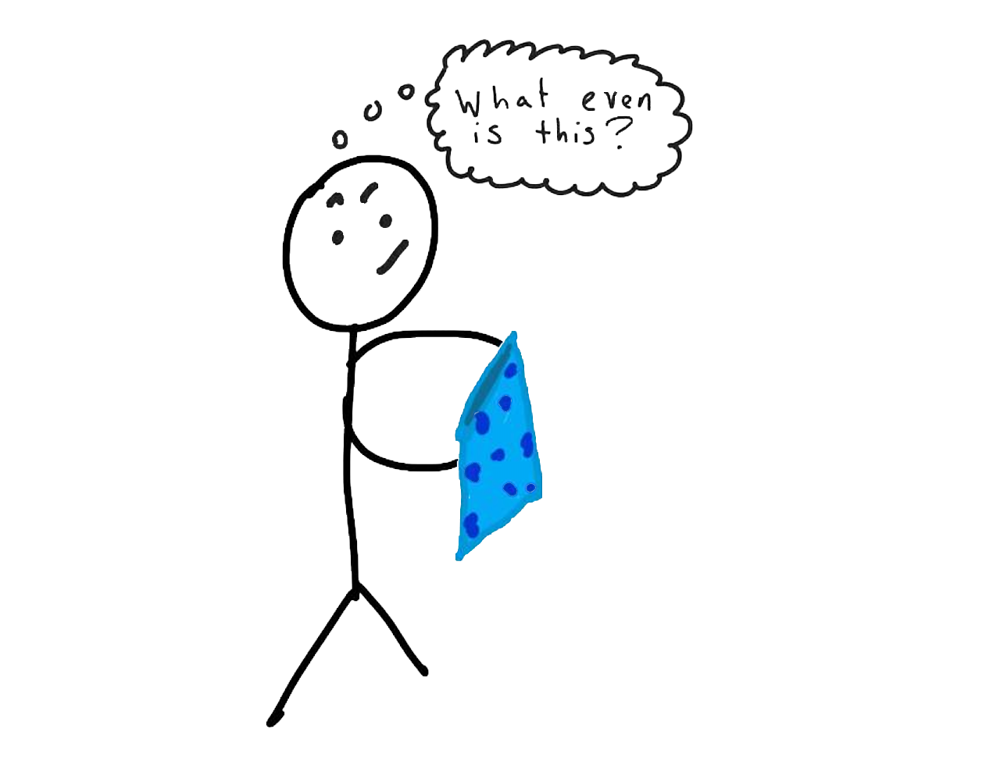
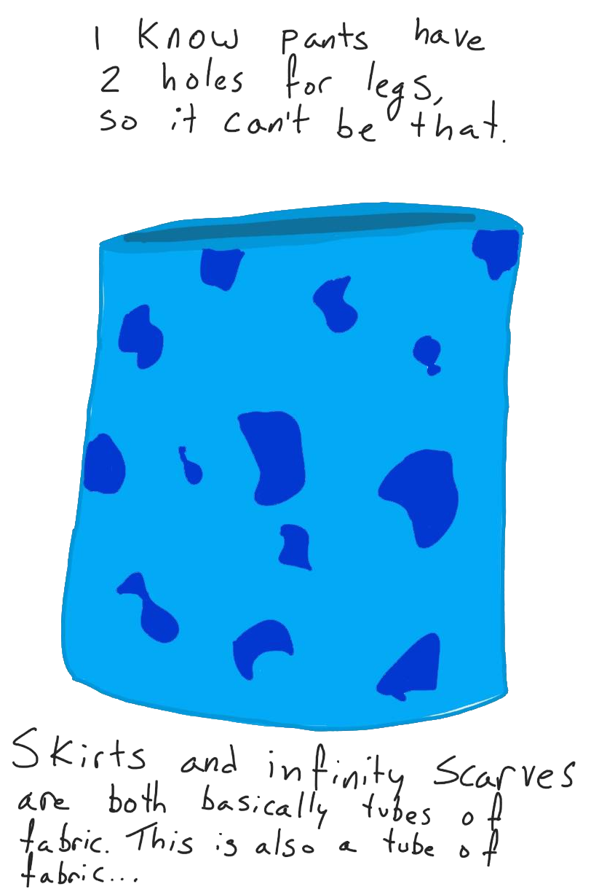
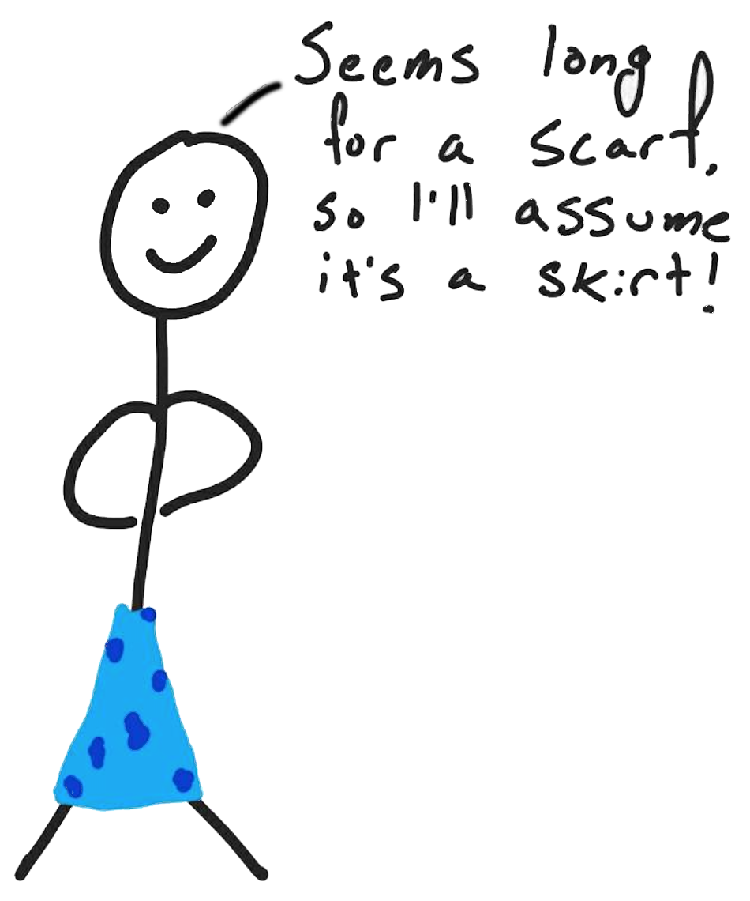

```{r setup, include = FALSE}
knitr::opts_chunk$set(echo = TRUE)
knitr::opts_chunk$set(cache=TRUE)
knitr::opts_chunk$set(fig.align='center', out.width="63%", warning=FALSE)
```

```{r load libraries, include=FALSE, comment='#'}
#install.packages( 'tidyverse' )
#install.packages( 'readxl' )

library( tidyverse, quietly=T, warn.conflicts = F )
library( knitr, quietly=T, warn.conflicts = F )
library( readxl, quietly=T, warn.conflicts = F )
#library( tufte, quietly=T, warn.conflicts = F )
library( quantmod, quietly=T, warn.conflicts = F )

```

```{r reduce code spacing, include = FALSE}
hook1 <- function(x){ gsub("```\n*```r*\n*", "", x) }
hook2 <- function(x){ gsub("```\n+```\n", "", x) }
knit_hooks$set(document = hook2)
```


layout: true
class: 

<!-- Old footer font color: #00A895 -->
<!-- old footer background color: #383838 -->

<!-- footer -->
 <div style="position:fixed; bottom:10px; left:4px; font-size: 12pt; color: #17f9b4; background-color: #545454; width:93.5%">&nbsp;&nbsp;&nbsp;&nbsp;&nbsp;Mary Ryan</div> <!--&nbsp;&nbsp;&nbsp;&nbsp;&nbsp;&nbsp;&nbsp;&nbsp;&nbsp;&nbsp;&nbsp;&nbsp;&nbsp;&nbsp;&nbsp;&nbsp;&nbsp;&nbsp;&nbsp;&nbsp;&nbsp;&nbsp;&nbsp;&nbsp;&nbsp;&nbsp;&nbsp;&nbsp;&nbsp;&nbsp;&nbsp;&nbsp;&nbsp;&nbsp;&nbsp;&nbsp;&nbsp;&nbsp;&nbsp;&nbsp;&nbsp;&nbsp;&nbsp;&nbsp;&nbsp;&nbsp;&nbsp;&nbsp;&nbsp;&nbsp;&nbsp;&nbsp;&nbsp;&nbsp;&nbsp;&nbsp;&nbsp; -->
<div style="position:fixed; bottom:10px; left:500px; font-size: 12pt; color: #17f9b4">Discrete Distributions</div> <!--&nbsp;&nbsp;&nbsp;&nbsp;&nbsp;&nbsp;&nbsp;&nbsp;&nbsp;&nbsp;&nbsp;&nbsp;&nbsp;&nbsp;&nbsp;&nbsp;&nbsp;&nbsp;&nbsp;&nbsp;&nbsp;&nbsp;&nbsp;&nbsp;&nbsp;&nbsp;&nbsp;&nbsp;&nbsp;&nbsp;&nbsp;&nbsp;&nbsp;&nbsp;&nbsp;&nbsp;&nbsp;&nbsp;&nbsp;&nbsp;&nbsp;&nbsp;&nbsp;&nbsp;&nbsp;&nbsp;&nbsp;&nbsp;&nbsp;&nbsp;&nbsp;&nbsp;&nbsp;&nbsp;&nbsp;&nbsp;&nbsp; -->
<div style="position:fixed; bottom:10px; right:92px; font-size: 12pt; color: #17f9b4">Stats 7</div>

<!-- Recording Notice Slide -->
---

<div style="position:fixed; left:50px; right:50px; top:175px; padding:30px; margin:auto; background-color:#C0F3E4; border-radius: 15px">
<p>This class is being conducted over Zoom. As the instructor, I will be .alert[recording] this session. I have disabled the recording feature for others so that no one else will be able to record this session. I will be posting this session to the course’s website.</p>

<p>If you have privacy concerns and .alert[do not wish to appear in the recording], you may turn video off (click .alert[“stop video”]) so that Zoom does not record you.</p>

<p>The chat box is always open for discussion and questions to the entire class. You may also send messages privately to the instructor or the TAs. Please note that Zoom saves all chat transcripts.</p>
</div>

<!-- Title Slide -->
---

class: title-slide2

# <center> Discrete Probability Distributions </center>
## <center> Stats 7 </center>
### <center> Mary Ryan </center>
### .center[Aug. 20, 2020]

<!-- social media info -->
<div style="position:fixed; bottom:40px; left:70px;">
<div><a href="https://canvas.eee.uci.edu/courses/28451"> https://canvas.eee.uci.edu/courses/28451 </a></div>
</div>


---

# Probability Distributions

- Previously, probability for events have been given to us

- What if we want to know the probability of an event, but have no data?

- Might be useful to apply a .alert[**probability model**] or .alert[**probability distribution**]

   - Existing framework with .alert2[**known properties**], given that certain .alert2[**conditions**] apply
   
   - Each distribution has formulae for calculating probability
   
   - Different types of models for .alert2[**discrete**] and .alert2[**continuous**] variables
   
   - We call these variables, .alert[**random variables**]
      - Today, we'll focus on discrete random variables

---

# Discrete Random Variables

- Like discrete data types, discrete random variables are variables that take on numerical values in .alert2[**jumps**]

- However, we believe the values these variables take on is .alert2[**random**]

   - We try to identify the random process that generates these values by looking at .alert[**probability distributions**]

---

# Probability Distributions

- How to pick a probability distribution?

   - Compare the distribution's conditions and assumptions to your scenario and see if they apply
  
--
  
- Think of a scenario where you would like to find some probabilities like a unidentifiable article of clothing

   - You have no knowledge of what the clothing item is actually *meant* to be

<div style="position:relative; top:-30px">
.center[]
</div>
   
---

# Probability Distributions

.pull-left[
- Think of a scenario where you would like to find some probabilities like a unidentifiable article of clothing

   - You examine the item of clothing and compare it to assumptions and conditions you have about clothing items you can identify
   
]

.pull-right[
<div style="position:relative; top:-100px">
.center[]
</div>
]

---

# Probability Distributions

<div style="position:absolute; right:100px; top:50px;">
.center[]
</div>

.pull-left[
- Think of a scenario where you would like to find some probabilities like a unidentifiable article of clothing

   - Once you make your comparisons, you identify the unknown item as an article of clothing that meets the most conditions, because that's the best you can do
]
--

<div style="position:absolute; left:75px; top:350px">
.pull-left[
- We do the same with probability distributions:

   - We can rarely know the function that truly generates probabilities for a scenario
   
   - To give it our best guess, we see which probability distribution our scenario meets most of the conditions for, and use those functions and known properties
]
</div>

---

# Discrete Uniform Distribution

<div style="position:fixed; right:125px; top:0px">

</div>

- The most simple probability distribution we might think of is one where all events have an equal probability of happening

--

- Applies to .alert2[**discrete**] random variables
   - Variables can take on values that exist between some number *a* and another number *b*
   - Each value is .alert2[**equally likely**] to happen
   - Defined by the minimum value the variable can take on (*a*) and the maximum value it can take on (*b*)

.content-box-teal[
- Some properties:
   - $P(X=x) = \frac{1}{b-a+1} = \frac{1}{\text{# of total values random variable X can take on}}$ (known as the .alert[**probability mass function**], or pmf )
   - $E(X) = \frac{a+b}{2}$
   - $Var(X) = \frac{(b-a+1)^2 - 1}{12}$
]
   
- An evenly weighted die

---

# Dice Activity

<div style="position:fixed; right:125px; top:10px">

</div>

- Split up into breakout room groups

- Each group is assigned a die:

- Go to Google and search "roll ___", with your type of die in the blank
   - What value did you get? Record it

- Take turns "rolling" the die and recording the values you get. Do this until you have 100 observations
   - You can roll dice in bulk. To roll 10 d10 dice at once, search "roll 10 d10". It caps you at rolling 90 dice at one time

- What are the observed probabilities for each die face value?

- Create a histogram of your observations. Describe its shape

- Explain why a Uniform distribution might be a good model for scenarios involving your die

---

# A Game of Dice

- Say we are playing a game with a regular six-sided die

   - If we roll a 4 or higher, we win
   - If we roll a 3 or lower, we lose
   
--

- What is the probability of winning? What is the probability of losing?

<br>
<br>
<br>
<br>

--

- We know a die can be described as a discrete Uniform distribution. Can we describe this game as a Uniform?

---

# Getting More Complicated

- The last example shows that sometimes we aren't really interested in the probability of *any* event happening, but just a particular (set of) event(s)

   - We can still describe this as a Uniform distribution if the event(s) we're interested in have the same probability those event(s) not happening

--

- What if we don't necessarily think that all events have the same probability of happening?

---

# Bernoulli Distribution

<div style="position:fixed; right:125px; top:10px">

</div>

- Applies to .alert2[**discrete**] random variables
   - Variable can be described as whether an event happens  (.alert2[**"success"**]) in a trial
   - Each trial has a known probability of "success", *p*
   - Can take on values that exist between 0 (no success observed) and 1 (a success observed)

.content-box-teal[  
- Some properties:
   - $P(X=x) = p^x(1-p)^{1-x}$
   - $E(X) = p$
   - $Var(X) = p(1-p)$
]

- Number of heads you get in a coin flip
   - Each head is a "success"
   - Probability of success = 0.5 for each trial

---

# Back to our dice game

- Say we are playing another game with a regular six-sided die

   - If we roll a 5 or higher, we win
   - If we roll a 4 or lower, we lose
   
--

- What is *p*?

<br>
<br>

- What is the probability of winning the game? Of losing?

<br>
<br>

--

- What if we wanted to play this game several times? 

---

# Binomial Distribution

<div style="position:fixed; right:125px; top:0px">

</div>

- Applies to .alert2[**discrete**] random variables
   - Variable can be described as the number of "successes" in *n* .alert2[**independent trials**]
   - Each trial has a known probability of "success", *p*
   - Can take on values that exist between 0 (no successes observed) and *n* (all trials were a success)

- It's like we're doing *n* Bernoulli trials

.content-box-teal[  
- Some properties:
   - $P(X=x) = \frac{n!}{x!(n-x)!}p^x(1-p)^{n-x} = {n \choose x}p^x(1-p)^{n-x}$
   - $E(X) = np$
   - $Var(X) = np(1-p)$
]

- Number of heads you get in 10 coin flips
   - n=10 independent trials
   - Each head is a "success"
   - Probability of success = 0.5 for each trial
   
---

# Binomial Distribution

- What's up with $P(X=x) = {n \choose x}p^x(1-p)^{n-x}$?

--

- When performing the same trial over and over again, there are .alert2[**many different ways**] to get *x* successes
   - All the successes could be seen at the beginning of the trials, or at the end, or in the middle
   
- Can think of $P(X=x)$ as:
$$P(Event) = (\text{# scenarios event can occur})P(\text{Single scenario})$$

--

- The .alert[**choose function**], ${n \choose x}$, gives us the total number of ways of selecting *x* distinct combinations of *n* trials, irrespective of order


- Since all the trials are .alert2[**independent**], we can use the independence property $P(\text{A and B}) = P(A)P(B)$:
   - $p^x(1-p)^{n-x}$, tells us the probability that *x* successes occur and (*n-x*) failures occur

---

# Example 1: Two-Factor Authentication

A [June 2019 survey](https://www.pewresearch.org/internet/2019/10/09/americans-and-digital-knowledge/) by Pew Research Center found that only 28% of U.S. adults were able to correctly identify an example of [two-factor authentication](https://www.cnet.com/news/two-factor-authentication-what-you-need-to-know-faq/).

To see if this holds true at UCI, we provide the same question to 30 UCI students.

- To think of this scenario in terms of the Binomial distribution, what are the trials we are performing? Are they independent?

<br>
<br>
<br>
<br>

--

- What can we think of as a "success"? What is the probability of success?

---

# Example 1: Two-Factor Authentication

A [June 2019 survey](https://www.pewresearch.org/internet/2019/10/09/americans-and-digital-knowledge/) by Pew Research Center found that only 28% of U.S. adults were able to correctly identify an example of [two-factor authentication](https://www.cnet.com/news/two-factor-authentication-what-you-need-to-know-faq/).

To see if this holds true at UCI, we provide the same question to 30 UCI students.

- If the Pew Research Center proportion is true for the general population, what can we expect the probability to be that:

   - 13 of our UCI students are able to correctly identify two-factor authentication?
<br>
<br>
<br>
<br>

--
   
   - 5 of our UCI students are able to correctly identify two-factor authentication?

---

# Example 1: Two-Factor Authentication

A [June 2019 survey](https://www.pewresearch.org/internet/2019/10/09/americans-and-digital-knowledge/) by Pew Research Center found that only 28% of U.S. adults were able to correctly identify an example of [two-factor authentication](https://www.cnet.com/news/two-factor-authentication-what-you-need-to-know-faq/).

To see if this holds true at UCI, we provide the same question to 30 UCI students.

- If the Pew Research Center proportion is true for the general population, what can we expect the probability to be that:

   - Fewer than 3 UCI students are able to correctly identify two-factor authentication?
<br>
<br>
<br>
<br>

--

   - At least 28 UCI students are able to correctly identify two-factor authentication?

---

# Example 2: Data Breach

A [June 2019 survey](https://www.pewresearch.org/fact-tank/2020/04/14/half-of-americans-have-decided-not-to-use-a-product-or-service-because-of-privacy-concerns/) by Pew Research Center found that 52% of U.S. adults recently decided not to use a product or service because they were worried about how much personal information would be collected about them.

- How would you conduct a similar study?
<br>
<br>
<br>
<br>

--

- Let's say that we enroll 50 Orange County residents in our study. Based on our prior knowledge from Pew Research, how many might we expect to say decided not to use a product or service because because of personal information collection?

---

# Example 2: Data Breach

A [June 2019 survey](https://www.pewresearch.org/fact-tank/2020/04/14/half-of-americans-have-decided-not-to-use-a-product-or-service-because-of-privacy-concerns/) by Pew Research Center found that 52% of U.S. adults recently decided not to use a product or service because they were worried about how much personal information would be collected about them.

- From our 50 study enrollees, what is the probability that:

   - 30 decided not to use a product or service because because of personal information collection?
<br>
<br>
<br>
<br>
<br>

--
   - More than 20, but fewer than 27 decided not to use a product or service because because of personal information collection?

---

# Example 3: Household Languages

According to the [2018 American Community Survey](https://data.census.gov/cedsci/table?q=language&hidePreview=false&tid=ACSST1Y2018.S1601&vintage=2018) from the U.S. Census Bureau, 21.9% of U.S. households speak a language other than English at home.

- If 3,285 people in the survey said their household speaks a language other than English at home, how many people in total were surveyed?
<br>
<br>
<br>
<br>
<br>

--

- Do we have independent trials here? What issues may put this independence into jeopardy?

---

# Example 4: Playlists vs. Albums

In a [2018 survey](https://dima.org/) by the Digital Music Alliance, 54% of surveyed consumers said that playlists are replacing albums in their listening habits.

The Digital Music Alliance represents Amazon, Apple, Google, Microsoft, Napster, Pandora, Spotify, and YouTube.

- If we asked 10 random people if they were replacing albums with playlists in their music listening habits, what is the probability that a majority would say yes?

---

# Example 5: Stardew Valley

In the game Stardew Valley, you play as a farmer/adventurer making a life for yourself. One activity you can do is pan the stream for different kinds of minerals, though you have no control over what mineral you will get. According to game statistics, each time you pan there is a 23.1% probability you will get gold ore.

We will pan the stream 15 times.

- What is the total number of independent trials? What are we considering a "success"? What is the probability of success?
<br>
<br>
<br>
<br>

--

- How many gold ores can we expect to get?

---

# Example 5: Stardew Valley

In the game Stardew Valley, you play as a farmer/adventurer making a life for yourself. One activity you can do is pan the stream for different kinds of minerals, though you have no control over what mineral you will get. According to game statistics, each time you pan there is a 23.1% probability you will get gold ore.

We will pan the stream 15 times.

- What is the probability we will get 7 gold ores?
<br>
<br>
<br>
<br>
<br>

--

- What is the probability we will get no more than 4 gold ores?

---

# Example 5: Stardew Valley

In the game Stardew Valley, you play as a farmer/adventurer making a life for yourself. One activity you can do is pan the stream for different kinds of minerals, though you have no control over what mineral you will get. According to game statistics, each time you pan there is a 23.1% probability you will get gold ore.

We will pan the stream 15 times.

- What is the probability we will get more than 6 gold ores, but less than 10 gold ores?
<br>
<br>
<br>
<br>
<br>

--

- The probability of getting an iron ore in a pan is 35.9%. How would our binomial distribution change if we reclassified our definition of "success" as getting either a gold or iron ore?

---

# Dice Game, Part 3

- Say we are playing another game with a regular six-sided die

   - If we roll a 5 or higher, we win
   - If we roll a 4 or lower, we lose
   
--

- If we play this game 5 times, what is the probability we win at least once?

<br>
<br>
<br>
<br>
<br>

--

- What if we say we're going to keep playing until we win?

---

# Geometric Distribution

- Applies to .alert2[**discrete**] random variables
   - Variable can be described as the number of trials it takes to observe a success
   - Known probability of success, *p*,  in each trial is the same
   - Can take on values that exist between 1 (get a success of the first trial) and $\infty$
   
.content-box-teal[  
- Some properties:
   - $P(X=x) = p(1-p)^{n-1}$
   - $E(X) = \frac{1}{p}$
   - $Var(X) = \frac{1-p}{p^2}$
]

- Number of coin flips it takes you to get 1 tail
   - Each tail is a "success"
   - Probability of success = 0.5 for each trial

---

# A Warning

- Be careful when you look up the Geometric distribution online
   
   - You can also express this distribution in terms of the number of .alert[failures] you need in order to get a success
   
   - This changes the formula for $P(X=x)$, the expected value, and the variance
   
- If you see a problem being worked out in a way that doesn't match up with these notes, it's likely that they're using the other parameterization

   - Both ways are correct, just be careful whether you're looking at number of total trials or number of failed trials to make sure you're not mixing up methods
   
---

# Example 1: UCI First Gen

According to [U.S. News & World Report](https://www.usnews.com/best-colleges/university-of-california-irvine-1314/student-life), 44% of UCI undergraduates in 2017 were first generation college students. We are running a study looking at the experiences of first generation college students at UCI, and need to find eligable students to enroll.

- If we randomly choose UCI undergraduates to contact from the university masterlist, what is the probability that any given student will be first generation?

<br>
<br>

- If we contact 10 random students, what is the probability that we would contact at least 1 first generation student?

---

# Example 1: UCI First Gen

According to [U.S. News & World Report](https://www.usnews.com/best-colleges/university-of-california-irvine-1314/student-life), 44% of UCI undergraduates in 2017 were first generation college students. We are running a study looking at the experiences of first generation college students at UCI, and need to find eligable students to enroll.

- What is the probability that the first first-gen student we get in contact with is the 5th person we've contacted today?

<br>
<br>
<br>
<br>
<br>

- What is the probability that we will contact a first generation student within the first 3 students we contact?

---

# Example 3: Minecraft Creepers

In the game Minecraft, [creepers](https://minecraft.fandom.com/wiki/Creeper) are green monsters that will explode when close to a player. When you kill this monster, it will sometimes drop items like gunpowder or music discs. There is a 67% chance that the creeper will [drop at least one unit of gunpowder](https://minecraft.gamepedia.com/Drops#Common_drops) when you kill it.

- How many creepers  can we expect to kill before we get our first gun powder drop?

<br>
<br>
<br>
<br>

- What is the probability that we will get our first gun powder drop when we kill the 4th creeper?

---

# Example 3: Minecraft Creepers

In the game Minecraft, [creepers](https://minecraft.fandom.com/wiki/Creeper) are green monsters that will explode when close to a player. When you kill this monster, it will sometimes drop items like gunpowder or music discs. There is a 67% chance that the creeper will [drop at least one unit of gunpowder](https://minecraft.gamepedia.com/Drops#Common_drops) when you kill it.

- What is the probability that we will kill no more than 6 creepers to get our first gunpowder drop?

<br>
<br>
<br>
<br>

- What is the probability that we will need to kill at least 2 creepers and at most 4 creepers to get our first gun powder drop?

---

# Example 5: Booker Prize

The [Booker Prize](https://en.wikipedia.org/wiki/Booker_Prize#Winners) is a literary award given to the best English-language novel published in the U.K. Out of the 55 prizes awarded since 1969, 20 winners have been women.

- We want to use a Geometric distribution to estimate how many more award cycles we need to go through to get to our next female prize winner. Explain whether or not using this distribution would be a good idea.

---

# Poisson Distribution

- Applies to .alert2[**discrete**] random variables
   - Variable can be described the number of events that occur in a defined period of time
   - The rate at which events happen is known as $\lambda = \frac{\text{# events}}{\text{amount of time}}$
   - Can take on values that exist between 0 and $\infty$
   
.content-box-teal[  
- Some properties:
   - $P(X=x) = \frac{\lambda^x}{x!}e^{-\lambda}$
   - $E(X) = \lambda$
   - $Var(X) = \lambda$
]

- The number of cars that pass through an intersection in 1 hour
   - $\lambda = \frac{\text{# cars}}{\text{1 hour}}$

---

# Poisson Distribution

- Two cool videos about how the Poisson and Binomial distributions are related:

<br>

.pull-left[
<iframe width="400" height="225" src="https://www.youtube.com/embed/3z-M6sbGIZ0" frameborder="0" allow="accelerometer; autoplay; encrypted-media; gyroscope; picture-in-picture" allowfullscreen></iframe> 
]

.pull-right[
<iframe width="400" height="225" src="https://www.youtube.com/embed/Jkr4FSrNEVY" frameborder="0" allow="accelerometer; autoplay; encrypted-media; gyroscope; picture-in-picture" allowfullscreen></iframe>
]

---

# Example 1: UCI Libraries

According to [UCI](https://www.lib.uci.edu/facts-and-figures), about 4,505 people visit UCI libraries every day, on average.

- What is $\lambda$?

<br>
<br>

- How many people can we expect UCI Libraries to see in a typical 5 day school week?

---

# Example 1: UCI Libraries

According to [UCI](https://www.lib.uci.edu/facts-and-figures), about 4,505 people visit UCI libraries every day, on average.

- What is the probability that UCI Libraries will see exactly 3,000 people on a typical day?

<br>
<br>
<br>
<br>

- What is the probability that UCI Libraries will see fewer than 6,000 on a typical day?

---

# Example 1: UCI Libraries

According to [UCI](https://www.lib.uci.edu/facts-and-figures), about 4,505 people visit UCI libraries every day, on average.

- What is the probability that UCI Libraries will see between 2,500 and 5,000 people in a typical 12-hour period?