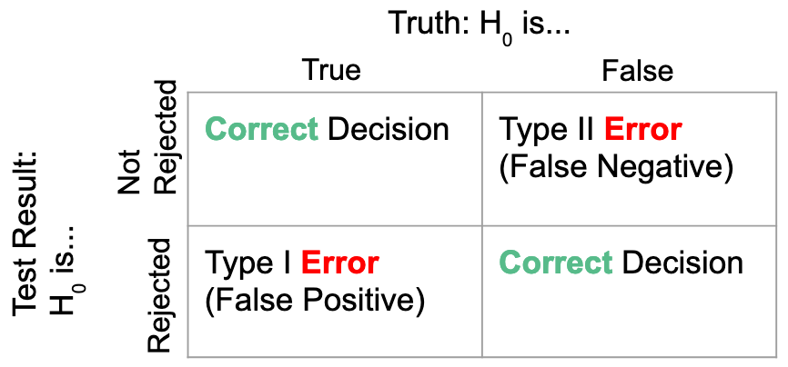

```{r setup, include = FALSE}
knitr::opts_chunk$set(echo = TRUE)
knitr::opts_chunk$set(cache=TRUE)
knitr::opts_chunk$set(fig.align='center', out.width="53%", warning=FALSE, fig.retina = 3)
```

```{r load libraries, include=FALSE, comment='#'}
#install.packages( 'tidyverse' )
#install.packages( 'readxl' )

library( tidyverse, quietly=T, warn.conflicts = F )
library( knitr, quietly=T, warn.conflicts = F )
library( readxl, quietly=T, warn.conflicts = F )
#library( tufte, quietly=T, warn.conflicts = F )
#library( quantmod, quietly=T, warn.conflicts = F )
library( WVPlots, quietly=T, warn.conflicts = F )
library(patchwork)

```

```{r reduce code spacing, include = FALSE}
hook1 <- function(x){ gsub("```\n*```r*\n*", "", x) }
hook2 <- function(x){ gsub("```\n+```\n", "", x) }
knit_hooks$set(document = hook2)
```

layout: true
class: 

<!-- Old footer font color: #00A895 -->
<!-- old footer background color: #383838 -->

<!-- footer -->
 <div style="position:fixed; bottom:10px; left:4px; font-size: 12pt; color: #2DD8A5; background-color: #545454; width:93.5%">&nbsp;&nbsp;&nbsp;&nbsp;&nbsp;Mary Ryan</div> <!--&nbsp;&nbsp;&nbsp;&nbsp;&nbsp;&nbsp;&nbsp;&nbsp;&nbsp;&nbsp;&nbsp;&nbsp;&nbsp;&nbsp;&nbsp;&nbsp;&nbsp;&nbsp;&nbsp;&nbsp;&nbsp;&nbsp;&nbsp;&nbsp;&nbsp;&nbsp;&nbsp;&nbsp;&nbsp;&nbsp;&nbsp;&nbsp;&nbsp;&nbsp;&nbsp;&nbsp;&nbsp;&nbsp;&nbsp;&nbsp;&nbsp;&nbsp;&nbsp;&nbsp;&nbsp;&nbsp;&nbsp;&nbsp;&nbsp;&nbsp;&nbsp;&nbsp;&nbsp;&nbsp;&nbsp;&nbsp;&nbsp; -->
<div style="position:fixed; bottom:10px; left:500px; font-size: 12pt; color: #2DD8A5">One Sample Inference</div> <!--&nbsp;&nbsp;&nbsp;&nbsp;&nbsp;&nbsp;&nbsp;&nbsp;&nbsp;&nbsp;&nbsp;&nbsp;&nbsp;&nbsp;&nbsp;&nbsp;&nbsp;&nbsp;&nbsp;&nbsp;&nbsp;&nbsp;&nbsp;&nbsp;&nbsp;&nbsp;&nbsp;&nbsp;&nbsp;&nbsp;&nbsp;&nbsp;&nbsp;&nbsp;&nbsp;&nbsp;&nbsp;&nbsp;&nbsp;&nbsp;&nbsp;&nbsp;&nbsp;&nbsp;&nbsp;&nbsp;&nbsp;&nbsp;&nbsp;&nbsp;&nbsp;&nbsp;&nbsp;&nbsp;&nbsp;&nbsp;&nbsp; -->
<div style="position:fixed; bottom:10px; right:92px; font-size: 12pt; color: #2DD8A5">Stats 7</div>

---

<div style="position:fixed; left:50px; right:50px; top:125px; padding:30px; margin:auto; background-color:#C0F3E4; border-radius:15px">
<p>This class is being conducted over Zoom. As the instructor, I will be .alert[recording] this session. I have disabled the recording feature for others so that no one else will be able to record this session. I will be posting this session to the course’s website.</p>

<p>If you have privacy concerns and .alert[do not wish to appear in the recording], you may turn video off (click .alert[“stop video”]) so that Zoom does not record you.</p>

<p>The chat box is always open for discussion and questions to the entire class. You may also send messages privately to the instructor or the TAs. Please note that Zoom saves all chat transcripts.</p>

<p>I create a live transcription of each session using <a href="https://otter.ai/">Otter.ai</a>. This means that Otter.ai will transcribe anything spoken over the Zoom audio. The transcript will be posted with the session video on the course website.</p>
</div>

---

class: title-slide2

# <center> One Sample Inference </center>
## <center> Stats 7 </center>
### <center> Mary Ryan </center>
### .center[Aug. 27, 2020]

<!-- social media info -->
<div style="position:fixed; bottom:40px; left:70px;">
<p> Course website:</p>
<p><a href="https://canvas.eee.uci.edu/courses/28451"> https://canvas.eee.uci.edu/courses/28451 </a></p>

<p> Slides can be found at:</p>
</p><a href="https://maryryan.github.io/stats7-SS2-2020-slides/stats7-SS2-2020-oneSampleInference/stats7-SS2-2020-oneSampleInference"> https://maryryan.github.io/stats7-SS2-2020-slides/stats7-SS2-2020-oneSampleInference/stats7-SS2-2020-oneSampleInference </a></p>
</div>


---

# Learning Objectives

By the end of today's lecture, you should be able to:

- calculate confidence intervals and test statistics

- understand testing error

- interpret what confidence intervals tell us about our estimate of the population parameter

- draw an appropriate conclusion from a hypothesis test in the context of our question of interest

---

# What is One-Sample Inference?

- When we perform .alert[**one-sample inference**], we are using our sample data to infer or make assumptions about one population of interest

   - What does our sample mean tell us about the population?
   
- One-sample inference is how we turn data into knowledge we can use

- Several ways to perform inference...


---

# Capturing the Population Mean

- Recall: our sample mean is only one estimate of the population mean

   - If we took other samples, we would get other sample means with different values

   - We can throw a spear where we see a fish but we will probably miss

--

- It would be nicer if there were a .alert2[**range of plausible values**] between which we might think the true population mean might lie, with a  certain degree of certainty

   - If we toss a net in the general area we saw a fish, we have a good chance of catching it
   
---

# 95% Confidence Intervals

- Maybe we would think a plausible range of values might be the middle 95% of the sampling distribution of the sample mean $\bar{x}$

$$P(a < \bar{X} < b) = 0.95$$

- But what are *a* and *b*?

--

.pull-left-66[

- We know that the middle 95% of a sampling distribution is the range of values within 1.96 standard deviations above and below the mean

   - Standard deviation for the sampling distribution is $\frac{\sigma}{\sqrt{n}}$ -- here we call it the .alert[**standard error**]
]

.pull-right-33[

```{r sample dist, echo=FALSE, message=FALSE, out.width="100%"}
a <- rnorm(1000000)

z <- data.frame(seq(1000000), a)

threshold1 <- quantile(z[, 2], prob = 0.975)[[1]]
threshold2 <- quantile(z[, 2], prob = 0.025)[[1]]

ShadedDensityCenter(frame = z, xvar = "a",
                    boundaries = c(threshold2, threshold1),
                    shading = "red",
                    title = "",
                    annotate_area=FALSE)+
   xlab("")+
   ylab("")+
   geom_hline(yintercept=0)+
   annotate("text",0,0.2,label="95%",color="white", size=17)+
   annotate("text",1.5,-0.03,label="1.96", size=10, col="red")+
   annotate("text",-3,-0.03,label="-1.96", size=10, col="red")+
   annotate("text",c(-1.4, 2.95),
            rep(-0.03,2),label=expression(sigma/sqrt(n)), size=10, col="red")+
   annotate("text",0,-0.03,label=expression(bar(x)), size=10)+
   theme_minimal()+
   theme(axis.title.x=element_blank(),
         axis.text.x=element_blank(),
         axis.ticks.x=element_blank(),
         axis.title.y=element_blank(),
         axis.text.y=element_blank(),
         axis.ticks.y=element_blank())

```
]

---

# 95% Confidence Intervals

- So:

$$P \left(-1.96\frac{\sigma}{\sqrt{n}} < \bar{X} < 1.96\frac{\sigma}{\sqrt{n}} \right) = 0.95$$

--

.content-box-teal[
.center[
**We call this a 95% confidence interval**

$$\left( \bar{x} - 1.96 \frac{\sigma}{\sqrt{n}}, \bar{x} + 1.96 \frac{\sigma}{\sqrt{n}} \right)$$

]
]

- We can shorthand the math to:
$$\bar{x} \pm \color{red}{1.96 \frac{\sigma}{\sqrt{n}}}$$

   - We call the red portion of the equation the .alert[**margin of error**]

---

# 95% Confidence Intervals

.content-box-teal[
.center[
**"We are 95% confident that the interval**

$$\left( \bar{x} - 1.96 \frac{\sigma}{\sqrt{n}}, \bar{x} + 1.96 \frac{\sigma}{\sqrt{n}} \right)$$

**captures/contains the true population mean."**
]
]

- We call 95% the .alert[**confidence level**]

- Helps tell us how certain we are of our estimate of the mean

- The true population mean is .alert2[**constant**]

   - The confidence interval is .alert2[**random**]: it changes every time we take a new sample (because it's centered over the sample mean)

---

# General Confidence Intervals

- What if we think an interval other than the middle 95% is appropriate?
   
   - We change the number of standard errors we're adding and subtracting to $\bar{x}$


```{r 99 sample dist, echo=FALSE, message=FALSE,out.width="65%", fig.dim=c(9.8, 6.5)}
threshold1 <- quantile(z[, 2], prob = 0.995)[[1]]
threshold2 <- quantile(z[, 2], prob = 0.005)[[1]]

p99 <- ShadedDensityCenter(frame = z, xvar = "a",
                    boundaries = c(threshold2, threshold1),
                    shading = "red",
                    title = "",
                    annotate_area=FALSE)+
   xlab("")+
   ylab("")+
   geom_hline(yintercept=0)+
   annotate("text",0,0.2,label="99%",color="white", size=12)+
   annotate("text",0,0.2,label="99%",color="white", size=12)+
   annotate("text",2,-0.03,label="2.58", size=6, col="red")+
   annotate("text",-3.5,-0.03,label="-2.58", size=6, col="red")+
   annotate("text",c(-2, 3.5),
            rep(-0.03,2.5),label=expression(sigma/sqrt(n)), size=6, col="red")+
   annotate("text",0,-0.03,label=expression(bar(x)), size=6)+
   theme_minimal()+
   theme(axis.title.x=element_blank(),
         axis.text.x=element_blank(),
         axis.ticks.x=element_blank(),
         axis.title.y=element_blank(),
         axis.text.y=element_blank(),
         axis.ticks.y=element_blank())

threshold1 <- quantile(z[, 2], prob = 0.90)[[1]]
threshold2 <- quantile(z[, 2], prob = 0.1)[[1]]

p80 <- ShadedDensityCenter(frame = z, xvar = "a",
                    boundaries = c(threshold2, threshold1),
                    shading = "red",
                    title = "",
                    annotate_area=FALSE)+
   xlab("")+
   ylab("")+
   geom_hline(yintercept=0)+
   annotate("text",0,0.2,label="80%",color="white", size=12)+
   annotate("text",1,-0.03,label="1.28", size=6, col="red")+
   annotate("text",-3,-0.03,label="-1.28", size=6, col="red")+
   annotate("text",c(-1.5, 3),
            rep(-0.03,2),label=expression(sigma/sqrt(n)), size=6, col="red")+
   annotate("text",0,-0.03,label=expression(bar(x)), size=6)+
   theme_minimal()+
   theme(axis.title.x=element_blank(),
         axis.text.x=element_blank(),
         axis.ticks.x=element_blank(),
         axis.title.y=element_blank(),
         axis.text.y=element_blank(),
         axis.ticks.y=element_blank())

p99 | p80
```


---

# General Confidence Intervals

- Can write confidence interval formula generally as:

$$\bar{x} \pm Z^*_{1-\frac{1}{2}\text{confidence}} \frac{\sigma}{\sqrt{n}}$$
--

- Width of confidence interval depends on:

   - confidence level
   
   - variance of observations in population
   
   - sample size
   
--

.pull-left[
- .alert[**Wider**] confidence interval:
   
   - .alert[**increase**] confidence
   
   - .alert[**increase**] population variance
   
   - .alert[**decrease**] sample size
]

.pull-right[
- .alert2[**Narrower**] confidence interval:
   
   - .alert2[**decrease**] confidence
   
   - .alert2[**decrease**] population variance
   
   - .alert2[**increase**] sample size
]
   
---

# Calculator: ZInterval

To get to the calculator function on a TI-84:
- STAT > TESTS > 7: ZInterval

To calculate confidence interval:
- input:
   - population standard deviation ( $\sigma$ )
   - sample mean ( $\bar{x}$ )
   - sample size (n)
   - confidence level (C-Level)
- then arrow down to CALCULATE and press ENTER


---

# Example: SAT

The Scholastic Assessment Test (SAT) is a standardized test that's (was?🤞) widely used by colleges and universities to help make admission decisions. Scores can range 400 to 1600. SAT scores have a population standard deviation of 200. We take a sample of 100 scores and get an average of 956.

- Calculate a 95% confidence interval.

---

# Example: SAT

The Scholastic Assessment Test (SAT) is a standardized test that's (was?🤞) widely used by colleges and universities to help make admission decisions. Scores can range 400 to 1600. SAT scores have a population standard deviation of 200. We take a sample of 100 scores and get an average of 956.

- Calculate a 90% confidence interval.


---

# Example: Solar Energy

A Pew Research poll found that 88.7% of a random sample of 1000 American adults supported expanding the role of solar power.

- Calculate a 95% confidence interval.

---

# Example: Solar Energy

A Pew Research poll found that 88.7% of a random sample of 1000 American adults supported expanding the role of solar power.

- Calculate a 99% confidence interval.


---

# Confidence Intervals with Sample Standard Deviation

- We can also create confidence intervals if we're estimating the population standard deviation with the sample standard deviation

   - Instead of using the Normal distribution to figur out how many standard deviations above and below the mean, .alert2[**we use the T distribution**]
   
$$\bar{x} \pm T^*_{1-\frac{1}{2}\text{confidence, } df=n-1} \frac{s}{\sqrt{n}}$$
---

# Calculator: TInterval

To get to the calculator function on a TI-84:
- STAT > TESTS > 8: TInterval

To calculate confidence interval:
- input:
   - sample mean ( $\bar{x}$ )
   - sample standard deviation ( $S_x$ )
   - sample size (n)
   - confidence level (C-Level)
- then arrow down to CALCULATE and press ENTER

---

# Example: Mercury in Dolphins

Elevated mercury concentrations are an important problem for both dolphins and other animals. We randomly sample 19 dolphins and test their muscle for mercury levels. We get a sample mean of 4.4, and a sample standard deviation of 2.3.

- Calculate a 95% confidence interval.

---

# Example: Mercury in Dolphins

Elevated mercury concentrations are an important problem for both dolphins and other animals. We randomly sample 19 dolphins and test their muscle for mercury levels. We get a sample mean of 4.4, and a sample standard deviation of 2.3.

- Calculate a 99% confidence interval.
   

---

# Testing our Notions of the Population

- We might be gathering our sample because we want to see if a .alert2[**preconceived notion**] we have about the population is true

- If we believe the population mean is one value and the data gives us an estimate, how can we tell if the sample mean is .alert2[**confirming or challenging**] our assumption?


---

# How to Perfom a Hypothesis Test

1. State your hypotheses

2. Calculate your Z-statistic

3. Find your critical value/calculate your p-value

4. Draw a conclusion

5. Interpret you conclusion in context

---

# Step 1: State your hypotheses

- .alert[**Null hypothesis**] ( $H_0$ ) represents "status quo", or what we assume to be true without more evidence
- Question will usually give you the .alert[**alternative hypothesis**] ( $H_A$ )

- Two types of tests:
   - Two-sided test:
   
      - $H_0$: We assume the population mean is $= \mu_0$
      - $H_A$: We assume the population mean is $\ne \mu_0$
      
   - One-sided test:
      - $H_0$: We assume the population mean is $\ge/\le \mu_0$
      - $H_A$: We assume the population mean is $>/< \mu_0$
   
- Always write hypotheses in terms of the parameter of interest (not the sample estimate)

---

# Step 2: Calculate your Z-statistic

- If we know the population standard deviation:
$$z = \frac{\bar{x} - \mu_0}{\sqrt{\sigma/n}}$$
$$z = \frac{\hat{p} - p_0}{\sqrt{p(1-p)/n}}$$

- If we're estimating the population standard deviation with the sample standard deviation:
$$t = \frac{\bar{x} - \mu_0}{\sqrt{s/n}}$$
.content-box-teal[
.center[
**"If the null hypothesis was true, this is how many standard deviations away from the null hypothesis mean our sample mean is"**
]
]


---

# Step 3: Find Your Critical Value/Calculate Your P-value

- Two ways to see if our sample mean is "too different" than the null hypothesis population mean

.pull-left-33[   
1. Find "critical value" to compare test statistic against

   - If the test statistic is .alert2[**more extreme**] than this value, we know our sample mean is .alert2[**very different**] than our null mean
   
   - Determine before seeing data

- For one-sided tests, we can determine critical value by the probability we would see sample means more extreme than it
]

.pull-right-66[
```{r oneSided, echo=FALSE, out.width="95%", fig.dim=c(9.8, 5.5)}
par(mfrow=c(1,2), mar = c(5.1, 0.5, 4.1, 0.5))
x <- seq(-6,6, length=1000)
y <- dnorm(x)
# greater than plot
plot(x, y, type="l", lwd=1,
     xaxt="n", xlab="",
     yaxt="n", ylab="")

abline(v=1.96)
#abline(v=-1.96)

text(1.96, -0.04, expression(Z^"*"), xpd=NA)

text(0, 0.1, "Not crazy\n values", col="forest green")
text(3, 0.1, "Woah!", col="red")
text(2.5, 0.0, expression(alpha), cex=0.9)

text(0, -0.08, expression(H[A]: mu > mu[0]), xpd=NA, cex=1.2)

# less than plot 
plot(x, y, type="l", lwd=1,
     xaxt="n", xlab="",
     yaxt="n", ylab="")

#abline(v=1.96)
abline(v=-1.96)

text(-1.96, -0.04, expression(-Z^"*"), xpd=NA)

text(0, 0.1, "Not crazy\n values", col="forest green")
text(-3, 0.1, "Woah!", col="red")
text(-2.5, 0.0, expression(alpha), cex=0.9)

text(0, -0.08, expression(H[A]: mu < mu[0]), xpd=NA, cex=1.2)


```
]

---

# Step 3: Find Your Critical Value/Calculate Your P-value

1. Find "critical value" to compare test statistic against

.pull-left[
- For two-sided tests, we can determine critical value by the probability we would see sample means more extreme than it
   
   - Then split that probability between both the tails
]

.pull-right[
```{r twoSided, echo=FALSE, out.width="90%"}
par(mar = c(5.1, 0.5, 4.1, 0.5))

plot(x, y, type="l", lwd=1,
     xaxt="n", xlab="",
     yaxt="n", ylab="")

abline(v=1.96)
abline(v=-1.96)

text(c(-1.96,1.96), rep(-0.04,2), c(expression(-Z^"*"), expression(Z^"*")), xpd=NA)

text(0, 0.1, "Not crazy\n values", col="forest green")
text(c(-3,3), 0.1, "Woah!", col="red")
text(c(-2.5, 2.5), 0.0, expression(alpha/2), cex=0.9)
text(0, -0.08, expression(H[A]: mu != mu[0]), xpd=NA, cex=1.2)


```
]

---

# Step 3: Find Your Critical Value/Calculate Your P-value

2. Calculate probability we see sample mean .alert2[**as or more extreme**] as your sample mean, .alert2[**if the null hypothesis mean was true**]

.pull-left-33[
- Call this the .alert[**p-value**]

   - For a one-sided test:
]

.pull-right-66[

```{r pvalue oneSided, echo=FALSE, out.width="95%", fig.dim=c(9.8, 5.5)}
par(mfrow=c(1,2), mar = c(5.1, 0.5, 4.1, 0.5))

# greater than plot
plot(x, y, type="l", lwd=1,
     xaxt="n", xlab="",
     yaxt="n", ylab="")

abline(v=1.96)
#abline(v=-1.96)

text(1.96, -0.04, "z", xpd=NA)


text(2.7, 0.0, "p-value", cex=0.9)

text(0, -0.08, expression(H[A]: mu > mu[0]), xpd=NA, cex=1.2)

# less than plot
plot(x, y, type="l", lwd=1,
     xaxt="n", xlab="",
     yaxt="n", ylab="")

#abline(v=1.96)
abline(v=-1.96)

text(-1.96, -0.04, "z", xpd=NA)

text(-2.7, 0.0, "p-value", cex=0.9)

text(0, -0.08, expression(H[A]: mu < mu[0]), xpd=NA, cex=1.2)


```

]


---

# Step 3: Find Your Critical Value/Calculate Your P-value

2. Calculate probability we see sample mean .alert2[**as or more extreme**] as your sample mean, .alert2[**if the null hypothesis mean was true**]

.pull-left-33[
- Call this the .alert[**p-value**]

   - For a two-sided test, you need to look at the probability on .alert2[**both sides**] of the distribution
   
      - Since Normal/T distributions symmetric, can find the probability on one side and **double it**
]

.pull-right-66[
```{r pvalue twosided, echo=FALSE, out.width="65%"}
par(mar = c(5.1, 0, 4.1, 0.5))

plot(x, y, type="l", lwd=1,
     xaxt="n", xlab="",
     yaxt="n", ylab="")

abline(v=1.96)
abline(v=-1.96)

text(c(-1.96,1.96), rep(-0.04,2), c("-z", "z"), xpd=NA)

text(c(-2.5, 2.5), 0.0, c("p-value", "p-value"), cex=0.9)
text(0, -0.08, expression(H[A]: mu != mu[0]), xpd=NA, cex=1.2)


```
]

---

# Step 4: Draw a conclusion

.pull-left[
- For two-sided test:
   - If |Z| > $Z^*$, __reject__ the null
   - If |Z| < $Z^*$, __fail to reject__ the null
   
- For one-sided test:
   - Greater-than test:
      - If Z > $Z^*$, reject the null
      - If Z < $Z^*$, fail to reject the null
      
   - Less-than test:
      - If Z < $-Z^*$, reject the null
      - If Z > $-Z^*$, fail to reject the null
      
]

--

.pull-right[

.content-box-teal[

**We never "accept" the null hypothesis!**

- We are gathering evidence against the null hypothesis
   - If we don't have evidence against, we just can't assume the null is false
   
- Like in an American legal trial, where defendant assumed innocent until proven guilty
   - Judge gives verdict of "guilty" or "not guilty"
   
   - If found "not guilty", we aren't saying they are innocent - just that we don't have enough evidence to say they're guilty
   
]

]

---

# Step 5: Interpret your conclusion in context

- For a rejection

   - Why are we rejecting?
   - What strength of evidence do we have?
   - What does a rejection of the null hypothesis mean for our knowledge about the population?

- For a fail-to-reject

   - Why are we not rejecting?
   - Was our evidence not very strong?
   - What does a failure to reject the null hypothesis mean for our knowledge about the population?

---

# Calculator: Z-Test

To get to the calculator function on a TI-84:
- STAT > TESTS > 1: Z-Test

To calculate hypothesis test statistic and p-value:
- input:
   - population mean under null hypothesis ( $\mu_0$ )
   - population standard deviation ( $\sigma$ )
   - sample mean ( $\bar{x}$ )
   - sample size (n)
   - direction of test: ( $\mu: \ne \mu_0 < \mu_0 < \mu_0$ )
- then arrow down to CALCULATE and press ENTER

---

# Calculator: T-Test

To get to the calculator function on a TI-84:
- STAT > TESTS > 2: T-Test

To calculate hypothesis test statistic and p-value:
- input:
   - population mean under null hypothesis ( $\mu_0$ )
   - sample mean ( $\bar{x}$ )
   - sample standard deviation ( $S_x$ )
   - sample size (n)
   - direction of test: ( $\mu: \ne \mu_0 < \mu_0 < \mu_0$ )
- then arrow down to CALCULATE and press ENTER

---

# Example: Mercury in Dolphins

Say that mercury levels above 5.2 micrograms of mercury per wet gram of muscle in dolphins indicates that there may be pollution in the area. 

As part of an ocean pollution watchdog group, we randomly sample 19 dolphins and test their muscle for mercury levels. We get a sample mean of 4.4, and a sample standard deviation of 2.3.

- What are our null and alternative hypotheses?

---

# Example: Mercury in Dolphins

Say that mercury levels above 5.2 micrograms of mercury per wet gram of muscle in dolphins indicates that there may be pollution in the area. 

We randomly sample 19 dolphins and test their muscle for mercury levels. We get a sample mean of 4.4, and a sample standard deviation of 2.3.

- What is our test statistic? What is our critical value/p-value?

---

# Example: Mercury in Dolphins

Say that mercury levels above 5.2 micrograms of mercury per wet gram of muscle in dolphins indicates that there may be pollution in the area. 

We randomly sample 19 dolphins and test their muscle for mercury levels. We get a sample mean of 4.4, and a sample standard deviation of 2.3.

- What's our conclusion? What does this mean?

---

# Testing Error

- Type I errors happen when we .alert[**reject**] the null hypothesis when actully it is .alert2[**true**]

- Type II errors happen when we .alert2[**fail to reject**] the null hypothesis when actully it is .alert[**false**]

.center[

]

---

# What Else Can We Do Inference On?

- Much of the time we're focused on trying to make inference about the population mean, but that's not the only parameter we can work with!

--

- We saw that we can also perform one-sample inference on sample proportions

--

- We can also perform one-sample inference on the slope of regressions!

   - Regression outputs will often give you both the estimated slope of a regression, $\hat{\beta}$ , and the standard error of that slope
   
   - If we perform a hypothesis test on the regression slope, we often want to know if it is different from 0 -- many outputs will also calculate a t-statistic for you and calculate the two-sided p-value
   
.pull-left[
   
- 95% confidence interval for regression slope: $\text{slope}\pm t_{1-\frac{1}{2}\text{confidence, } df=\text{n - # of variables - 1}} \times SE$
]

.pull-right[
- Hypothesis test for regression slope:

   - $H_0$: True slope $=/\ge/\le$ 0
   - $H_A$: True slope $\ne/>/<$ 0

   - Test statistic for regression slope:
   $t = \frac{slope - 0}{SE}$
]

---

# Example: MLB  2011

Is the number of times a team has a player go up to bat throughout a season (called .alert2[**"at-bats"**]) related to the number of .alert2[**runs**] that teams scores? There are 30 teams in the dataset (n=30).

Runs = $\hat{\beta_0} + \hat{\beta_1}$ (at-bats)

Regression output:
```{r mlbReg, echo=FALSE}
load(url("http://www.openintro.org/stat/data/mlb11.RData"))
mlb.lm <- summary(lm(runs ~ at_bats, data=mlb11))

knitr::kable(mlb.lm$coef, 'html')
```


Runs = `r round(mlb.lm$coef[1,1], 4)` + `r round(mlb.lm$coef[2,1], 4)`(at-bats)

.pull-left[
- Hypotheses:
   - $H_0$: slope = 0 (no association)
   - $H_A:$ slope $\ne$ 0 (some kind of association)
- Degrees of freedom: n - # of variables - 1 = 30 - 1 - 1 = 28
]

.pull-right[
- p-value: 0.0003

- Reject $H_0$ : strong evidence to suggest the number of at-bats a team has is related to the number of runs the team scores
]
