```{r setup, include = FALSE}
knitr::opts_chunk$set(echo = TRUE)
knitr::opts_chunk$set(cache=TRUE)
knitr::opts_chunk$set(fig.align='center', out.width="63%", warning=FALSE)
```

```{r load libraries, include=FALSE, comment='#'}
#install.packages( 'tidyverse' )
#install.packages( 'readxl' )

library( tidyverse, quietly=T, warn.conflicts = F )
library( knitr, quietly=T, warn.conflicts = F )
library( readxl, quietly=T, warn.conflicts = F )
#library( tufte, quietly=T, warn.conflicts = F )
library( quantmod, quietly=T, warn.conflicts = F )
library(kableExtra)

```

```{r reduce code spacing, include = FALSE}
hook1 <- function(x){ gsub("```\n*```r*\n*", "", x) }
hook2 <- function(x){ gsub("```\n+```\n", "", x) }
knit_hooks$set(document = hook2)
```


layout: true
class: 

<!-- Old footer font color: #00A895 -->
<!-- old footer background color: #383838 -->

<!-- footer -->
 <div style="position:fixed; bottom:10px; left:4px; font-size: 12pt; color: #17f9b4; background-color: #545454; width:93.5%">&nbsp;&nbsp;&nbsp;&nbsp;&nbsp;Mary Ryan</div> <!--&nbsp;&nbsp;&nbsp;&nbsp;&nbsp;&nbsp;&nbsp;&nbsp;&nbsp;&nbsp;&nbsp;&nbsp;&nbsp;&nbsp;&nbsp;&nbsp;&nbsp;&nbsp;&nbsp;&nbsp;&nbsp;&nbsp;&nbsp;&nbsp;&nbsp;&nbsp;&nbsp;&nbsp;&nbsp;&nbsp;&nbsp;&nbsp;&nbsp;&nbsp;&nbsp;&nbsp;&nbsp;&nbsp;&nbsp;&nbsp;&nbsp;&nbsp;&nbsp;&nbsp;&nbsp;&nbsp;&nbsp;&nbsp;&nbsp;&nbsp;&nbsp;&nbsp;&nbsp;&nbsp;&nbsp;&nbsp;&nbsp; -->
<div style="position:fixed; bottom:10px; left:500px; font-size: 12pt; color: #17f9b4">Probability</div> <!--&nbsp;&nbsp;&nbsp;&nbsp;&nbsp;&nbsp;&nbsp;&nbsp;&nbsp;&nbsp;&nbsp;&nbsp;&nbsp;&nbsp;&nbsp;&nbsp;&nbsp;&nbsp;&nbsp;&nbsp;&nbsp;&nbsp;&nbsp;&nbsp;&nbsp;&nbsp;&nbsp;&nbsp;&nbsp;&nbsp;&nbsp;&nbsp;&nbsp;&nbsp;&nbsp;&nbsp;&nbsp;&nbsp;&nbsp;&nbsp;&nbsp;&nbsp;&nbsp;&nbsp;&nbsp;&nbsp;&nbsp;&nbsp;&nbsp;&nbsp;&nbsp;&nbsp;&nbsp;&nbsp;&nbsp;&nbsp;&nbsp; -->
<div style="position:fixed; bottom:10px; right:92px; font-size: 12pt; color: #17f9b4">Stats 7</div>

<!-- Recording Notice Slide -->
---

<div style="position:fixed; left:50px; right:50px; top:125px; padding:30px; margin:auto; background-color:#C0F3E4; border-radius:15px">
<p>This class is being conducted over Zoom. As the instructor, I will be .alert[recording] this session. I have disabled the recording feature for others so that no one else will be able to record this session. I will be posting this session to the course’s website.</p>

<p>If you have privacy concerns and .alert[do not wish to appear in the recording], you may turn video off (click .alert[“stop video”]) so that Zoom does not record you.</p>

<p>The chat box is always open for discussion and questions to the entire class. You may also send messages privately to the instructor or the TAs. Please note that Zoom saves all chat transcripts.</p>

<p>I create a live transcription of each session using <a href="https://otter.ai/">Otter.ai</a>. This means that Otter.ai will transcribe anything spoken over the Zoom audio. The transcript will be posted with the session video on the course website.</p>
</div>

<!-- Title Slide -->
---

class: title-slide2

# <center> Basic Probability </center>
## <center> Stats 7 </center>
### <center> Mary Ryan </center>
### .center[Aug. 13, 2020]

<!-- social media info -->
<div style="position:fixed; bottom:40px; left:70px;">
<p> Course website:</p>
<p><a href="https://canvas.eee.uci.edu/courses/28451"> https://canvas.eee.uci.edu/courses/28451 </a></p>

<p> Slides can be found at:</p>
</p><a href="https://maryryan.github.io/stats7-SS2-2020-slides/stats7-SS2-2020-samplingBias/stats7-SS2-2020-samplingBias"> https://maryryan.github.io/stats7-SS2-2020-slides/stats7-SS2-2020-probability/stats7-SS2-2020-probability</a></p>
</div>

---

# Set Notation

- .alert[**Sample Space**] **(S)**: All of the outcomes that could possibly occur

- .alert[**Union**] **(** $\boldsymbol{\cup}$ **)**: The event where A happens, B happens, .alert2[**or**] both happen

- .alert[**Interscetion**] **(** $\boldsymbol{\cap}$ **)**: The event where A and B .alert2[**both**] happen

- .alert[**Compliment**] **(c or ')**: The event where A .alert2[**doesn't**] happen

--

.center[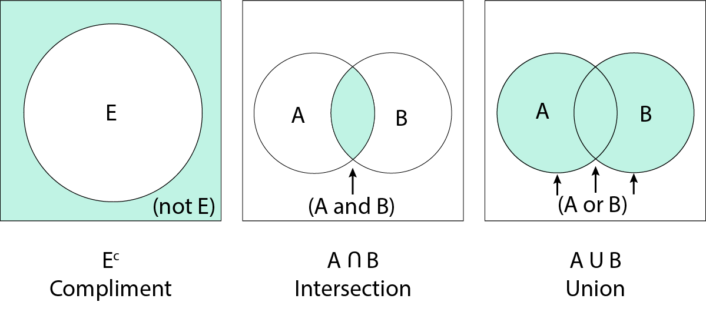]

---

# Sample Space Examples

.pull-left[
- Sample Space if...

   - Roll a die once?
   
   - Number of days you go to campus?
   
   - Days of the week you go to campus?
   
   - Blood type?

]

--

.pull-right[

<br>
\{1,2,3,4,5,6\}
{{content}}
]

--

\{0,1,2,3,4,5,6,7\}
{{content}}

--

\{Monday, Tuesday, Wednesday, Thursday, Friday, Saturday, Sunday\}
{{content}}

--

\{A+, A-, B+, B-, O+, O-, AB+, AB-\}
{{content}}


---

# Set Notation Example 1

- How would you draw the venn diagram for $P(A\cap B^c)$?

---

# Set Notation Example 2

- How would you draw the venn diagram for $P(\left[A\cap B \right]^c)$?

---

# Set Notation Example 3

- How would you draw the venn diagram for $P(A\cap B \cap C)$?

---

# Set Notation Example 4

- How would you draw the venn diagram for $P(A\cup B \cup C)$?

---

# Set Notation Example 5

- How would you draw the venn diagram for $P([A\cup B] \cap C^c)$?


---

# Subsets

- There also may be situations where one event is a .alert[**subset**] of another event

- This means that the second event is a .alert2[**more specific**] version of the first event

   - leaving the house and going to campus
   
   - getting a pet and getting a dog
   
   - passing a class and getting an A

--

- Here, $A \cap B = B$

- Also, $A\cup B = A$

<div style="position:fixed; bottom:40px; right: 100px;">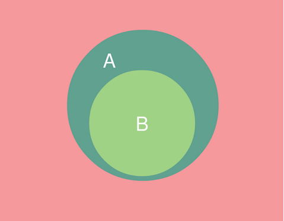</div>

---

# Probability

- The .alert[**probability**] of an event is the proportion of times we would see the event if we observed the process an infinite number of times

   - If we were to randomly pick 1 card out of a 52 card deck an infinite number of times, what proportion of the time would we get a heart card?

- Probability exists between 0 and 1
   
   - Think: 50%, 3/4, etc.
   
- The probability of the complete sample space (all possible outcomes) .alert2[**must equal 1**]

.content-box-teal[
- $P(A)$ is the probability that event A happens

- $P(A \cap B)$ is the probability that both event A and B happen

- $P(A \cup B)$ is the probability that either event A, event B, or both events A and B happen
]

---

# Probability

- Sometimes we have probabilities of some events, but not the specific event we want

--

- We can get the probability that A happens if we know the probability that A .alert2[*doesn't*] happen:
.content-box-teal[
$$P(A) = 1 - P(A^c)$$
]

--

- We can get the probability that A .alert2[*or*] B happen if we have the general probability of A, the general probability of B, and the probability of A .alert2[*and*] B:
.content-box-teal[
$$P(A \cup B) = P(A) + P(B) - P(A \cap B)$$
]

---
<div style="position:relative; top:-15px;">
<h2> Anatomy of $P(A \cup B)$</h2>
</div>

<div style="position:fixed; bottom:25px; left:50px">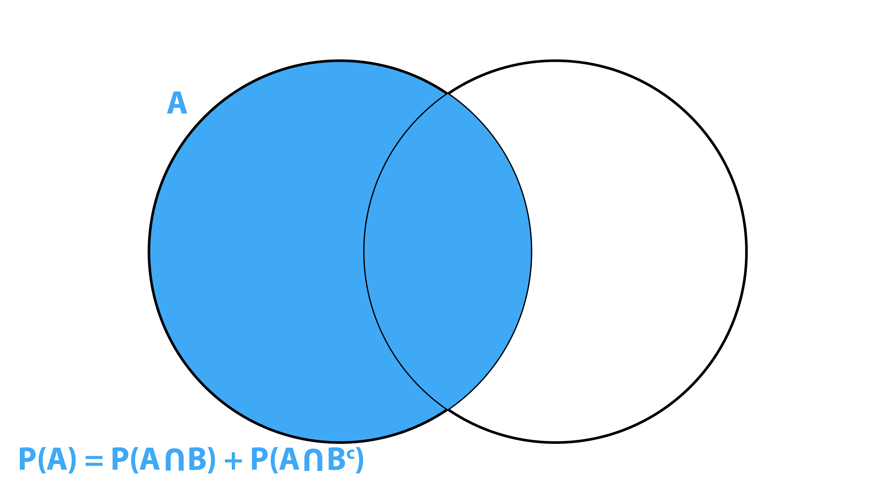</div>

--

<div style="position:fixed; bottom:25px; left:50px">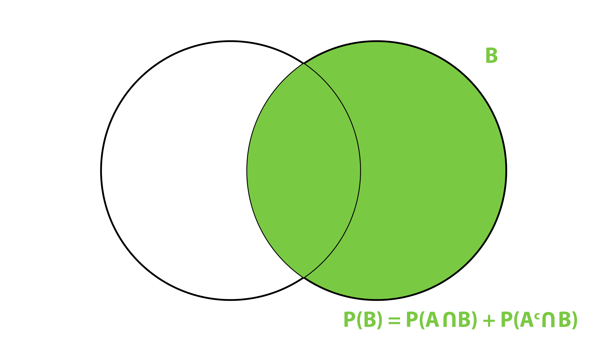</div>

--

<div style="position:fixed; bottom:25px; left:50px">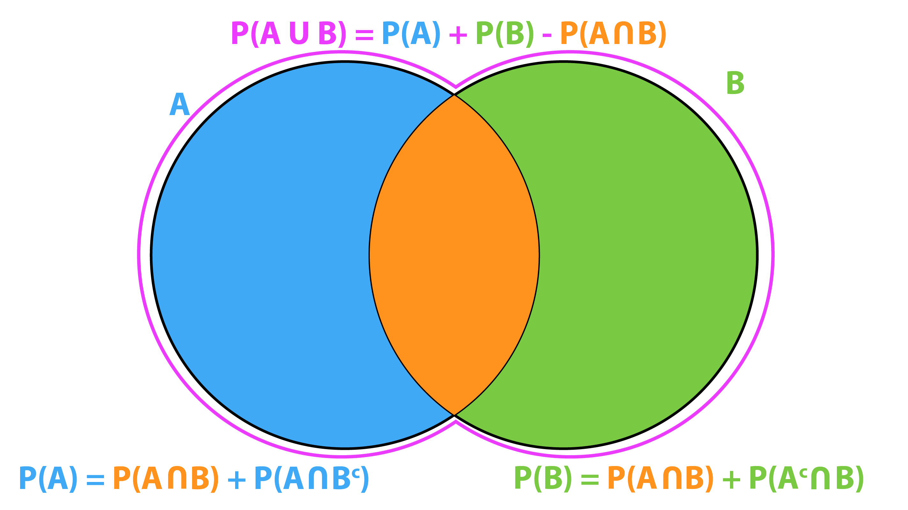</div>

---

# Example: Lottery Scratchers

.pull-left-66[
You have a scratch-off lottery card. If you reveal a picture of a stack of money, you win whatever dollar amount it shows underneath ($50 or $100). There are 25 scratch spots. The card tells you that 1 in 9 cards will be a winner. We also know from a database of past tickets sold, that there is an 8% chance that a card will have at least one $50 prize, and a 4% chance a card will have at least one $100 prize.
]

.pull-right-33[
.right[
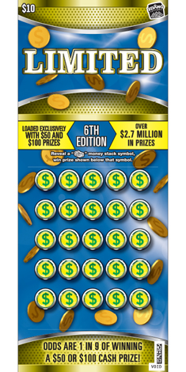]
]

--

- What is the probability of getting at least one $50 prize and at least one $100 prize on the same ticket?

---

# Example: Lottery Scratchers

You have a scratch-off lottery card. If you reveal a picture of a stack of money, you win whatever dollar amount it shows underneath ($50 or $100). There are 25 scratch spots. The card tells you that 1 in 9 cards will be a winner. We also know from a database of past tickets sold, that there is an 8% chance that a card will have at least one $50 prize, and a 4% chance a card will have at least one $100 prize.

- What is the probablity of getting a $100 prize, but no $50 prize?

<br>
<br>
<br>

--

- What is the probability of getting no prize?

---

# Example: Lottery Scratchers

.center[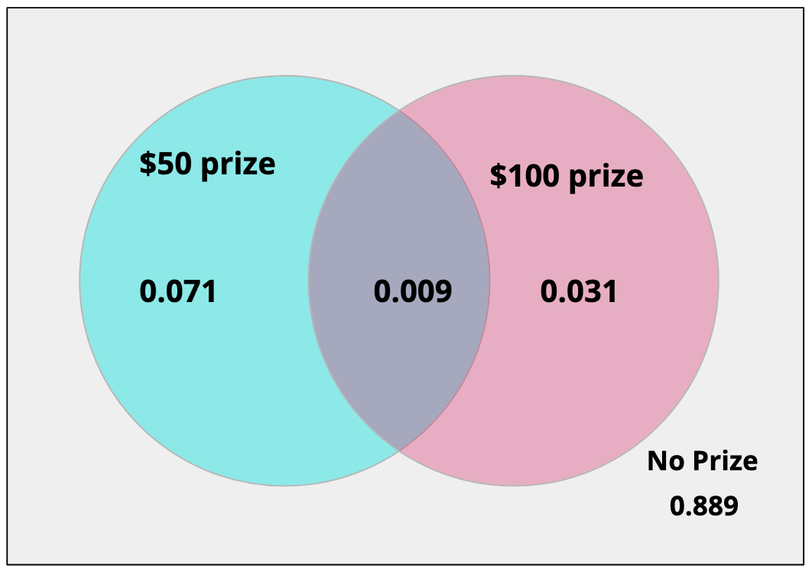]


---

# Probability Example 2

---

# Probability Example 3

---

# Mutually Exclusive and Independent

- When comparing two events we’d like to know how they relate to one another...

- Two events are .alert[**mutually exclusive**] if only one or the other can happen at a given time, .alert2[*but not both*]
   - $P(A \cap B)=0$
   - Subsequently, $P(A \cup B) = P(A) + P(B)$
   - Also known as .alert[**disjoint**]
   
--

- Two events are .alert[**independent**] if the happening of one .alert2[**does not affect**] the happening of another
   - $P(A) \times P(B)=P(A \cap B)$
   - .alert2[**Does not mean they are mutually exclusive!**]
   - Two events can only be both mutually exclusive and independent if the probability of one event is 0
   
---

# Mutally Exclusive and Independent

<br>

.pull-left[
.center[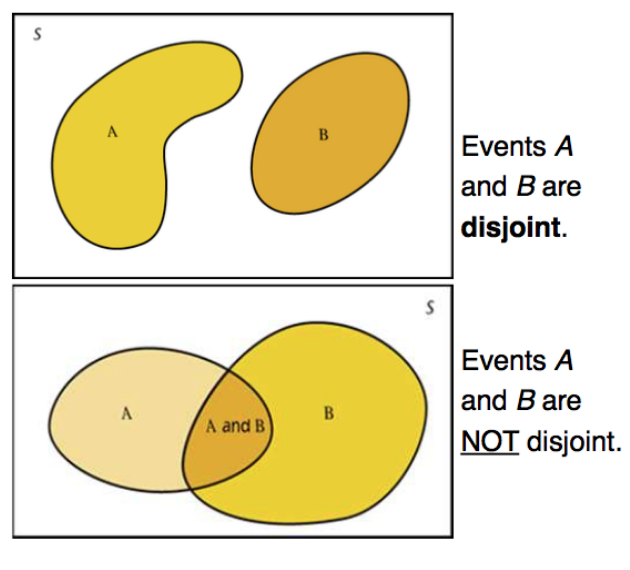]

]

--

.pull-right[

<br>

.center[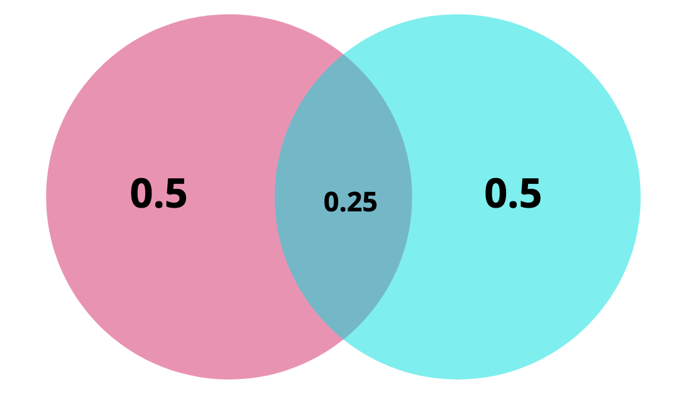]
]
---

# Example: Mutually Exclusive or Independent?

- I'm making two decisions today: whether to go to the beach and whether to get In N Out for dinner. There's a 40% chance I'll go to the beach, a 60% chance I'll get In N Out, and a 76% chance I'll go to the beach or get In N Out.

   - Are these decisions, mutually exclusive? Independent?

<br>
<br>
<br>
<br>

--

- I'm making a presentation for a PowerPoint party. There's a 35% chance my presentation will be on video games, a 15% chance it'll be on music, and a 50% chance it will be on neither video games nor music.

   - Are these decisions, mutually exclusive? Independent?

---

# Conditional Probability

- If we know one event has happened, should that affect the probability of the next event happening?

- P(B|A) reads .alert2[**“probability of event B happening given event A has already occurred”**]

$$P(B|A) = \frac{P(B \cap A)}{P(A)}$$

   - Known as .alert[**Bayes Rule**]
   
--

- Instead of looking at the probability of event B happening over the .alert2[**entire**] sample space, we are only interested in the probability of even B happening over the .alert2[**portion**] of the sample space where A has already happened

<div style="position:relative; top:50px; left:200px">

$P(B|A) = \frac{P(B \cap A)}{P(A)}$

<div style="position:relative; top:-60px; left:200px; font-size:11pt"><span style="font-size:16pt">&#8592;</span> If A already happened, then all the B cases we're interested in are when B happens with A </div>
</div>

<div style="position:relative; top:-10px; left:400px; font-size:11pt"><span style="font-size:16pt">&#8592;</span> Instead of the whole space, we're just looking at the space where A happened</div>
</div>

---

# Conditional Probability
   
- Given it rains today, what is the probability of crowd favorite Union Rags winning the Kentucky Derby? (this happened in 2012: I’ll Have Another won)
   
--
   
   - P(Wins | Rain)
      
- What is the probability I’ll study for exams given I just got a cat?
   
--
   
   - P(Study | Cat)
      
- If two events are independent then P(B|A) = P(B)
   
   - What about if two events are mutually exclusive?

---

# Conditional Probability

- Sometimes we are given a general/marginal probability and a conditional probability, but we want to know the probability of the 2 events happening

- We can rearrange Bayes theorem:

$$P(B|A) = \frac{P(B \cap A)}{P(A)} \Rightarrow P(B \cap A) = P(B|A)\times P(A)$$

---

# Example: Coin flips

Say you flip a fair coin twice. Let event A be the first flip is heads, and event B be the second flip is heads. The coin flips are said to be independent, the first flip has no bearing on what the second flip will be.

- What is P(A)?

<br>
<br>

--

- What is $P(A \cap B)$?

<br>
<br>
<br>

--

- What is P(B|A)?


---

# Probability Trees

<div style="position:fixed; bottom:25px; left:50px">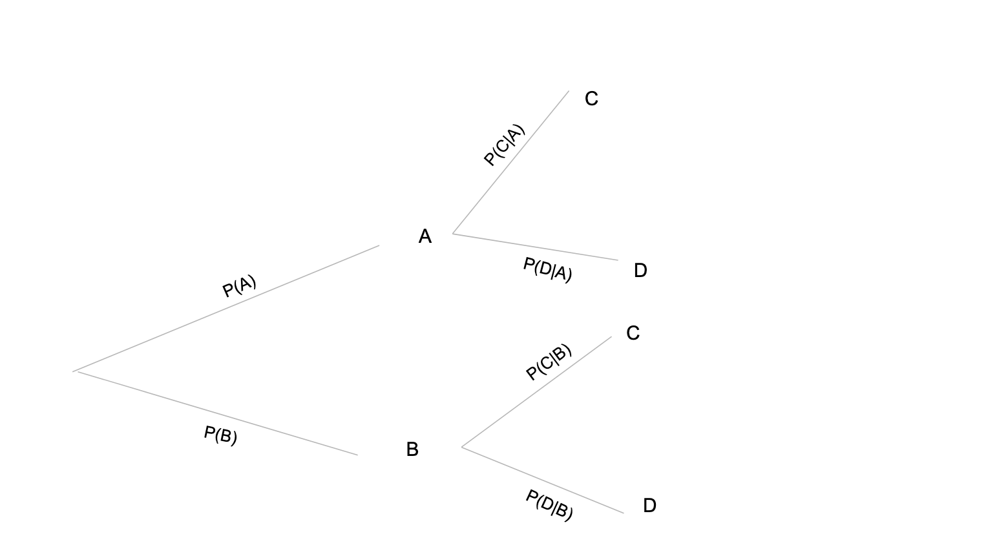</div>

--

<div style="position:fixed; bottom:25px; left:50px">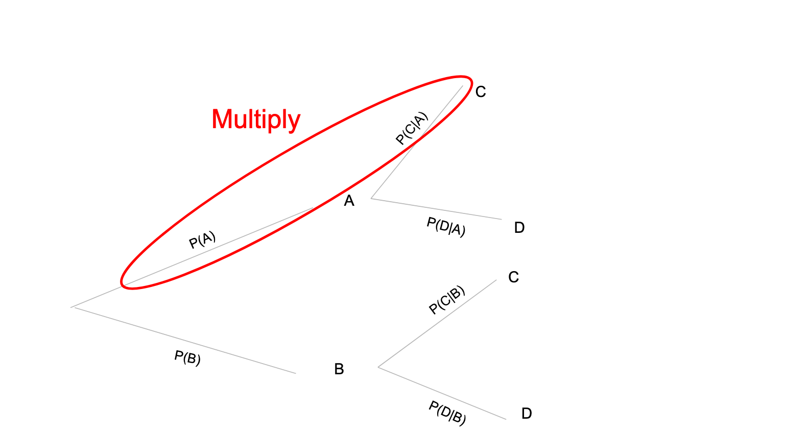</div>

--

<div style="position:fixed; bottom:25px; left:50px">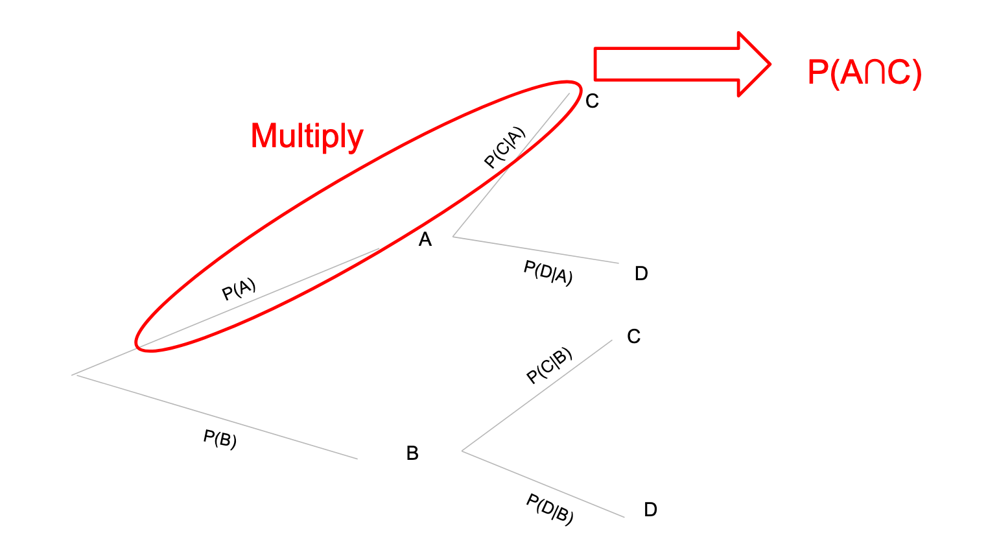</div>

---

# Example: Mumps

.pull-left-66[In 2015 and 2016, the University of Iowa experienced an outbreak of mumps on its campus. The CDC traditionally recommends 2 doses of the MMR vaccine.Researchers were interested in the effect extra doses of MMR might have on disease contraction.

- If someone has contracted mumps, what's the probability they had fewer than 2 doses?

- What is the probability of getting mumps, regardless of the number of MMR doses you receive?

- What's the probability of getting mumps given you've gotten 3+ doses of MMR?

]

<div style="position:relative; top:-100px">
.pull-right-33[
```{r mumps, echo=FALSE}

mumps <- cbind(c(103,15206,5187, 20496),c(4,221,34, 259))
rownames(mumps) <- c("< 2 doses", "2 doses", "3+ doses", "Total")
colnames(mumps) <- c("# At Risk", "# Cases")

knitr::kable(mumps, format="html")

```
]
</div>


---

# Example: Airport TSA

.pull-left[
An airport screens bags for forbidden items, and an alarm is supposed to be triggered when a forbidden item is detected. Suppose that 5% of bags contain forbidden items. If a bag contains a forbidden item, there is a 98% chance that it triggers the alarm. If a bag doesn't contain a forbidden item, there is an 8% chance that it triggers the alarm.

- What is the general probability that the alarm will go off on a randomly chosen bag?

<br>
<br>

- Given a randomly chosen bag triggers the alarm, what is the probability that it contains a forbidden item?
]


---

# Example: Oil and Gas

Say you are drilling for oil. When you drill a sample well, there is a 60% chance you'll find oil. When you do find oil, there's a 10% chance that it's of a quality that you could sell it commercially.

---

# Probability Tables

- Sometimes it's useful to organize the probabilities of events into a table

```{r prob table, echo=FALSE}
events <- c("A", "B", "C", "D")
probs <- c("P(A)", "P(B)", "P(C)", "P(D)")

probTable <- rbind(events, probs)
rownames(probTable) <- c("Events", "Probability")

probTable %>% 
   knitr::kable(format="html") %>% 
   column_spec(1, bold = T)

```

- The probability of any one event, P(A) is in the box underneath that value

- We call these tables a .alert[**probability distribution**]

- In order to be a legitimate probability distribution, .alert2[**all the probabilities must add to 1**] 
   
   - i.e., the entire sample space must be defined in the table
   
   - This is known as .alert[**the law of total probability**]
   
   - This means each event must be .alert2[**mutually exclusive **]
   
---

# Example: Coin Flips

We have a fair coin. We flip the coin 5 times and count the number of heads we get. Using our knowledge of probability, we can fill in the probability distribution below:

```{r coin flips, echo=FALSE}
coinFlips <- as.character(0:5)
coinProbs <- rep("", 6)

coinTable <- rbind(coinFlips, coinProbs)
rownames(coinTable) <- c("Number of coins landing on heads", "Probability")

coinTable %>% 
   knitr::kable(format="html") %>% 
   column_spec(1, bold = T) %>% 
   column_spec(2:7, width = "5em")

```

---

# Discrete Random Variables

- A .alert[**random variable**] is a variable that may assume different values as events with certain probabilities
   - There are two types of random variables: discrete and continuous -- we’ll focus on discrete for now

- .alert[**Discrete random variables**] are ones where you can count all the possible values that the variable might take on

- Examples:

   - The number you get when you roll a single die
   
   - The total number you get when you roll 3 dice
   
   - The number of cookies left in the box


---

# Probabilities of Discrete Random Variables

- Because the events are mutually exclusive, we can compute the probability that random variable X takes on one of several values by adding up the probabilities:
$$P(X \in \{a,b,c,d\}) = \sum_{i\in\{a,b,c,d\}}P(X=i)$$

--

- Similarly, we can also compute the probability of that a random variable X takes on values .alert2[**less than**] a number, denoted as $P(X < a)$:
$$P(X < a) = \sum_{i\text{ where }x< a}P(X=i)$$
or .alert2[**greater than**] a number, denoted as $P(X>a)$:
$$P(X > a) = \sum_{i\text{ where }x> a}P(X=i)$$
   - Basically, if we want the probability that X is less than/greater than some number a, then we just add up the corresponding probabilities that are associated with $X < a$ or $X > a$

---

# Probabilities of Discrete Random Variables

- Depending on how many total events you have, $P(X<a)$ or $P(X>a)$ may be easier to calculate than the other

- Using the law of total probability, we can create a shortcut:
$$P(X>a) = 1- P(X \le a)$$
or,
$$P(X<a) = 1 - P(X \ge a)$$

---

# Example: National Youth Risk Behavior Survey

The 2011 National Youth Risk Behavior Survey provides insight on the physical activity (among other things) of US high school students. Physical activity was defined as any activity that increases heart rate. Here is the probability model obtained by asking, “During the past 7 days, on how many days were you physically active for a total of at least 60 minutes per day?"

.pull-right[
```{r nyrbs, echo=FALSE}
days <- as.character(0:7)
nyrbs.prob <- c(0.15, 0.08, 0.1, 0.11, 0.1, 0.12, 0.07, 0.27)

nyrbs <- rbind(days, nyrbs.prob)
rownames(nyrbs) <- c("Days", "Probability")

nyrbs %>% 
   knitr::kable(format="html") %>% 
   column_spec(1, bold = T) %>% 
   column_spec(2:9, width = "5em")
```
]

.pull-left[
<div style="position:relative; top:-100px;">
<ul>
<li>What is the probability a high schooler is active for exactly 4 days?</li>

<br>
<br>

<li>What is the probability a high schooler active for more than 2 days?</li>

<br>
<br>

<li>What is the probability a high schooler is active for less than 5 days?</li>

<br>
<br>

<li>What is the probability a high schooler is active more than 1 day but less than or equal to 6 days?</li>
</ul>
</div>
]

---

# Example: Puppies

Below is the distribution of the number of pups in a litter of dogs for a certain breed:

```{r puppies, echo=FALSE}
puppies <- as.character(1:4)
puppiesProb <- c("0.3", "0.2", " ", "0.1")
puppiesProbFull <- c(0.3, 0.2, 0.4, 0.1)

puppiesTable <- rbind(puppies, puppiesProb, puppiesProbFull)
rownames(puppiesTable) <- c("Number of Puppies", "Probability", "Probability")

puppiesTable[1:2,] %>% 
   knitr::kable(format="html") %>% 
   column_spec(1, bold = T) %>% 
   column_spec(2:5, width = "5em")
```

- In order for the distribution to be legitimate, what must the missing probability be?

<br>
<br>

- What is the probability of having fewer than 3 pups?

<br>
<br>

- What is the probability of having more than 2 pups but at most 4 pups?


---

# Expected Value

- The .alert[**expected value**], E(X), represents the average outcome or what you would generally expect to happen

   - If you flip a coin 10 times in a row, you would expect to get heads about half the time, or 5 times

- In a discrete setting, the expected value is found by multiplying each value of X by its probability, then adding them all up:
.content-box-teal[
$$E(X) = \sum_{i=1}^n x_i P(X=x_i)$$
]

- This can also be thought of a .alert2[**probability weighted average**]

   - i.e., values with a higher probability (are more likely) will be given more weight than rare values

- Expected value only applies to .alert2[**quantitative variables**]

---

# Example: National Youth Risk Behavior Survey

The 2011 National Youth Risk Behavior Survey provides insight on the physical activity (among other things) of US high school students. Physical activity was defined as any activity that increases heart rate. Here is the probability model obtained by asking, “During the past 7 days, on how many days were you physically active for a total of at least 60 minutes per day?"

```{r nyrbs2, echo=FALSE}

nyrbs %>% 
   knitr::kable(format="html") %>% 
   column_spec(1, bold = T) %>% 
   column_spec(2:9, width = "5em")
```

- How many days per week do we expect the average high schooler to be active?

---

# Example: Puppies

Below is the distribution of the number of pups in a litter of dogs for a certain breed:

```{r puppies2, echo=FALSE}

puppiesTable[c(1,3),] %>% 
   knitr::kable(format="html") %>% 
   column_spec(1, bold = T) %>% 
   column_spec(2:5, width = "5em")
```

- How many puppies do we expect to be in the average litter?

---

# Variance

- Back in Lecture 1 we learned about the concept of .alert[**variance**], Var(X), or how much data points tend to stray from the mean

   - Remember: to calculate those, you subtract the mean from a data point, square this, repeat for all data points, and add them all up and divide by n-1
   
- Sometimes, though, you aren't given an entire set of data points, but only the probability distribution table

- To calculate variance for a discrete random variable using only the distribution, you can use the following formula:
.content-box-teal[
$$\text{Var}(X) = \sum_{i=1}^n [x_i - E(X)]^2 P(X=x_i)$$
]

---

# Example: National Youth Risk Behavior Survey

The 2011 National Youth Risk Behavior Survey provides insight on the physical activity (among other things) of US high school students. Physical activity was defined as any activity that increases heart rate. Here is the probability model obtained by asking, “During the past 7 days, on how many days were you physically active for a total of at least 60 minutes per day?"

```{r nyrbs3, echo=FALSE}

nyrbs %>% 
   knitr::kable(format="html") %>% 
   column_spec(1, bold = T) %>% 
   column_spec(2:9, width = "5em")
```

- How much do we expect an average high school to vary from the average the number of active days?

---

# Example: Puppies

Below is the distribution of the number of pups in a litter of dogs for a certain breed:

```{r puppies3, echo=FALSE}

puppiesTable[c(1,3),] %>% 
   knitr::kable(format="html") %>% 
   column_spec(1, bold = T) %>% 
   column_spec(2:5, width = "5em")
```

- On average, how far from the mean do we expect the average litter size to vary?
