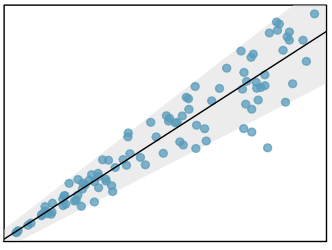
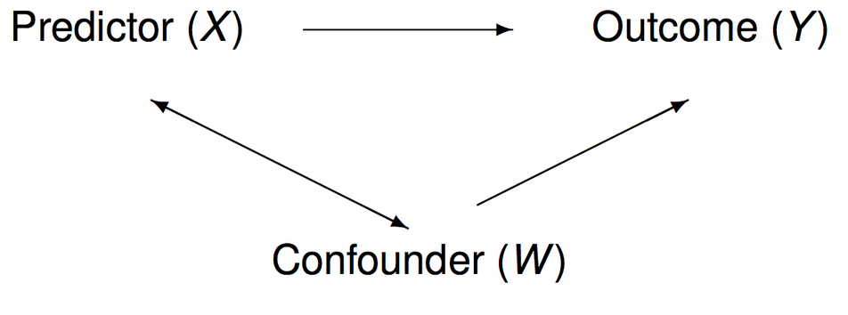
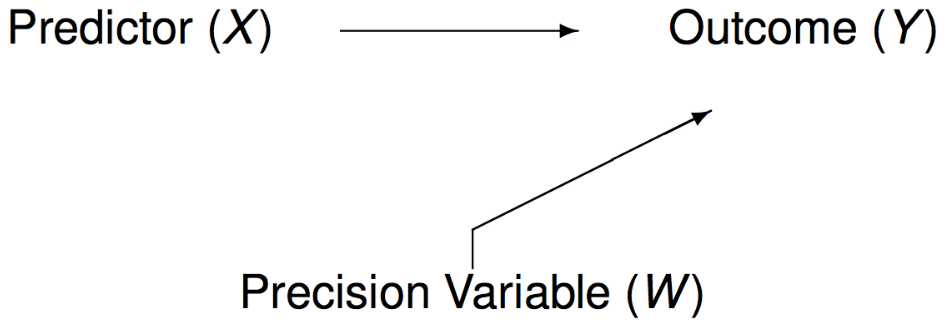

```{r setup, include = FALSE}
knitr::opts_chunk$set(echo = TRUE)
knitr::opts_chunk$set(cache=TRUE)
knitr::opts_chunk$set(fig.align='center', out.width="63%", warning=FALSE, fig.retina=3)
```

```{r load libraries, include=FALSE, comment='#'}
#install.packages( 'tidyverse' )
#install.packages( 'readxl' )

library( tidyverse, quietly=T, warn.conflicts = F )
library( knitr, quietly=T, warn.conflicts = F )
library( readxl, quietly=T, warn.conflicts = F )
#library( tufte, quietly=T, warn.conflicts = F )
library( quantmod, quietly=T, warn.conflicts = F )
library(kableExtra)
#library(gganimate)
#library(rvest)
#library(jsonlite)
#library(listviewer)
library(janitor)

```

```{r reduce code spacing, include = FALSE}
hook1 <- function(x){ gsub("```\n*```r*\n*", "", x) }
hook2 <- function(x){ gsub("```\n+```\n", "", x) }
knit_hooks$set(document = hook2)
```

```{r download data, include=FALSE}
#download.file("http://www.openintro.org/stat/data/mlb11.RData", destfile = "mlb11.RData")
load("mlb11.RData")

#items <- readr::read_csv('https://raw.githubusercontent.com/rfordatascience/tidytuesday/master/data/2020/2020-05-05/items.csv')

#video_games <- readr::read_csv("https://raw.githubusercontent.com/rfordatascience/tidytuesday/master/data/2019/2019-07-30/video_games.csv")
video_games <- read_csv("video_games.csv")
video_games <- video_games %>% 
   clean_names()
```

layout: true
class: 

<!-- Old footer font color: #00A895 -->
<!-- old footer background color: #383838 -->

<!-- footer -->
 <div style="position:fixed; bottom:10px; left:4px; font-size: 12pt; color: #17f9b4; background-color: #545454; width:93.5%">&nbsp;&nbsp;&nbsp;&nbsp;&nbsp;Mary Ryan</div> <!--&nbsp;&nbsp;&nbsp;&nbsp;&nbsp;&nbsp;&nbsp;&nbsp;&nbsp;&nbsp;&nbsp;&nbsp;&nbsp;&nbsp;&nbsp;&nbsp;&nbsp;&nbsp;&nbsp;&nbsp;&nbsp;&nbsp;&nbsp;&nbsp;&nbsp;&nbsp;&nbsp;&nbsp;&nbsp;&nbsp;&nbsp;&nbsp;&nbsp;&nbsp;&nbsp;&nbsp;&nbsp;&nbsp;&nbsp;&nbsp;&nbsp;&nbsp;&nbsp;&nbsp;&nbsp;&nbsp;&nbsp;&nbsp;&nbsp;&nbsp;&nbsp;&nbsp;&nbsp;&nbsp;&nbsp;&nbsp;&nbsp; -->
<div style="position:fixed; bottom:10px; left:550px; font-size: 12pt; color: #17f9b4">Regression</div> <!--&nbsp;&nbsp;&nbsp;&nbsp;&nbsp;&nbsp;&nbsp;&nbsp;&nbsp;&nbsp;&nbsp;&nbsp;&nbsp;&nbsp;&nbsp;&nbsp;&nbsp;&nbsp;&nbsp;&nbsp;&nbsp;&nbsp;&nbsp;&nbsp;&nbsp;&nbsp;&nbsp;&nbsp;&nbsp;&nbsp;&nbsp;&nbsp;&nbsp;&nbsp;&nbsp;&nbsp;&nbsp;&nbsp;&nbsp;&nbsp;&nbsp;&nbsp;&nbsp;&nbsp;&nbsp;&nbsp;&nbsp;&nbsp;&nbsp;&nbsp;&nbsp;&nbsp;&nbsp;&nbsp;&nbsp;&nbsp;&nbsp; -->
<div style="position:fixed; bottom:10px; right:92px; font-size: 12pt; color: #17f9b4">Stats 7</div>

<!-- Recording Notice Slide -->

---

<div style="position:fixed; left:50px; right:50px; top:125px; padding:30px; margin:auto; background-color:#C0F3E4; border-radius:15px">
<p>This class is being conducted over Zoom. As the instructor, I will be .alert[recording] this session. I have disabled the recording feature for others so that no one else will be able to record this session. I will be posting this session to the course’s website.</p>

<p>If you have privacy concerns and .alert[do not wish to appear in the recording], you may turn video off (click .alert[“stop video”]) so that Zoom does not record you.</p>

<p>The chat box is always open for discussion and questions to the entire class. You may also send messages privately to the instructor or the TAs. Please note that Zoom saves all chat transcripts.</p>

<p>I create a live transcription of each session using <a href="https://otter.ai/">Otter.ai</a>. This means that Otter.ai will transcribe anything spoken over the Zoom audio. The transcript will be posted with the session video on the course website.</p>
</div>

<!-- Title Slide -->
---

class: title-slide2

# <center> Regression </center>
## <center> Stats 7 </center>
### <center> Mary Ryan </center>
### .center[Aug. 11, 2020]

<!-- social media info -->
<div style="position:fixed; bottom:40px; left:70px;">
<p> Course website:</p>
<p><a href="https://canvas.eee.uci.edu/courses/28451"> https://canvas.eee.uci.edu/courses/28451 </a></p>

<p> Slides can be found at:</p>
</p><a href="https://maryryan.github.io/stats7-SS2-2020-slides/stats7-SS2-2020-regression/stats7-SS2-2020-regression"> https://maryryan.github.io/stats7-SS2-2020-slides/stats7-SS2-2020-regression/stats7-SS2-2020-regression </a></p>
</div>

---

# Learning Objectives

By the end of today's lecture you should be able to:

- understand how to describe the relationship between two variables

- interpret the intercept and slope(s) of a regression model

- diagnose the appropriateness of a regression model

---

# Studies

- The goal is to explore an association or relationship between two variables

   - There may be a relationship or there may not!
   
- How do we assess whether there is a relationship?

---

# Scatterplots

.pull-left[
- Used to .alert2[**visualize**] relationship between 2 variables

- .alert[**Explanatory/Indendent variable**] goes on x-axis

- .alert[**Dependent variable/response**] goes on y-axis

- .alert2[**Are x and y related?**]

   - Shape (line, curve, mass of points)
   
   - Direction (positive, negative, horizontal, vertical)
   
   - Strength (defined/tight or scattered)
   
   - Outliers?

]

.pull-right[
```{r scatterplot exp, echo=FALSE, out.width="100%"}
x <- rnorm(20,0,1)
beta1 <- rnorm(1,4,2)
beta0 <- rnorm(1,1,1)

y <- beta0+beta1*x + rnorm(20,0,3)

xy.df <- cbind(x, y)
colnames(xy.df) <- c("x", "y")
xy.df <- as.data.frame(xy.df)

xy.df %>% 
   ggplot(aes(x=x, y=y))+
   geom_point(size=4)+
   ggtitle("Scatterplot")+
   xlab("Explanatory (Independent) Variable")+
   ylab("Dependent Variable (Response)")+
   #theme_bw()+
   theme(axis.title = element_text(size=18),
         axis.text = element_text(size=14),
         title = element_text(size=20))

```
]

---

# Example: MLB 2011

Is the number of times a team has a player go up to bat throughout a season (called .alert2[**"at-bats"**]) related to the number of .alert2[**runs**] that teams scores?

```{r mlbPlot, echo=FALSE, out.width="43%"}
#Lab: http://htmlpreview.github.io/?https://github.com/andrewpbray/oiLabs-base-R/blob/master/simple_regression/simple_regression.html


mlb11.p <- mlb11 %>% 
   ggplot(aes(x=at_bats, y=runs, label=team))+
   geom_point(size=2)+
   xlab("at-bats")+
   ggtitle("MLB 2011")+
   theme_minimal()+
   theme(
      title = element_text(size=14),
      axis.title.x = element_text(size=14),
      axis.title.y = element_text(size=14),
      axis.text.x = element_text(size=14),
      axis.text.y = element_text(size=14)
   )

mlb11.p
```

---

# Example: Video Game Ratings

Does the .alert2[**time it takes to complete**] a handheld game affect its .alert2[**ratings**]?

```{r videoGamePlot, echo=FALSE, out.width="45%"}
video_games <- video_games %>% 
   drop_na(c("metrics_review_score", "length_all_play_styles_median"))

video_games.p <- video_games %>% 
   ggplot(aes(x=length_all_play_styles_median,
              y=metrics_review_score))+
   geom_point(size=2)+
   xlab("Median Time to Game Completion (Hours)")+
   ylab("Rating Score")+
   ggtitle("Video Game Ratings")+
   theme_minimal()+
   theme(
      title = element_text(size=14),
      axis.title.x = element_text(size=14),
      axis.title.y = element_text(size=14),
      axis.text.x = element_text(size=14),
      axis.text.y = element_text(size=14)
   )

video_games.p
```

---

# Example: Mass and Height of Star Wars Characters

Is the .alert2[**height**] of a character related to that character's .alert2[**mass**]?

```{r starWars, echo=FALSE, out.width="45%"}
data(starwars)

starwars <- starwars %>% 
   dplyr::filter(!(is.na(mass)), !(is.na(height)))

starwars.p <- starwars %>% 
   ggplot(aes(x=height,
              y=mass))+
   geom_point(size=2)+
   xlab("Height (cm)")+
   ylab("Mass (kg)")+
   ggtitle("Star Wars Characters")+
   theme_minimal()+
   theme(
      title = element_text(size=14),
      axis.title.x = element_text(size=14),
      axis.title.y = element_text(size=14),
      axis.text.x = element_text(size=14),
      axis.text.y = element_text(size=14)
   )

starwars.p
```

---

# Correlation

- .alert[**Correlation, R**], tries to quantify the .alert2[**strength**] and .alert2[**direction**] of a .alert2[**linear**] relationship between two variables

.content-box-gray[
$$R = \frac{\sum_{i=1}^n(x_i - \bar{x})(y_i - \bar{y})}{\sqrt{\sum_{i=1}^n(x_i - \bar{x})^2 \sum_{i=1}^n(y_i - \bar{y})^2}}$$
]

--

- Takes on values from -1 to 1 (unitless)
   
   - R = 0 means the variables have no linear relationship
   
   - R = 1 means the variables have a perfect, .alert2[**positive**] linear relationship
   
      - If X increases by 1 unit, Y increases by 1 unit as well
   
   - R = -1 means the variables have a perfect, .alert2[**negative**] linear relationship
   
      - If X increases by 1 unit, Y decreases by 1 unit
     
---

# Example: MLB 2011 (pt. 2)
Is the number of times a team has a player go up to bat throughout a season (called .alert2[**"at-bats"**]) related to the number of .alert2[**runs**] that teams scores?

```{r mlbPlot2, echo=FALSE, out.width="45%"}
mlb.corr <- cor(mlb11$runs, mlb11$at_bats)

mlb11.p.lab <- mlb11.p + 
   geom_label(aes(x=5460, y=825, label=paste("R=", round(mlb.corr, 4))), size=6)

mlb11.p.lab
```
 
---

# Example: Video Game Ratings (pt. 2)

Does the .alert2[**time it takes to complete**] a handheld game affect its .alert2[**ratings**]?

```{r videoGamePlot2, echo=FALSE, out.width="45%"}
vg.corr <- cor(video_games$metrics_review_score, video_games$length_all_play_styles_median)

vg.p.lab <- video_games.p + 
   geom_label(aes(x=100, y=30, label=paste("R=", round(vg.corr, 4))), size=6)

vg.p.lab
```

---

# Example: Star Wars (pt. 2)

Is the .alert2[**height**] of a character related to that character's .alert2[**mass**]?

```{r starWarsPlot2, echo=FALSE, out.width="45%"}
sw.corr <- cor(starwars$mass, starwars$height)
starwars.p.lab <- starwars.p + 
   geom_label(aes(x=100, y=1000, label=paste("R=", round(sw.corr, 4))), size=6)

starwars.p.lab

```

---

# Correlation

- R only measures the .alert2[**linear**] relationship between two variables

   - Two variables could be perfectly related in a non-linear way and have an R near 0
   
--

- Just because two variables *seems* related, does not mean changes in one *cause* changes in the other
   
.content-box-pink[
<div style="text-align:center">Correlation does not equal causation!</div>
]

---

# Correlation doesn't equal causation example

---

# Linear Regression

- Knowing there *is* a linear relationship is great, but I want to know *how* two variables are related

--

- .alert[**Linear regression**] is like finding the line of best fit

.content-box-teal[
$$y = mx+b$$
$$\Rightarrow y = \beta_0 + \beta_1 x$$
]

- $\beta_0$ is the .alert[**intercept**]
   
   - What we would expect *y* to be if *x* = 0
   
   - Doesn't always have a logical real-world interpretation
   
- $\beta_1$ is the .alert[**slope**]
   
   - How much we expect *y* to change by if we increase *x* by 1 unit
   
   - Usually what we're most intereseted in
   
---

# Regression

- What makes our regression line the "best fit"?

   - It's the line that minimizes the .alert2[**sum of squared residuals**]
   
- A .alert[**residual**], $e_i$, is the distance between an observed data point, and what our line would predict it to be

.pull-left[
.content-box-teal[
$$e_i = y_i - \hat{y}_i$$
]

- Squaring the residuals makes sure positive and negative residuals don't cancel each other out
]

.pull-right[
```{r residual plot, echo=FALSE, out.width="75%", message=FALSE}
xy.lm <- lm(y~x, data=xy.df)
xy.df <- xy.df %>% 
   mutate(fitted = fitted(xy.lm),
          residual = round(residuals(xy.lm), 3))

xy.df %>% 
   ggplot(aes(x=x, y=y))+
   geom_point(size=4)+
   ggtitle("Scatterplot")+
   xlab("Explanatory (Independent) Variable")+
   ylab("Dependent Variable (Response)")+
   geom_smooth(method="lm", se=FALSE)+
   geom_segment(aes(x = x, y = y,
                   xend = x, yend = fitted, color="red"))+
   #geom_label(aes(label=residual, x=x, y=fitted + 0.5*residual, color="red"))+
   theme(axis.title = element_text(size=18),
         axis.text = element_text(size=14),
         title = element_text(size=20),
         legend.position = "none")
```
]

---

# Regression

.content-box-gray[
$$\hat{\beta}_0 = \bar{y} + \hat{\beta_1}\bar{x}$$
$$\hat{\beta}_1 = \frac{\sum_{i=1}^n (x_i - \bar{x})(y_i - \bar{y})}{\sum_{i=1}^n(x_i-\bar{x})^2}$$
]

---

# Conditions for Linear Regression

**There are 4 conditions we need to meet for linear regression to be appropriate. If we fail to meet one (or multiple) of these conditions, the reported relationship between X and Y from the regression might be biased from the truth** 

<div style="position:fixed; top:450px; right:400px">   
   
</div>

1. .alert[**Linearity**]

   - Linear regression models the linear relationship between variables, so the data should look like some sort of linear relationship exists

2. .alert[**Roughly "bell-curve" residuals**]

   - If you make histogram of the residuals, it should look like a bell curve (symmetric, unimodal)

3. .alert[**Constant variability**]

   - The variability of points around the least squares line remains roughly constant
      - Example of non-constant variability:
   <br>
   <br>
   <br>
   <br>

4. .alert[**Independent observations**]
   
   - No observation should influence the values of other observations

---

# Example: MLB 2011 (pt. 3.1)

Is the number of times a team has a player go up to bat throughout a season (called .alert2[**"at-bats"**]) related to the number of .alert2[**runs**] that teams scores?

.pull-left[
<div style="top:10px;">
```{r mlbPlot3, echo=FALSE, out.width="95%"}

mlb11.p.lab.lm <- mlb11.p.lab+
   geom_smooth(method='lm', se=FALSE)

mlb11.p.lab.lm
```
</div>
]

--

.pull-right[

```{r mlbReg, echo=FALSE}
mlb.lm <- summary(lm(runs ~ at_bats, data=mlb11))
```

Runs = $\beta_0 + \beta_1$ (at-bats)

Runs = `r round(mlb.lm$coef[1,1], 4)` + `r round(mlb.lm$coef[2,1], 4)`(at-bats)

{{content}}

]


--

<span style="color:#1f9773">**When a team sends no players to bat for an entire season, we would expect their runs for the season to be `r round(mlb.lm$coef[1,1], 4)`, on average.**</span>

{{content}}

--

<div style="color:#d82d47; font-weight:bold; position:relative; right:-50px;">

Doesn't make sense

</div>
{{content}}

--

<span style="color:#1f9773">**For every 1 extra player a team sends to bat during a season, their total runs increase by `r round(mlb.lm$coef[2,1], 4)`, on average.**</span>

{{content}}

---

# Example: MLB 2011 (pt. 3.2)

- Is linear regression appropriate for this data?

--

```{r mlbResid, echo=FALSE, out.width="45%", message=FALSE}

mlb.lm$residuals %>% 
   as.data.frame() %>% 
   ggplot(aes(x=.), bins=25)+
   geom_histogram()+
   theme_minimal()

```


---

# Example: Video Game Ratings (pt. 3.1)

Does the .alert2[**time it takes to complete**] a handheld game affect its .alert2[**ratings**]?

.pull-left[
<div style="top:10px;">
```{r vgPlot3, echo=FALSE, out.width="95%", message=FALSE}

vg.p.lab.lm <- vg.p.lab +
   geom_smooth(method='lm', se=FALSE)

vg.p.lab.lm
```
</div>
]

--

.pull-right[

```{r vgReg, echo=FALSE}
vg.lm <- summary(lm(metrics_review_score ~ length_all_play_styles_median, data=video_games))
```

Review Score = $\beta_0 + \beta_1$ (Median time to completion)

Review Score = `r round(vg.lm$coef[1,1], 4)` + `r round(vg.lm$coef[2,1], 4)`(Median time to completion)

{{content}}

]


--

<span style="color:#1f9773">** When a game's median completion time is 0 hours, the game will receive a rating of `r round(vg.lm$coef[1,1], 4)`, on average.**</span>

{{content}}

--

<div style="color:#d82d47; font-weight:bold; position:relative; right:-50px;">

Doesn't make sense

</div>
{{content}}

--

<span style="color:#1f9773">**When the median completion time increases by 1 hour, a game's rating increases by `r round(vg.lm$coef[2,1], 4)`, on average.**</span>

{{content}}

---

# Example: Video Game Ratings (pt. 3.2)

- Is linear regression appropriate for this data?

--

```{r vgResid, echo=FALSE, out.width="45%", message=FALSE}

vg.lm$residuals %>% 
   as.data.frame() %>% 
   ggplot(aes(x=.), bins=45)+
   geom_histogram()+
   theme_minimal()

```

---

# Example: Star Wars (pt. 3.1)

Is the .alert2[**height**] of a character related to that character's .alert2[**mass**]?

.pull-left[
<div style="top:10px;">
```{r starwarsPlot3, echo=FALSE, out.width="95%", message=FALSE}

starwars.p.lab.lm <- starwars.p.lab+
   geom_smooth(method='lm', se=FALSE)

starwars.p.lab.lm
```
</div>
]

--

.pull-right[

```{r swReg, echo=FALSE}
sw.lm <- summary(lm(mass ~ height, data=starwars))
```

Mass = $\beta_0 + \beta_1$ (height)

Mass = `r round(sw.lm$coef[1,1], 4)` + `r round(sw.lm$coef[2,1], 4)`(height)

{{content}}

]


--

<span style="color:#1f9773">**When a character is 0 cm tall, we would expect their mass to be `r round(sw.lm$coef[1,1], 4)` kg, on average.**</span>

{{content}}

--

<div style="color:#d82d47; font-weight:bold; position:relative; right:-50px;">

Doesn't make sense

</div>
{{content}}

--

<span style="color:#1f9773">**For every 1 extra centimeter taller a character is, their mass increases by `r round(sw.lm$coef[2,1], 4)` kg, on average.**</span>

{{content}}

---

# Example: Star Wars (pt. 3.2)

- Is linear regression appropriate for this data?

--

```{r swResid, echo=FALSE, out.width="45%", message=FALSE}

sw.lm$residuals %>% 
   as.data.frame() %>% 
   ggplot(aes(x=.), bins=45)+
   geom_histogram()+
   theme_minimal()

```


---

# $R^2$

- How can we tell whether our regression model is good?

   - Regression gives us the "best fit" line, but is "best" actually good?
   
- $R^2$ quantifies how much .alert2[**variation**] in our response is explained by our explanatory variable

   - If our explanatory variable explains most of the variation in our response, then our regression model is probably pretty good at predicting what the response will do
   
   - If our explanatory variable explains little of the variation in our response, then it will not do a good job of predicting what the response will do

.content-box-teal[
"Variable *x* explains $(R^2 \times 100)$% of the variation in response variable *y*"
]

---

# Example: MLB 2011 (pt. 4)

Is the number of times a team has a player go up to bat throughout a season (called .alert2[**"at-bats"**]) related to the number of .alert2[**runs**] that teams scores?

.pull-left[
<div style="top:10px;">
```{r mlbPlot4, echo=FALSE, out.width="95%"}

mlb11.p.lab.lm
```
</div>
]


.pull-right[

Runs = $\beta_0 + \beta_1$ (at-bats)

Runs = `r round(mlb.lm$coef[1,1], 4)` + `r round(mlb.lm$coef[2,1], 4)`(at-bats)

<span style="color:#1f9773">**When a team sends no players to bat for an entire season, we would expect their runs for the season to be `r round(mlb.lm$coef[1,1], 4)`, on average.**</span>

<div style="color:#d82d47; font-weight:bold; position:relative; right:-50px;">

Doesn't make sense

</div>

<span style="color:#1f9773">**For every 1 extra player a team sends to bat during a season, their total runs increase by `r round(mlb.lm$coef[2,1], 4)`, on average.**</span>

{{content}}

]

--

R<sup>2</sup> = `r round(mlb.lm$r.squared, 4)`

{{content}}

--

<span style="color:#1f9773">**`r round(mlb.lm$r.squared, 4)*100` % of the variability in runs is explained by at-bats.**</span>

{{content}}

---

# Example: Video Game Ratings (pt. 4)

Does the .alert2[**time it takes to complete**] a handheld game affect its .alert2[**ratings**]?

.pull-left[
<div style="top:10px;">
```{r vgPlot4, echo=FALSE, out.width="95%"}
vg.p.lab.lm
```
</div>
]


.pull-right[

Review Score = $\beta_0 + \beta_1$ (Median time to completion)

Review Score = `r round(vg.lm$coef[1,1], 4)` + `r round(vg.lm$coef[2,1], 4)`(Median time to completion)

<span style="color:#1f9773">** When a game's median completion time is 0 hours, the game will receive a rating of `r round(vg.lm$coef[1,1], 4)`, on average.**</span>


<div style="color:#d82d47; font-weight:bold; position:relative; right:-50px;">

Doesn't make sense

</div>

<span style="color:#1f9773">**When the median completion time increases by 1 hour, a game's rating increases by `r round(vg.lm$coef[2,1], 4)`, on average.**</span>

{{content}}


]

--

R<sup>2</sup> = `r round(vg.lm$r.squared, 4)`

{{content}}

--

<span style="color:#1f9773">**`r round(vg.lm$r.squared, 4)*100` % of the variability in rating score is explained by median completion time.**</span>

{{content}}

---

# Example: Star Wars (pt. 4)

Is the .alert2[**height**] of a character related to that character's .alert2[**mass**]?

.pull-left[
<div style="top:10px;">
```{r starwarsPlot4, echo=FALSE, out.width="95%", message=FALSE}

starwars.p.lab.lm
```
</div>
]

.pull-right[

Mass = $\beta_0 + \beta_1$ (height)

Mass = `r round(sw.lm$coef[1,1], 4)` + `r round(sw.lm$coef[2,1], 4)`(height)

<span style="color:#1f9773">**When a character is 0 cm tall, we would expect their mass to be `r round(sw.lm$coef[1,1], 4)` kg, on average.**</span>

<div style="color:#d82d47; font-weight:bold; position:relative; right:-50px;">

Doesn't make sense

</div>

<span style="color:#1f9773">**For every 1 extra centimeter taller a character is, their mass increases by `r round(sw.lm$coef[2,1], 4)` kg, on average.**</span>

{{content}}

]

--

R<sup>2</sup> = `r round(sw.lm$r.squared, 4)`

{{content}}

--

<span style="color:#1f9773">**`r round(sw.lm$r.squared, 4)*100` % of the variability in mass is explained by character height.**</span>

{{content}}


---

# Prediction

- We can also use the regression model to .alert2[**predict**] response variables given explanatory variables that aren’t explicitly in our dataset!

.content-box-teal[
$$\hat{y}^* = \beta_0 + \beta_1x^*$$
]

--

- Must be careful of .alert[**extrapolation**] though

   - Making inference wildly outside of the range of our data
   
   - We are only sure of the relationship between explanatory and response variables within the scope of data we have observed

---

# Example: MLB 2011 (pt. 5)

We want to predict the number of runs we can expect to get in a season if our team has 5,650 at-bats.

.pull-left[
<div style="top:10px;">
```{r mlbPlot5, echo=FALSE, out.width="95%"}

mlb11.p.lab.lm+
   annotate("text", x=5650, y=540, label="5650", color="red", size=6, vjust=1)+
   coord_cartesian(expand=F, clip = "off")

```
</div>
]


.pull-right[

Runs = `r round(mlb.lm$coef[1,1], 4)` + `r round(mlb.lm$coef[2,1], 4)`(at-bats)

{{content}}

]

--

Runs<sup>*</sup> = `r round(mlb.lm$coef[1,1], 4)` + `r round(mlb.lm$coef[2,1], 4)`(5,650)

{{content}}

--

<span style="color:#1f9773; font-weight:bold;">
Runs<sup>*</sup> = `r round(mlb.lm$coef[1,1], 4) + round(mlb.lm$coef[2,1], 4)*5650`
</span>


---

# Example: Video Game Ratings, (pt. 5)

We want to predict the rating score we can expect a game to receive if the median completion time is 250 hours.

.pull-left[
<div style="top:10px;">
```{r vgPlot5, echo=FALSE, out.width="95%"}

video_games.p+
   xlim(0, 300)+
   ylim(0, 150)+
   geom_smooth(method='lm', se=FALSE, fullrange=TRUE)+
   annotate("text", x=250, y=0, label="250", color="red", size=6, vjust=1)+
   coord_cartesian(expand=F, clip = "off")

```
</div>
]


.pull-right[

Review Score = `r round(vg.lm$coef[1,1], 4)` + `r round(vg.lm$coef[2,1], 4)`(Median time to completion)

{{content}}

]

--

Review Score<sup>*</sup> = `r round(vg.lm$coef[1,1], 4)` + `r round(vg.lm$coef[2,1], 4)`(250)

{{content}}

--

<span style="color:#d82d47; font-weight:bold;">
Review Score<sup>*</sup> = `r round(vg.lm$coef[1,1], 4) + round(vg.lm$coef[2,1], 4)*250`
</span>

---

# Example: MLB 2011, (pt. 6)

We want to predict the number of runs we can expect to get in a season if our team has 8,500 at-bats.

.pull-left[
<div style="top:10px;">
```{r mlbPlot6, echo=FALSE, out.width="95%"}

mlb11.p+
   xlim(5000, 9000)+
   ylim(540, 3000)+
   geom_smooth(method='lm', se=FALSE, fullrange=TRUE)+
   annotate("text", x=8500, y=540, label="8,500", color="red", size=6, vjust=1)+
   coord_cartesian(expand=F, clip = "off")

```
</div>
]


.pull-right[

Runs = `r round(mlb.lm$coef[1,1], 4)` + `r round(mlb.lm$coef[2,1], 4)`(at-bats)

{{content}}

]

--

Runs<sup>*</sup> = `r round(mlb.lm$coef[1,1], 4)` + `r round(mlb.lm$coef[2,1], 4)`(8,500)

{{content}}

--

<span style="color:#d82d47; font-weight:bold;">
Runs<sup>*</sup> = `r round(mlb.lm$coef[1,1], 4) + round(mlb.lm$coef[2,1], 4)*8500`
</span>


---

# Multiple Regression

- In the real world, one explanatory variable is rarely the sole explanation for how the response variable acts

- .alert[**Multiple regression**] is an extension of simple linear regression, but instead of one explanatory variable we may have two or more

   - Still have one explanatory .alert2[**variable of interest**] that we care most about how it interacts with the response variable
   
   - Other explanatory variables in the regression are then known as .alert2[**adjustment variables**], or variables that we know are related to the response variable in some way
   
---

# Types of Adjustment Variables

- .alert[**Confounding variables**]

   - Related to both the explanatory variable of interest and the response variable
   
   - Including these in the model will adjust for this variable’s confounding effect and .alert2[**isolate**] the effect of the explanatory variable of interest
   


---

# Types of Adjustment Variables

- .alert[**Precision variables**]

   - Just related to the response variable
   
   - Including these in a regression will make our model .alert2[**more accurate**] and give us more specific effects of the explanatory variable of interest on the response
   


---

# Example: MLB 2011 (pt. 7)

What else might be related to the number of runs a team scores as well as the number of players they send to bat?

---

# Example: MLB 2011 (pt. 7)

What else might be related to the number of runs a team scores as well as the number of players they send to bat?

- Batting average?
   - Teams with a higher batting average will probably score more runs
   - A low batting average would mean players are frequently struck out, which means less opportunity for players to bat (if 3 players strike out, the teams switch places)
  
--
 
- Home runs?
   - Teams with more home runs score more runs
   - Teams with more home runs might mean fewer strike outs, which means more opportunities for players to bat
   
--

- Wins?
   - Teams who scored more runs will have more wins
   - Don't say much about at-bats...

---

# Example: MLB 2011 (pt. 7)

Adjusted Model:

- Runs = $\beta_0$ + $\beta_1$(at-bats) + $\beta_2$(batting avg) + $\beta_3$(homeruns)

```{r MLBmulti, echo=FALSE}
mlb.lm.multi <- summary(lm(runs ~ at_bats + bat_avg + homeruns, data=mlb11))

```

--

- Runs = `r round(mlb.lm.multi$coef[1,1],4)` + `r round(mlb.lm.multi$coef[2,1],4)`(at-bats) + `r round(mlb.lm.multi$coef[3,1],4)`(batting avg) + `r round(mlb.lm.multi$coef[4,1],4)`(homeruns)

--


.alert2[**For every 1 extra player a team sends to bat during a season, their total runs**] .alert[**decrease**] .alert2[**by `r -round(mlb.lm.multi$coef[2,1], 4)`, on average.**]

--

Old Model:

- Runs = `r round(mlb.lm$coef[1,1],4)` + .alert[`r round(mlb.lm$coef[2,1],4)`](at-bats) 

---

# Example: Video Game Ratings (pt. 6)

What else might be related to a game's rating score, as well as the completion time?

---

# Example: Video Game Ratings (pt. 6)

What else might be related to a game's rating score, as well as the completion time?

- Genre?

- ESRB Rating?

---

# Example: Video Game Ratings (pt. 6)

Adjusted Model:

- Review Score = $\beta_0$ + $\beta_1$(Median time to completion) + $\beta_2$(ESRB rating)

```{r VGmulti, echo=FALSE}
vg.lm.multi <- summary(lm(metrics_review_score ~ length_all_play_styles_median + release_rating, data=video_games))

```

--

- Review Score = `r round(vg.lm.multi$coef[1,1],4)` + `r round(vg.lm.multi$coef[2,1],4)`(Median time to completiton) `r round(vg.lm.multi$coef[3,1],4)`(ESRB rating = T) `r round(vg.lm.multi$coef[4,1],4)`(ESRB rating = M)

--


.alert2[**When the median completion time increases by 1 hour, a game's rating increases by `r round(vg.lm.multi$coef[2,1], 4)`, on average.**]

--

Old Model:

- Review Score = `r round(vg.lm$coef[1,1],4)` + .alert[`r round(vg.lm$coef[2,1],4)`](Median time to completion) 
