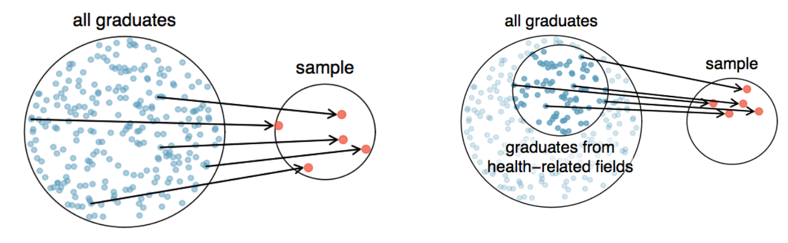
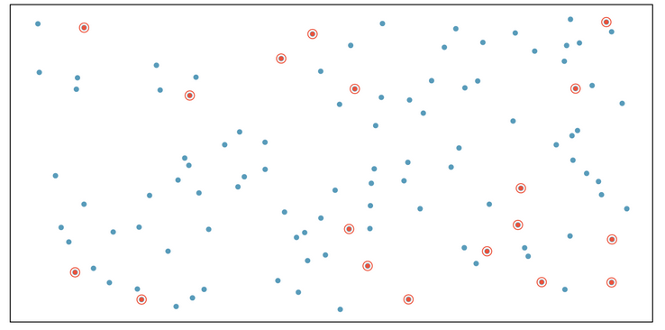
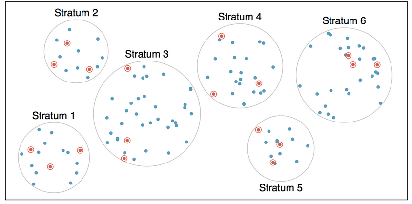
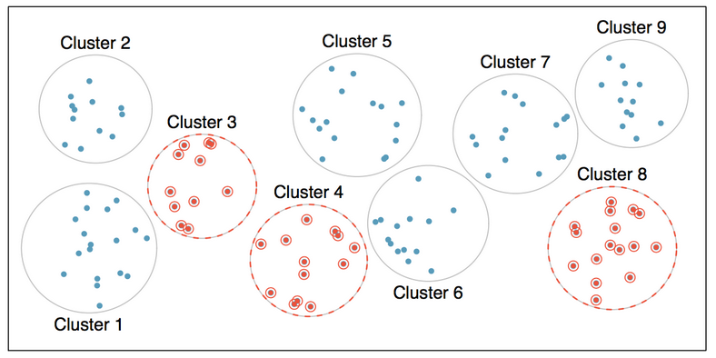
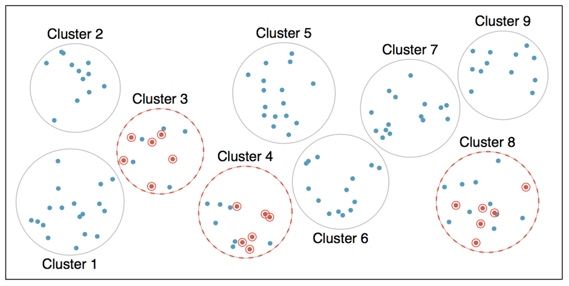
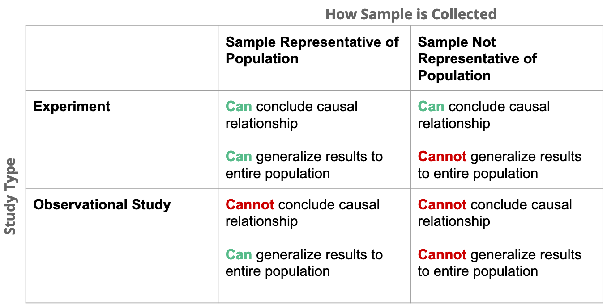

```{r setup, include = FALSE}
knitr::opts_chunk$set(echo = TRUE)
knitr::opts_chunk$set(cache=TRUE)
knitr::opts_chunk$set(fig.align='center', out.width="63%", warning=FALSE)
```

```{r load libraries, include=FALSE, comment='#'}
#install.packages( 'tidyverse' )
#install.packages( 'readxl' )

library( tidyverse, quietly=T, warn.conflicts = F )
library( knitr, quietly=T, warn.conflicts = F )
library( readxl, quietly=T, warn.conflicts = F )
#library( tufte, quietly=T, warn.conflicts = F )
library( quantmod, quietly=T, warn.conflicts = F )

```

```{r reduce code spacing, include = FALSE}
hook1 <- function(x){ gsub("```\n*```r*\n*", "", x) }
hook2 <- function(x){ gsub("```\n+```\n", "", x) }
knit_hooks$set(document = hook2)
```

```{r load data, include=F}

#avocado <- read_excel( "avocado.xlsx" )

```

layout: true
class: 

<!-- Old footer font color: #00A895 -->
<!-- old footer background color: #383838 -->

<!-- footer -->
<div style="position:fixed; bottom:10px; left:4px; font-size: 12pt; color: #17f9b4; background-color: #545454; width:93.5%">&nbsp;&nbsp;&nbsp;&nbsp;&nbsp;Mary Ryan</div> <!--&nbsp;&nbsp;&nbsp;&nbsp;&nbsp;&nbsp;&nbsp;&nbsp;&nbsp;&nbsp;&nbsp;&nbsp;&nbsp;&nbsp;&nbsp;&nbsp;&nbsp;&nbsp;&nbsp;&nbsp;&nbsp;&nbsp;&nbsp;&nbsp;&nbsp;&nbsp;&nbsp;&nbsp;&nbsp;&nbsp;&nbsp;&nbsp;&nbsp;&nbsp;&nbsp;&nbsp;&nbsp;&nbsp;&nbsp;&nbsp;&nbsp;&nbsp;&nbsp;&nbsp;&nbsp;&nbsp;&nbsp;&nbsp;&nbsp;&nbsp;&nbsp;&nbsp;&nbsp;&nbsp;&nbsp;&nbsp;&nbsp; -->
<div style="position:fixed; bottom:10px; left:500px; font-size: 12pt; color: #17f9b4">Data Collection & Bias</div> <!--&nbsp;&nbsp;&nbsp;&nbsp;&nbsp;&nbsp;&nbsp;&nbsp;&nbsp;&nbsp;&nbsp;&nbsp;&nbsp;&nbsp;&nbsp;&nbsp;&nbsp;&nbsp;&nbsp;&nbsp;&nbsp;&nbsp;&nbsp;&nbsp;&nbsp;&nbsp;&nbsp;&nbsp;&nbsp;&nbsp;&nbsp;&nbsp;&nbsp;&nbsp;&nbsp;&nbsp;&nbsp;&nbsp;&nbsp;&nbsp;&nbsp;&nbsp;&nbsp;&nbsp;&nbsp;&nbsp;&nbsp;&nbsp;&nbsp;&nbsp;&nbsp;&nbsp;&nbsp;&nbsp;&nbsp;&nbsp;&nbsp; -->
<div style="position:fixed; bottom:10px; right:92px; font-size: 12pt; color: #17f9b4">Stats 7</div>

---

<div style="position:fixed; left:50px; right:50px; top:175px; padding:30px; margin:auto; background-color:#C0F3E4; border-radius:15px">
<p>This class is being conducted over Zoom. As the instructor, I will be .alert[recording] this session. I have disabled the recording feature for others so that no one else will be able to record this session. I will be posting this session to the course’s website.</p>

<p>If you have privacy concerns and .alert[do not wish to appear in the recording], you may turn video off (click .alert[“stop video”]) so that Zoom does not record you.</p>

<p>The chat box is always open for discussion and questions to the entire class. You may also send messages privately to the instructor or the TAs. Please note that Zoom saves all chat transcripts.</p>
</div>

---

class: title-slide2

# <center> Sampling & Bias </center>
## <center> Stats 7 </center>
### <center> Mary Ryan </center>

<!-- social media info -->
<div style="position:fixed; bottom:40px; left:70px;">
<div><a href="https://canvas.eee.uci.edu/courses/28451"> https://canvas.eee.uci.edu/courses/28451 </a></div>
</div>


---

# Populations & Samples

- A .alert[**population**] is all of the members of a specific group

   - All the animals at the Irvine animal shelter
   
   - All the books in the Orange County Public Library system
   
   - All the people living in California
   
--
   
- A larger population can be made up of several smaller sub-populations

   - All the dogs at the Irvine animal shelter
   
   - All the novels in the Orange County Public Library system
   
   - All the people living in Orange County

--

- A .alert[**sample**] is a subset of a population

   - Five animals at the Irvine animal shelter
   
   - Twenty-five books in the Orange County Public Library system
   
   - Fifty-seven people living in California

---

# Why Sample?

- The goal of a .alert[**census**] is to collect information about an entire population

   - We want to know about a population's .alert[**parameters**]
      
      - i.e., population's true mean age, true proportion of homeless, true range of yearly incomes, etc.

--

- We want to learn about a population, but populations are often very large
   
   - Difficult to observe all populations members
   
   - Observing every member may be very expensive or take a very long time
   
- By selecting a sample and learning about its members, we assume their characteristics or opinions are representative of the whole population

   - The act of selecting a sample is known as .alert[**sampling**]
   
   - An estimate of a population parameter (using sample data) is known as a .alert[**statistic**]
   
---

# Why Sample?
<div style="position:absolute; top:40%; right:7%; width:90%">
.content-box-teal[
.center[
**P**arameters come from **p**opulations

**S**tatistics come from **s**amples
]
]
</div>

---

# Population of Interest



- What do we want our .alert[**population of interest**] to be?

- How widely do we want to generalize our results?

---

# Sampling

- We want to make sure our sample is .alert[**unbiased**], or not systematically different from the population

- Whenever possible, we want to ensure that sampling units are taken from the population at .alert2[**random**]

   - This reduces the chance of introducing bias
   
--

- Why might there be problems with not selecting sampling units at random?

   - Conducting a survey at Disneyland about guest preferences but only selecting people in high heels

   - Wanting to learn about shopping habits of all people in U.S., and we only talk to our friends

- Want to avoid .alert[**convenience samples**] when possible

   - Easily accessible individuals have a higher probability of being selected
   
---

# Types of Random Sampling

- Many types of sampling techniques, each with pros and cons depending on your goal

- .alert[**Simple random sample**]: sampling technique in which each case in a population has an .alert2[**equal chance**] of being included in the final sample and knowing that a particular case is in the sample gives us no knowledge about the other cases in the sample

   - This is the most common type of sampling you will encounter
   
   - When we say “randomly assign”, we generally mean simple random sample 
   

.center[

]

---

# Types of Sampling

- .alert[**Stratified sampling**]: the population are divided into mutually exclusive groups called .alert[**strata**] and then a simple random sample is taken from each strata
   
   - Cases within a strata will have something in common like gender, age, or race
   
   - Two strata will look different, while the cases within a strata will look similar
   
.center[]

---

# Types of Sampling

- .alert[**Cluster sampling**]: the population is divided into naturally occurring groups called .alert[**clusters**], and then entire clusters are randomly chosen

   - A common clustering is geographical location
   
   - Often, there will be differences within a cluster, but two clusters considered as a whole will look similar
   
.center[]
   
---

# Types of Sampling

- .alert[**Multi-stage cluster sampling**]: similar to cluster sampling, entire clusters are chosen at random, then a simple random sample is taken of the individual cases within those selected clusters

.center[]

---

# Sampling Example 1

Suppose we are interested in estimating the malaria rate in a densely tropical portion of rural Indonesia. We learn that there are 30 villages in that part of the Indonesian jungle, each more or less similar to the next. To sample 150 individuals to test for malaria, we randomly select half of the villages, then randomly select 10 people from each village.

- What type of sampling procedure does this describe?

---

# Sampling Example 2

Consider the salaries of Major League Baseball (MLB) players, where each player is a member of one of the league’s 30 teams. To take a sample of 120 baseball players and their salaries, we could write the names of that season’s several hundreds of players onto slips of paper, drop the slips into a bucket, shake the bucket around until we are sure the names are all mixed up, then draw out slips until we have the sample of 120 players.

- What type of sampling procedure does this describe?

---

# Sampling Example 3

A university wants to determine what fraction of its undergraduate student body support a new $25 annual fee to improve the student union. To obtain a sample of students, administrator break the students by their field of study, then sample 10% of students from each field.

- What type of sampling procedure does this describe?

---

# Types of Bias

- .alert[**Undercoverage**]: parts of the population will be left out depending on the survey method (i.e., the Census and homeless people)

- .alert[**Nonresponse**]: certain types of people choose not to respond or participate

- .alert[**Wording Effects**]: questions may be leading, biased, or confusing

- .alert[**Response Bias**]: people can lie about their answers to make themselves sound like better people

---

# Bias Example 1

A statistics student who is curious about the relationship between the amount of time students spend on social networking sites and their performance at school decides to conduct a survey.

.alert2[**They post a link to an online survey on Facebook and asks their friends to fill out the survey.**]

- What bias (if any) might you expect from this method?

---

# Bias Example 2

A statistics student who is curious about the relationship between the amount of time students spend on social networking sites and their performance at school decides to conduct a survey.

.alert2[**They randomly sample 40 students from the study’s population, gives them the survey, asks them to fill it out and bring it back the next day.**]

- What bias (if any) might you expect from this method?

---

# Bias Example 3

A statistics student who is curious about the relationship between the amount of time students spend on social networking sites and their performance at school decides to conduct a survey.

.alert2[**They randomly sample 5 classes and asks a random sample of students from those classes to fill out the survey.**]

- What bias (if any) might you expect from this method?

---

# Types of Studies: Experiments

- Two types: experimental and observational

- .alert[**Experimental studies**] are those where researchers explicitly administer a treatment

- Researchers randomly assign volunteers to treatment and control groups

- Reducing bias in experiments: blinding
   
   - Studies that are .alert[**blinded**] mean that the volunteer doesn’t know whether they’re in a treatment or control group
   
   - Studies that are .alert[**double-blind**] mean that neither the volunteer nor the treatment administrator know whether they’re in the treatment or placebo groups
      - Usually the treatment administrator is a “middle man” who is given a treatment from the researchers to give to the volunteer
      
- Blinding helps ensure that subjects or researchers aren’t behaving consciously (or subconsciously) to influence the outcome

---

# Principles of Experimental Design

- Controlling

   - Researchers do their best to reduce the differences between groups to isolate effect of treatment
   
   - Done by developing a thorough study design
   
   - Can therefore make .alert2[**causal**] conclusions
   
- Randomization

   - Researchers randomize volunteers into groups to account for factors that can’t be controlled (often because we can’t think of every little thing to control for)
   
---

# Principles of Experimental Design

- Replication

   - The smaller a sample you take, the more likely the effects you’re seeing are specific to that group of people
   
   - To make an experiment replicable, a large enough sample must be taken
   
   - Entire experiments can also be repeated to double-check results 

- Blocking

   - Sometimes necessary to divide your sampling pool into blocks based on a similar trait, and run the experiment on both blocks

   - After dividing into blocks, each block gets divided into control and treatment groups
   
   - Helps make conclusions and results more specific

---

# Completely Randomized vs. Block Design


---

# Types of Studies: Observational

- Sometimes it's not possible or ethical to conduct an experiment

- .alert[**Observational studies**] are those where researchers passively observe subjects and record certain variables as time goes on

- Because researchers cannot control outside factors, though, we cannot draw causal conclusions

---

# Types of Studies vs. Types of Conclusions

.center[]

---


# Experiments vs. Observational Studies: Pros and Cons


<div class="verticalLine" style="position:fixed; left:600px">
<br>
<br>
<br>
<br>
<br>
<br>
<br>
<br>
<br>
<br>
<br>
<br>
<br>
<br>
<br>
<br>
<br>
<br>
<br>
<br>
<br>
</div>


---