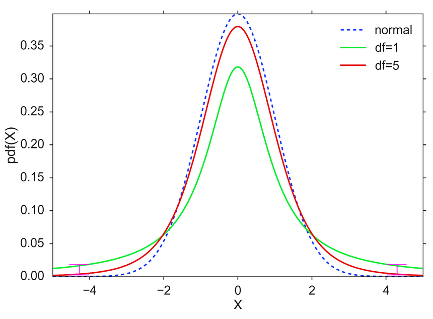

```{r setup, include = FALSE}
knitr::opts_chunk$set(echo = TRUE)
knitr::opts_chunk$set(cache=TRUE)
knitr::opts_chunk$set(fig.align='center', out.width="63%", warning=FALSE, fig.retina=3)
```

```{r load libraries, include=FALSE, comment='#'}
#install.packages( 'tidyverse' )
#install.packages( 'readxl' )

library( tidyverse, quietly=T, warn.conflicts = F )
library( knitr, quietly=T, warn.conflicts = F )
library( readxl, quietly=T, warn.conflicts = F )
#library( tufte, quietly=T, warn.conflicts = F )
#library( quantmod, quietly=T, warn.conflicts = F )
library( patchwork )

```

```{r reduce code spacing, include = FALSE}
hook1 <- function(x){ gsub("```\n*```r*\n*", "", x) }
hook2 <- function(x){ gsub("```\n+```\n", "", x) }
knit_hooks$set(document = hook2)
```


layout: true
class: 

<!-- Old footer font color: #00A895 -->
<!-- old footer background color: #383838 -->

<!-- footer -->
 <div style="position:fixed; bottom:10px; left:4px; font-size: 12pt; color: #17f9b4; background-color: #545454; width:93.5%">&nbsp;&nbsp;&nbsp;&nbsp;&nbsp;Mary Ryan</div> <!--&nbsp;&nbsp;&nbsp;&nbsp;&nbsp;&nbsp;&nbsp;&nbsp;&nbsp;&nbsp;&nbsp;&nbsp;&nbsp;&nbsp;&nbsp;&nbsp;&nbsp;&nbsp;&nbsp;&nbsp;&nbsp;&nbsp;&nbsp;&nbsp;&nbsp;&nbsp;&nbsp;&nbsp;&nbsp;&nbsp;&nbsp;&nbsp;&nbsp;&nbsp;&nbsp;&nbsp;&nbsp;&nbsp;&nbsp;&nbsp;&nbsp;&nbsp;&nbsp;&nbsp;&nbsp;&nbsp;&nbsp;&nbsp;&nbsp;&nbsp;&nbsp;&nbsp;&nbsp;&nbsp;&nbsp;&nbsp;&nbsp; -->
<div style="position:fixed; bottom:10px; left:500px; font-size: 12pt; color: #17f9b4">Sampling Distributions</div> <!--&nbsp;&nbsp;&nbsp;&nbsp;&nbsp;&nbsp;&nbsp;&nbsp;&nbsp;&nbsp;&nbsp;&nbsp;&nbsp;&nbsp;&nbsp;&nbsp;&nbsp;&nbsp;&nbsp;&nbsp;&nbsp;&nbsp;&nbsp;&nbsp;&nbsp;&nbsp;&nbsp;&nbsp;&nbsp;&nbsp;&nbsp;&nbsp;&nbsp;&nbsp;&nbsp;&nbsp;&nbsp;&nbsp;&nbsp;&nbsp;&nbsp;&nbsp;&nbsp;&nbsp;&nbsp;&nbsp;&nbsp;&nbsp;&nbsp;&nbsp;&nbsp;&nbsp;&nbsp;&nbsp;&nbsp;&nbsp;&nbsp; -->
<div style="position:fixed; bottom:10px; right:92px; font-size: 12pt; color: #17f9b4">Stats 7</div>

<!-- Recording Notice Slide -->
---

<div style="position:fixed; left:50px; right:50px; top:125px; padding:30px; margin:auto; background-color:#C0F3E4; border-radius:15px">
<p>This class is being conducted over Zoom. As the instructor, I will be .alert[recording] this session. I have disabled the recording feature for others so that no one else will be able to record this session. I will be posting this session to the course’s website.</p>

<p>If you have privacy concerns and .alert[do not wish to appear in the recording], you may turn video off (click .alert[“stop video”]) so that Zoom does not record you.</p>

<p>The chat box is always open for discussion and questions to the entire class. You may also send messages privately to the instructor or the TAs. Please note that Zoom saves all chat transcripts.</p>

<p>I create a live transcription of each session using <a href="https://otter.ai/">Otter.ai</a>. This means that Otter.ai will transcribe anything spoken over the Zoom audio. The transcript will be posted with the session video on the course website.</p>
</div>

<!-- Title Slide -->
---

class: title-slide2

# <center> Sampling Distributions </center>
## <center> Stats 7 </center>
### <center> Mary Ryan </center>
### .center[Aug. 25, 2020]

<!-- social media info -->
<div style="position:fixed; bottom:40px; left:70px;">
<p> Course website:</p>
<p><a href="https://canvas.eee.uci.edu/courses/28451"> https://canvas.eee.uci.edu/courses/28451 </a></p>

<p> Slides can be found at:</p>
</p><a href="https://maryryan.github.io/stats7-SS2-2020-slides/stats7-SS2-2020-samplingBias/stats7-SS2-2020-samplingBias"> https://maryryan.github.io/stats7-SS2-2020-slides/stats7-SS2-2020-samplingDist/stats7-SS2-2020-samplingDist</a></p>
</div>


---

# Variability in Sampling

- Two research groups are interested in the mean height of giraffes

--

- Both groups go out independently and gather a simple random sample of 200 giraffes and measure them

--

- Group 1 gets an sample mean of 17.32 feet. Group 2 gets a sample mean of 18.75 feet


--

- Who is correct?

---

# Sampling Distributions

- Because samples do not include every member of the population, there will be some .alert2[**variation**] in the value a sample's mean will take on

- As your sample size gets .alert2[**bigger**], there should be .alert2[**less variation**] because you are included a larger portion of the population

   - When your sample includes the whole population, there should be .alert2[**no variation**] at all

--

- In a way, your sample mean follows a distribution...

   - We call this a .alert[**sampling distribution**]
   
--

- But what distribution does your sample mean follow?

---

# Central Limit Theorem

.content-box-teal[
When

1) observations are .alert[**independent**], and 

2) the sample size is .alert[**sufficiently large**],

the sample mean $\bar{x}$ will follow a .alert[**Normal distribution**] with mean $\mu$ and standard deviation $\frac{\sigma}{\sqrt{n}}$:

$$\bar{x} \sim N \left(\mu, \frac{\sigma^2}{n}\right)$$
]

--

- Notice that the variance depends on your sample size, n
   
   - As .alert2[**n increases**], the variance of the sampling distribution of $\bar{x}$ .alert2[**decreases**]

---

# CLT example 1

---

# CLT example 2

---

# How Big Is Big Enough?

---

# CLT with Non-Normal Data

- One of the greatest things about CLT is that .alert2[**we don't have to know what distribution our observations come from**] in order to apply it

   - As long as the observations are independent and our sample size is large enough, we're good!

- If we have binomial data and we want to estimate the sample proportion of successes, $\hat{p}$, we simply need to remember what the mean and variance of a binomial distribution is to find the sampling distribution.

--

   - Remember: E(X) = p, Var(X) = p(1-p)
   
--

.content-box-teal[
$$\hat{p} \sim N \left(p, \frac{p(1-p)}{n} \right)$$
]

---

# Binomial CLT example 1

---

# Binomial CLT example 2

---

# Estimating Variance

- All the distributions we've talked about so far have assumed we know what the population variance is

--

   - You're telling me we're estimating the population mean with a sample mean, but we always know the population variance?
   
--
  
.center[]

--

- Then do we get a Z score if we replace $\sigma$ with *s*?

$$\frac{\bar{x} - \mu}{\frac{s}{\sqrt{n}}} = ?$$


---

# The T Distribution

.pull-left[
- When we replace $\sigma$ with *s*, we get a .alert[**T score**]:
$$T = \frac{\bar{x} - \mu}{\frac{s}{\sqrt{n}}}$$

- The T score follows the .alert[**T distribution**]:
$$t \sim T(df=n-1)$$
   
- Always centered with a mean of 0 (like a standard Normal)
   
- Shape defined by .alert[**degrees of freedom**] (df) = n-1
   
   - The more degrees of freedom, the more the distribution looks like a standard Normal
   
- Designed to give you a little more wiggle room than a regular Normal distribution, to account for you also estimating the standard deviation
   
]



---

# T probability on a calculator

---

# T score example 1

---

# T score example 2

---

# T score example 3